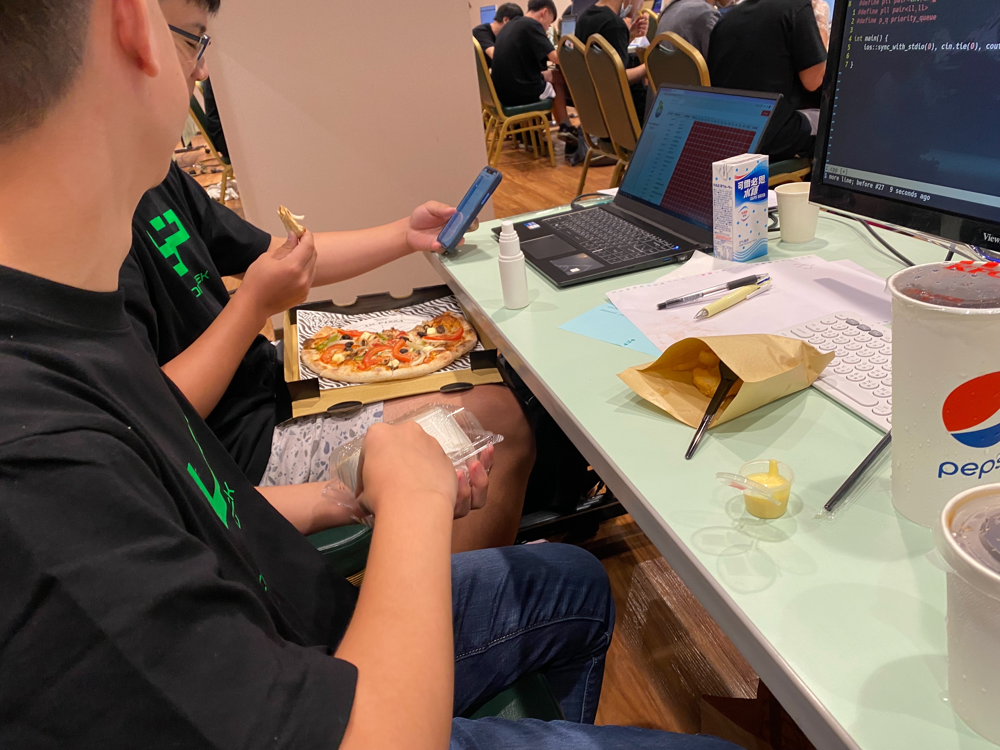
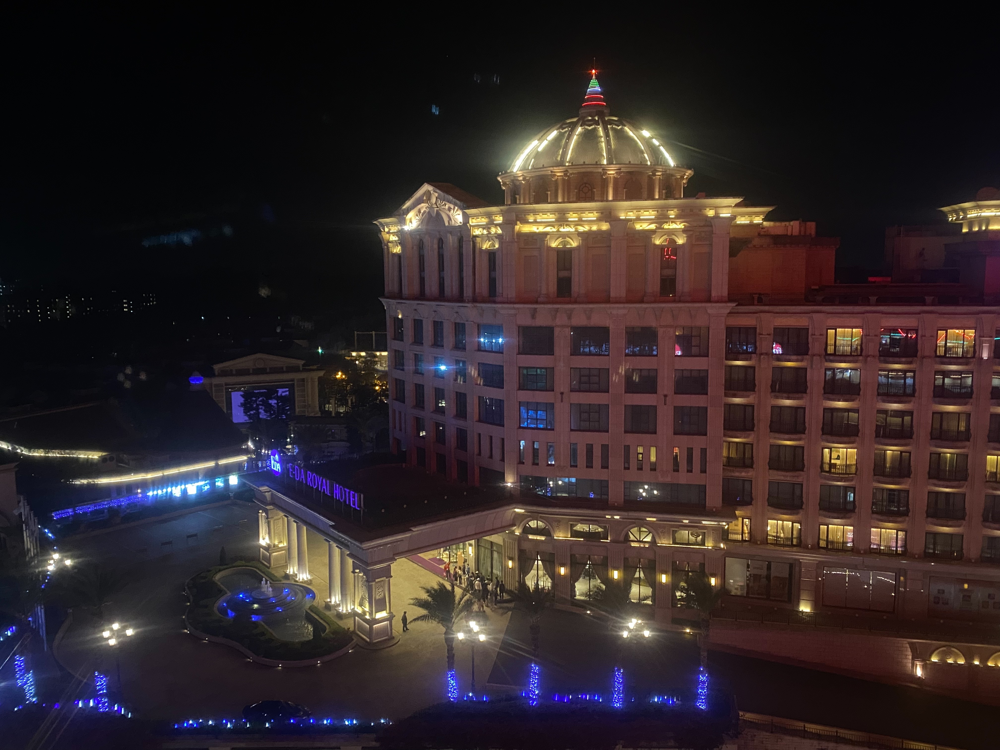

一轉眼，在建中三年的時光就過去了。三年前的我肯定沒辦法想像我現在會在這裡吧。

## 推動一切的骨牌

*人生，由一連串的連鎖反應主導。哪怕改變其中一小部分，都有可能產生蝴蝶效應，改變一個人的一生。而在國三畢業的那個暑假，我做出了將會改變我一生的決定，推倒了一塊至關重要的骨牌。*

### 毅然決然離開舒適圈
當年，我就讀私立南山中學的直升科學班，由於已經保證有學校念了，我當下是絲毫沒有壓力的考完了會考。也許正是因為沒有壓力我才能表現的那麼好吧，考完學測的我還真是羨慕當時的我呢。放榜當天傍晚，我看見了一位同學在 Instagram 限時動態上的一張「放棄直升切結書」，原來他會考考到了很好的分數，決定落跑去北一女當小綠綠。他的動態激起了深埋在我心裡的建中夢，於是我當晚和家人討論後隔天便去學校寫了一張切結書，離開給我豐厚獎學金和栽培的南山，前往那植物園對面的第一學府。

這對當時的我來說其實是個還蠻重大的決定。本來約定好的三年同學在畢業典禮後突然說要離別，讓我的同學滿是驚訝和不捨；除此之外，我還要把我在南山三年獲得的大量獎學金幾乎全數歸還，在經濟上也是造成了不小的負擔。不過權衡之後，我還是選擇了離開。

有些離開了南山的學長姐確實有感到後悔，但如今回去看，我一絲一毫的後悔都沒有，這是我至今做過最正確的一個決定。很謝謝當初那位上了北一女發了那篇限動並告訴我該怎麼申請，沒有他的幫忙大概就沒有今天的我了吧。

### 充滿未知的至高之處
「你想要去考數資班嗎？」 
另外一位也上了建中的王鶱華在我們某天見面的時候這樣問我。  
那時我對數資班根本沒有概念，只知道裡面大概會是一群怪物而已。聽說他要準備數資班之後，我也去報名了數資班考試，因為我也想去那最高點看看，揭開那全國的頂尖的神秘面紗。我自己對「資優」這個概念的理解是「資質不該是被培養出來的」，因此我本來是完全沒有打算去準備的，但是有個人激起了我準備的決心。

某天，我的國小同學突然聯絡上了我，和我聊自己的升學情況。雖然我考得得很好，他還是不停跟我炫耀，聽到我上了建中之後發現自己優越不了我，於是他開始拿自己的國中同學炫耀，說什麼他考上了建中科學班很厲害很聰明之類的。雖然不久前的我明明連建中的科學班跟數資班是什麼都不知道，但當時的我瞬間怒火中燒，覺得不考上數資班沒辦法為自己出一口氣。

我決定不擇手段，只要能進入數資班就好，於是我開始準備數資班的考試。 

雖然是這麼說，但我其實也不知道要幹嘛。我只有聽說有個叫薪哲的補習班出了很多的科學班和數資班學生而已。本來我可以選擇去聽他們的課什麼的就好，但我自尊和理念不允許我去補習，我認為補出來的學生不能被稱為「資優」。於是，我隨便找了幾本高一教科書還有大我兩屆的科學班學長做的考古題整理，自己讀完了高一的課程並寫了幾回考古題練練手感就去戰場了（其實大部分的時間我都在玩 [Warframe](https://www.warframe.com/) 啦哈哈）。滿有趣的是，刷完考古題對我的心理健康產生了嚴重的打擊，我有一回數學不知道在幹嘛，滿分 100 的考卷我居然拿了個 0 分。

### 莫名其妙的入學考

刷完考古題後，除了那回不知道發生什麼災難的數學考卷外，我的數學大概都有個 60~70 左右的成績，自然則是穩定在 80 分以上。問了考過科學班還有也在準備數資班的同學之後，我感覺這成績還蠻穩的，心態還不錯。況且，我數學只要考出非零實數的分數大概就會比我的最低紀錄高了吧。

上了考場，我發現自己數學基本上啥都不會寫，多選題只能把答案分組看有沒有用，填充只寫了個一半左有，手寫沒有全會的題目。

自然考科更是慘烈至極，我們當年度的單選是惡魔一般的計分制度，如果寫錯了要倒扣。一般來說，倒扣的用意是為了讓亂猜的考生不要靠運氣獲得更高的分數，因此會把猜題目的期望值歸到 0。但那份考卷的作者（aka 我未來三年的自然科老師們）不這麼認為，那份考卷的單選每選錯一題就會倒扣 $110\%$ 以上的題分；就是猜錯一題會把你前面辛苦算對的一題直接賠光光還順便再扣一點走的意思。這種狗都不猜的題目設計基本上就是告訴你：除非你這題有完全的把握，不然寫都不要寫。偏偏我自己最擅長（自稱）的物理題目是我看過歷屆最難的物理，那個手寫計算題老師事後承認是全國賽還是什麼的競賽題，當年學生的答對率是 $0\%$，物理老師對這數字很滿意，因為他說暑假來學校改考卷讓他很不爽，他覺得要讓自己改輕鬆一點。

考完之後我整個都沒有心態了，想著在建中念普通班也不錯。 

結果幾天後的成績又給我燃起了一線生機，看到不知道是什麼的 T 分數，本來想說自己成績可能還不錯，我立馬去 google「什麼是 T 分數」。我發現自己的成績其實是真的滿爛的，數學 57；比較拿手的自然甚至只有 55。如果把這兩科的分數直接拿去跟當年的考生數量拿過去換算的話，會發現我的成績分別是 57 跟 62 左右，而數資班只透過考試收 58 個人（兩個保送進去，一個是以後會提到的天才劉澈）。基本上是沒什麼希望了，因為可能會有偏科的把我用單科揍下去。

放榜的那天，奇蹟發生了，我以比錄取線高 0.4 分的些微差距壓線進入了數資班。直至今日，還沒有什麼比賽或是考試結果公布比這還要驚喜。

## 超越想像的世界

*進來建中前，我從來沒有想過我選擇的竟然是一個這樣的世界。聽別人口中述說的自由學風、臥虎藏龍的學生組成、破爛不堪的校舍……種種流言都比不上親身經歷這瘋狂的一切。*

### 自由狂風

建中以自由學風聞名，自由學風可以用三不一沒有概誇：不吃便當、不走校門、不準時上課和沒有制服。

沒有制服是我在線上成班說明會還有家長會的時候就有聽過，教官（時代的眼淚）三令五申告訴我們不用穿制服。這聽起來荒謬到不行，怎麼會有教官講這種話，忽然我想起來我讀的是臺北市立建國高級中學，所以教官才會有這麼高的素質（下略兩百字）。

至於不準時上課，我們班畢竟是一群國中乖小孩組成的班級，所以一開始都還蠻準時的，開始有很多人瘋狂遲到可能是一陣子後的事。不走校門也是一個高一不怎麼做的事情，主要原因跟不準時上課差不多，沒有人會遇到校門沒開時候，所以沒什麼感覺。

但是不吃便當，喔，天啊。那是真的非常的爽。

整條寧波西街都是我們的地盤，咖哩、炒飯、餃子、甚至披薩跟剉冰，你只要想的到你午餐就可以去吃。到後來我們甚至不甘於現狀，打算往更遠的地方去，像是西門町之類的。這也是為什麼我們班那麼愛免修，可以吃更多東西。只可惜高一上的我不懂甚麼是幸福，覺得東西太貴居然跑去吃合作社的素食便當，我真的是有病。

有些分數高分低填去念什麼附中、松山之類的學校的人，會說自己三年來從來都沒有後悔過。你知道為什麼他們不會後悔嗎，因為他們肯定沒有在中午逛過寧波西街，也沒有在段考日的中午去西門町吃過拉麵。

### 第一學府的下馬威

剛入學，我就報名了所有科目的免修還有各式各樣的能力競賽。我當初以為要國中成績單才能報名免修，還特別回去南山拿了成績證明（那張單子長得超級唬爛），沒想到錄取數資班之後特教組長說可以直接申請，特權真好！

由於校方限制一個人只能報名最多四科校內能力競賽（數學、資訊和自然選兩科），所以我選了國中最喜歡的物理跟化學還有數學和資訊。報名這麼也沒有什麼夢想進入校隊之類的，就只是想要看看而已。

果不其然，建中的老師們給了我們這些新生一次下馬威，告訴我們建中沒那麼好混。我的免修是全數槓龜的狀態，全槓龜不是什麼大不了的，比較搞的是物理老師特地在全班面前叫我的名字，然後跟我說我差一題過，超不爽的。不過班上好像也沒有什麼人通過，開始有人大量通過免修貌似是下學期才開始的事。至於能競，基本上也是沒有什麼亮眼的表現。我數學好像只拿了 16 分的樣子（滿分是 100），不過好像差一點就拿佳作了 XD。物理跟化學也是被打爛，連佳作的車尾燈都看不到。

那次的資訊能競我記得的細節不多，唯一還記得的大概就是我在和題目掙扎到一半時見到了一位突然站起的捲髮少年，揹著書包離開教室。他在比賽比到一半就破臺了，反觀我除了簽到題什麼都寫不出來。不過，最後來了個驚喜，雖然打得很爛，但是我憑著高一保障名額進入了建中的資訊校隊培訓，也是這次的機運讓我正式踏入了資訊競賽圈。

### 資訊校隊培訓

那年的校隊培訓講師特別讓我印象深刻的是賴昭勳和王渝立學長，他們很認真地上課，雖然我基本上是什麼都沒聽懂就是了。課程內容大部份都很簡單，不過那時候的我不知道是被嚇到了還是單純沒開竅，基本的原理還是沒有聽懂。

培訓時烙印在我腦海裡的還有幾個自顧自打著程式的學生，本來我以為他們都是高二的學長，後來才知道他們都是跟我同屆的學生。那些人是張庭瑋、陳柏凱和劉澈，最後都成為了資奧國手。

認知到自己和他們的差距後，一股自卑湧上心頭，正是這股自卑阻止了我全心全意投注在資訊競賽上。如果那時我願意繼續在這條賽道上全力衝刺的話，說不定一切都會變得不一樣呢。

### 我見識了知識之深淵

在校隊培訓時，學長向我們大力推薦了資訊讀書會，一個主要由高二學長所籌備的活動。那裡的課程主要是為了準備學科能力競賽和奧林匹亞所準備的，用比校內培訓更快的步調介紹各種程式競賽的技巧和理論。原本就已經跟不上校隊培訓的我，在聽過幾節課後更是落後了更多。我和那些願意全力以赴的人的差距也在日漸擴大。我覺得我在資訊讀書會最大的錯誤就是沒有好好把握練習的機會，就算聽不懂整份課程，慢慢練習的話日積月累也能累積一點實力的。

有位叫做王政凱的學長，我當時不管到哪都會看到他，資訊校隊培訓、資訊社、讀書會。我常常聽到他推廣地科讀書會，因為他我也去了地科讀書會聽了幾門課。地科讀書會的內容比起資訊讀書會更好理解一些，而且感覺不太像在比競賽，我當初是單純把去讀書會當興趣的在參加，現在想想可能這才是正確的學習態度吧。除了王政凱學長，我還在地科讀書會認識了涂宇軒學長，比我大一屆的數資班學長，還有一些同年級的同學，還蠻開心的。

### 那間日本料理

某天參加資讀的晚上，我經過了一家學校附近新開的日本料理，看到菜單的價錢後我感到很驚豔，於是我點了一碗鮭魚丼，想看看究竟 170 的生魚片丼能長什麼樣子。結果送上來的東西完全超出我的想像，快要比手掌大的鮭魚生魚片，把底下的醋飯掩蓋，和夢一樣。

那間店的名字叫做ゆき，老闆是很友善的日本人。在那之後，我每天都會到ゆき報到，一天至少一碗。我到店的頻率高到老闆甚至會請我吃試做的新商品，問我覺得怎麼樣。ゆき可以說是承包了我高一高二一半以上的幸福吧，能在那間店吃午餐是我一天最期待的事。

### 南山幫我的臺大物培

在南山國三的時候，有個準備高中資優營（現在的人才培育計畫）的夜間課程，我因為晚上沒什麼事就選了物理人培的準備課程去參加。說是準備課程，不過其實差不多就是教一些高中物理和刷考古題，也沒有什麼比較特別的課程。

上了建中後，我跟班上一堆同學一起報名了入學考。入學考的題目確實和考古題沒什麼太大差別，難度、數量和題目內容基本上和往年沒什麼差別。不過我對入學考還是很有印象，因為當時我唯一不會的數學題剛好是我刷過的考古題，雖然我還是不會解不過我記得答案，答案剛好就是我生日！於是我在答案卷上填上了自己的生日，即使完全不會算那題，我還是拿了滿分。除此之外，物理的考試也很有趣。題目有很多噁心的數字，基本上就是叫我們當人體計算機。但我就是不服這種考試方向，所以所有題目裡的 $g$ 我都很叛逆的直接把他當 $10$ 來算，最後再稍微把答案改大或改小一點點。憑藉我的~~精密計算~~唬爛，我拿到了一個很不錯的分數，和班上同學比好像是第一還是第二吧。

進去之後，我其實沒有什麼在聽數學課，因為老師會一直忘記自己教過泰勒展開然後一直跳針。不過高一的物理課還挺有料的，學到滿多東西的。

高一下我因為資訊之芽（後面會講）一直缺席，不過班上同學都有罩我，讓我順利過關，還讓我撈到一個優良結業，特別謝謝胡軒綸、張勝勛和陳尚寧。

### 慘烈的 NPSC

NPSC 大概是高中生能體驗到的少數 ICPC 制比賽，基本上就是三人一隊，要一起解若干題全有全無的題目，以 AC 時間和答錯次數來做排名的比賽制度。

我和賴泓安和陳澔樂一起參加了高一那年（2021）的 NPSC。那年賽制比較奇怪，只有一場，所以題目難度分布對新手比較不友善，五個小時的比賽我們好像只解出兩題吧，超醜。

那場比賽最大的收穫大概就是去賴泓安家玩還有蹭到他們家的飯了吧 XD。

### APCS 與資奧初選

從國中時我就聽說了 APCS 的存在，很多人都說考很高就可以有大學，我聽到之後就很心動，然後就去報名了。我那時候是真的很菜，不過因為實作有一題剛好是二分搜被我看出來所以給我撈到了 5/4 的分數。不過班上同學不知道為什麼都遇到奇怪的問題，不是忘記報名就是被觀念題搞心態之類的，只有我有拿到資奧初選的門票。

資奧初選可能跟我有仇吧，每次都會遇到有的沒有的問題。高一的那次資奧初選我寫一寫結果發現那臺電腦不能編譯，心態整個都沒了。那時候換電腦還沒給我補時讓我還蠻難過的，不過補不補我大概還是沒辦法寫出那題 2022 就是了。

我的分數最後只有一百出頭，雖然很爛不過我是真的沒什麼練習，所以也沒有什麼好抱怨的。

### 資訊之芽

資訊社的學長一直推我們去參加臺大資工學長姊辦的資訊之芽，所以寒假的時候班上的一些有比資訊的同學就一起去報名了。我、吳亞倫、陳澔樂都有進臺大的班，但賴泓安好像運氣不好還是 essay 寫的不讓人滿意就被送去新竹了。

資芽的課程真的非常扎實，在理論和實作也有很不錯的平衡，對資訊有興趣的學弟妹真的很推薦報名。是說大概就是從資芽開始，陳澔樂就開始突飛猛進然後狠狠把我們三個甩到腦後了。

一件好笑的事情是，資訊之芽和物培的時間是衝到的，所以我就一直在物培請公假去資芽上課。因為物培的學期成績要看出席率，所以一直請公假的我直接把出席率拉滿，間接幫我自己搞到了高一的優良結業。

### 回文老師與免修

寒假結束後，就是免修考的第二戰，老實說學期中我沒有什麼把心力放在讀後面的東西，可能只有數學有稍微讀一點吧。意外的是，我的地科莫名其妙的壓線過關了，拿到了 C 級免修，和蕭宇博還有吳亞倫拿到了超限量的地科免修（數學免修有很多機會可以過，但地科過了這學期就沒有了）。

本來很開心的我們收到李文禮老師通知，告訴我們免修還要交作業，只有段考可以免考。聽到之後我們就不太高興了，因為整個學期老師的規畫都沒有上課，只有每個學生上台報告地科課本裡面的內容，期末考題目原本規劃甚至是同學自己出，所以我們基本上什麼福利都沒有，是名存實亡的免修仔。



好像也就是這個學期，陳彥臻決定火力全開告訴大家誰才是老大，一口氣過了幾乎每一科免修，成為課表只有體育課的男人。

### 唬爛英文簡報比賽

英文老師告訴我們學校有舉辦英文簡報達人賽，當時常駐班排一的張勝勛同學跑來問我願不願意跟他一組，我感覺有分可躺，馬上就答應了下來。

不知道為什麼，我沒有想過這麼優秀的同學會是死線魔人，不斷定時回報進度，讓我感到壓力山大。不過正所謂一分耕耘一分收穫，我們拿到了很優秀的成績，我也很高興能跟張勝勛共事。這次比賽雖然很辛苦，不過也讓我感覺和遙遠的那位神親近許多。

### 突入！地科奧林匹亞選訓營

學期中，我收到一封地科校隊初選的通知郵件，何亮宏那時拿過來問我要不要亂喇一波，我想說我有去地科讀書會聽過幾次課，也有地科免修，比一下感覺不虧。

經過被跳過的校內初選（人太少 XD）、根本沒看懂的校內複選，我們莫名其妙當上了建中的代表，也算是某種程度上的當上校隊了吧。我們去參加選訓營初選（入營考）的時候也是唬爛了一波就很幸運的進入了選訓營，成為班上的第一批選訓仔。

那年的地奧選訓營辦的非常爛，不像資奧住在捷絲旅或生奧住在有 Häagen-Dazs 吃到飽的飯店，沒有人在乎的地奧只能住在師大的林口校區。不僅沒有床要自己帶睡袋，食堂的東西難吃的要命，那個芹菜簡直就是未受馴化，嚼了半天還是嚼不爛，吐出來變成一團纖維。除此之外，整個林口校區還到處都是蚊子，沒帶防蚊液的基本上就是宣告死亡。臺灣一點都不重視比地奧的學生，我們連狗都不如，如果學弟想比地奧的話，請三思。真的想要研究地科的話，務必要選國外的大學。

我爸也是學地科出身的，他曾經告訴我讀地科長大會沒飯吃。我在選訓營的時候發現，他說的是錯的，讀地科哪需要長大才沒飯吃？我現在就沒飯吃了。

我對高一地奧選訓營印象最深刻的不是什麼上課的內容，而是我沒在上課的時光，尤其是古生物學，那時剛剛好是資訊之芽的期中考，於是我直接在教授上課時打 code，不過因為我一直被教授打斷所以期中考拿了個壯烈的 0 分。

帶我們體驗地奧的涂宇軒和王政凱都進到了決選營並順利當上了國手，為臺灣摘下兩面獎牌（王政凱甚至世界排名 9，跟鬼一樣）並遠離了學測苦海。差不多是那時，我開始夢想著自己能成為一年後的他們。

雖然我覺得地奧爛透了，自己考試也考得非常爛，但最後成績公布的時候不知道為什麼我的名字出現在了前半名單上。就這樣，我獲得了大學的推薦資格，某種程度上算是第一次上岸（？

雖然沒有獲得自己原本想要的東西，不過還是收穫不少，見了見世面，也交了一些朋友（像之後跟我一起比北市賽的邱柏凱）。

### 狂妄之人

高一做了那麼多事情後，我很努力地想要成為一個更有價值的人，於是我同時報名了資訊社和電研社的學術幹部考試。

資訊社的題目還蠻有趣且多樣化的，除了有題本要寫，面試時也有一些酷酷的題目，像是手算模逆元之類的。本來我只是想當個普通的學術而已，結果因為我填自我介紹的時候手賤寫了我想當學術（長）所以我就變成學術長了。說是如此，我的工作基本上都被社長搶去做了，所以我跟一個一般的學術其實沒差多少，只有多排一點課而已（對不起學長 QwQ）。

電研社就比較有趣了，我甚至沒有地電研社，單純是吳亞倫問我要不要考我就把他當資訊社的備胎去報名了。電研社的學術幹部考試是以上機考為主，基本上就各式各樣的演算法題目，那時有好好學的吳亞倫大破臺，而我則是大破腦，只有把基本題跟幾題稍微難一點的題目做出來而已。唯一值得驕傲的大概就是我有一題比吳亞倫先做出來，搶了當時的首殺。

結果最後我兩個社團都錄取成為幹部了，我本來的認知是學術只要講課就好了，所以我就兩邊都接下來了。結果後來才發現原來還要籌備活動，整個人都沒了。

### 忙碌無比的暑假

不只要作為兩個社團的幹部（免費勞工）努力，我還為了申請英文免修，請我爸幫忙報名了 IELTS，希望未來能省下一點時間。除此之外，我還報名了 YTP 和成大資訊邀請賽，希望自己能在資訊領域有所成就。如果你以為我的暑假只有這樣，那你就錯了，作為高一升高二的學生，我還要和班上的同學一起辦建北數資聯合迎新、當暑假資訊讀書會的講師並作為地科讀書會的負責人籌辦暑假地科讀書會。

這個暑假成為了我人生中最忙碌的暑假，具體來說有多忙的，如果一天只能排一個行程，那我需要三個多月的暑假才能把所有行程排下去。

### 開始討厭成大的契機

很早之前，我們班上資芽小圈圈的四個人看到了成大資訊邀請賽的參賽資訊，決定暑假去比一下，順便當度假。那次的臺南行，是我家時隔三年的第一次家庭旅遊（對，我很可悲），所以我非常的期待。結果我媽在旅行的過程中受了很嚴重的傷，到現在都還沒完全康復，整個簡直就是一場惡夢。

## 最幸福的那段時光

*如果說我最懷念高中的哪段時光，那肯定就是從 YTP 開始的暑假到數資成發的那段時光了吧。我和班上同學約定了，當一生的兄弟，在校內也結交了更多同年級夥伴一同歌頌青春。在那看不見的遙遠未來，想必我還是能和他們開心的聊著這段時間的點點滴滴吧。*

### YTP 的蹭飯之旅

我和賴泓安和陳澔樂一起報名了少年圖靈計畫，一個資訊圈最知名的~~專題~~蹭飯活動，我們以不好不壞的成績的成績進入了複賽，拿到了免費的衣服和披薩。但老實說也就這樣而已，也沒有晉級，不過對當時的我們來說已經不錯了。

後來公布晉級名單的時候就是另外一回事了，發現我們離晉級線只差一個子題的時候基本上是心態全無的狀態。沒有被失敗擊倒，我們宣言會在明年發揮實力，進入最終階段。

### 猴神的唬爛稱霸記

聽到智慧鐵人後，你對這個比賽的第一個想法會是什麼？

我本來以為這會是一個比機器人之類的比賽，但我完全錯了。

這是從地奧選訓營的某個隊輔聽來的資訊，但我壓根沒有在聽，其實這是何亮宏聽到後跟胡軒綸講，胡軒綸再揪我們的。就這樣，我們在什麼都不知道的情況下以「Hanuman.」為名開始了我們的傳奇。

初賽時我們整隊沒有人知道接下來要幹嘛，我們就是拿到題目之後開始唬爛。我們的實作題非常慘烈，最後好像只拿了四五十分吧。本來以為文本題會是我們的強項，於是我們打了魔法卡（x2），結果我們只拿了比及格高一點點的分數。雖然不知道比賽怎麼運作，但比完前兩關後我們就覺得自己大概是會被刷掉了。沒想到的是最後一刻劉允中居然在體其題想到一個唬爛，靠洪浩烜的身高讓我們直接大破臺，拿了全國第一的 100 分。整體攤下來後，強運的我們壓線以外卡名額進入了複賽。

複賽和初賽是完全不一樣的兩種賽制，我們要完成一個 90 秒的表演並且完成兩關的密室逃脫（闖關）。表演的主題是望春風，那是一首老歌的名字，但我們隊伍裡面根本沒有人聽過那首歌，我們也不知道要表演什麼，最後靠著胡軒綸和劉允中靠垃圾素材湊出一個還算能聽的配樂，以及國寶級師傅賴泓安和王元粲做了個很猛的皮影戲，勉勉強強完成了一份表演。

你可能會問，我在幹嘛呢？**我在躺分阿！**

複賽的闖關才是我們真正的亮點。老實說，我已經不知道當時的題目了，但是我記得我們每個人都把自己能做的發揮得很好，神擋殺神，佛擋殺佛，每個人各司其職，在兩關都獲得極高的分數。最後，我們靠著還行的表演分數和滿分的闖關分數，以初心者的身分闖入了智慧鐵人的決賽。

那年決賽最爽的就是賽前和賽後的金門遊，用 300/人 的報名費能換到這麼多東西真的很划算。不過可能是我們被複賽的勝利沖昏頭了，我們在遊覽車上不斷的耍猴，耍到被同臺遊覽車上建中科學班的學長罵（很抱歉 QQ）。

決賽是長達三天三夜不間斷的主軸製作，穿插能獲得主軸製作經費的闖關活動。經過了複賽的大勝利，我們本來是想要衝擊闖關王的，結果我們被北一女科班的學姊和建中科學班的學長痛宰，打了幾關後就沒有心態了。於是乎我們改變策略，把闖關當休閒活動，開始認真做主軸。

前半天我們基本上都在闖關和耍廢，進度基本上是零。後面賴泓安看不下去了開始主導討論後就變得有效率很多，我們漸漸步上軌道，賴泓安負責作人偶、我負責打雜跟做小裝飾、王元粲負責~~做螃蟹人~~美術和比地理奧林匹亞……每個人都做好自己的事。最後我們做出了一個我們還算滿意的成品，自信的我們甚至覺得有機會撈到第三名之類的。

頒獎典禮上，聽到第三名不是我們後，心裡就有點小小的失望，因為我覺得我們頂多就拿個第三名。沒想到的是，評審很給我們面子，最後居然給了我們亞軍的肯定，那時我們心裡是又驚又喜，沒想到一個從頭到尾都在唬爛的隊伍居然可以拿到這麼好的成績。

這場比賽絕對是我高中最難忘也最快樂的體驗，Hanuman Forever!

### 能力競賽復仇記

新的一學年開始了，我已經比去年成長了許多，已非昔日吳下阿蒙，因此我想透過成為能力競賽校隊來證明自己。我半開玩笑的給自己設下了一個偉大的目標——成為和去年的王政凱一樣的資訊地科雙校隊。

其實我很清楚知道我自己遠遠不如去年的王政凱，因此我也只是說說而已，當時的我認為能當上地科校隊就應該要偷笑了。令我意外的是，當初的玩笑居然成為了現實。我在資訊能競複賽押對寶，寫了當天最甜最貴的子題，以校隊線本人的成績入選為建中資訊校隊。地科校隊的部分也很順利，聽說我的校內初賽只輸給兩位國手學長，複賽也是每張卷都拿了不錯的分數。

除了地科和資訊拿到校內賽的一等獎外，我的數學和物理也順帶拿了個佳作回來，雖然不是太好的獎，但姑且也算是推到了 100% 的得獎率，算是滿載而歸吧。

就這樣，我誤打誤撞成為了當初所夢想的建中校隊，兩次。

### 從 APCS 畢業了

「沒有建中校隊會笨到 APCS 沒有 5/5 吧」一樣是校隊的陳澔樂和我說。 

那時資芽小圈圈只有吳亞倫已經 5/5 了，我們剩下三個都還沒做到，因此我們很認真想要從 APCS 畢業。所幸那次的題目非常簡單，我們三個都在 APCS 拿到了實作滿級分的好成績。

### 大家的偶像布萊恩臺灣

升上高二的那個暑假，我開始投注大量心力在讀書會上面。暑假的時候，我找了班上的很多同學來辦暑假地科讀書會，大部分都沒有比地科就是了。為什麼不找比地科的人？因為比地科的真的很少，狗才比地科。很謝謝黃楷翔、林鈺軒、賴泓安和劉允中明明高中三年都沒比地科還是願意來幫忙講一個半小時的課。

除了地科，我也有在資訊讀書會講課，差不多是交接完我就決定好要接圖論和網路流的講師，因為當初沒有聽懂，而且學那個感覺就很酷。去資訊讀書會的時候也認識了更多跟我同年級的電神，也跟高二的學長變的更熟了。

好像是王民人開始的吧，他到處跟大家宣傳布萊恩臺灣。之後更多認識我的人（王政凱、何亮宏……）加入搞我的行列，導致當時建中競賽圈（至少資訊跟地科）和建北數資幾乎每個人都聽過我的名字。「布萊恩臺灣你是我的偶像，可以跟你要簽名嗎」更是取代早安，看到我必說的問候語。

在這樣的情況下，我在讀書會講了不少課，布萊恩臺灣的名號也流到了下一屆新生的耳中。不知道一兩年後回去還會不會有數資班的學弟妹看著我，對我說：「聽說你是數資班的是吧」。

### 資訊北市賽

雖然說是當上了校隊，不過我在資訊競賽的時間非常不平衡。我接了資訊讀書會的圖論講師，成為了備課街的亡靈，花了幾十個小時在學圖論、整理資料跟做簡報上。因為我真的花太多時間在那上面了，導致我對繼續讀更多東西有點過敏。也有可能是我覺得比我強的人的太多了吧，不如多花一點時間在讀地科上面。就短期來看，我的選擇也許是正確的吧，不過長遠來看還蠻後悔的。

我的北市賽打得非常小丑，幾乎就是建中最後一名了，拿了個很醜的佳作回來。不過我當時也沒有到很難過，畢竟資訊北市賽的校隊名額太多了，拿佳作也沒有到很丟臉。

### 與國手的 NPSC 冒險

有天，陳澔樂問我，陳柏凱要跟他一起比 NPSC，我要不要一起？我聽到後馬上答應了下來，畢竟我從來沒有跟他一起比過比賽，很想和他當好朋友。

我們初賽比的還不錯，基本上每個人都有做事，雖然我只有負責想題（實作能力嚴重不足），不過我有想到怎麼做一題不簡單的題目，還蠻開心的。

決賽的時候我就沒派上什麼用場了，不知道是我狀況不好還是我真的太菜，我明明知道想要考什麼的題目卻怎麼也寫不出來，比較難的題目也沒有派上用場，最後靠陳柏凱和陳澔樂把我 carry 到了第五名。

和他們一隊真的非常的開心，我也默默為自己設下了明年要變得跟他們一樣可靠的目標。

### 大錯特錯的血月之夜

在當上地科校隊之後，基本上就是公假自助餐的狀態。剛好那時候有好幾年才一次的月全食，涂宇軒就問我們要不要看，於是我、何亮宏還有王政凱就跟涂宇軒一起去竹中看月全食，因為竹中有另外兩個去年的地奧國手還有天文臺，除此之外，他們還順便約了蘇軒漢。

到了新竹之後，災難發生了。我們發現月亮所在的方向被無止境的烏雲籠罩，雖然那時還看得到月亮，但月食時亮度會變暗很多，有很大可能是我們什麼都看不到。隨著月亮慢慢進入地球的本影區，我們也就越來越緊張，我們盯著似乎不會散去的烏雲不斷祈禱。然而我們的祈禱並沒有得到回應，當月球被完整覆蓋後（食既），那理應是血色的銀盤瞬間消失於夜空之中。

一個小時過去，天色似乎沒有好轉，雲還是沒有消散。更令人絕望的是，涂宇軒的家人傳了一張臺北拍到的月全食照片給我們看；我們彷彿是到竹中巡迴演出的馬戲團。

正當快要生光的前幾分鐘，奇蹟發生了，那蓋滿整面南方天空的烏雲居然缺了一角，還剛好移到了月球所在的位置。就這樣，我們在最後一課脫離了小丑的身分。

在最後壓線看到高中生涯只有一次的月全食後，我們開始去到處找晚餐吃。我們最後找到了一家超扯的日本料理店，居然有 99 塊錢的生魚片丼飯，我整個人都嚇傻了。在那之後每次有人跟我說新竹沒東西吃我都會丟那家給他看。

### 地科北市賽

這大概是我競賽旅程少數順風的部分了吧，從校隊爬上來都沒有什麼太大的失誤。即使如此，我在比賽前夕還是緊張得要命。比第二次北市賽的王政凱叫我不要緊張，他告訴我，沒有什麼好怕的。

「放眼望去，你覺得誰打得贏建中校隊？」

雖然還是有點緊張，畢竟建中的校隊還是能打敗建中的校隊，而且當時的其他校隊有人一直不斷給我施加壓力，疑似是試圖搞垮我的心態，所以我很擔心會被同屆的其他校隊揍下去。不過王政凱的鼓勵仍舊是給我打了劑強心針。

北市賽的筆試整體而言算是滿順利的，除了海洋學有一題根本就是考古題的題目因為題目敘述打的怪怪的害我以為自己算錯沒解出來。特別刺激的是中午剛吃完午餐就在所有人面前公布進入口試的名單，沒有進的還會直接公布你是拿三等獎還是佳作，還滿恐怖的。和我同國中的蕭宇博和王鶱華都拿到了沒進口試的三等獎，雖然沒有進口試不過他們也還算開心啦，畢竟至少是剩下的人裡面分數最高的那群。

至於搞我心態的人呢？只有佳作，我想這就是因果循環吧。
 

不過下午的口試對我而言就是另外一回事了，不熟悉口試賽制的我（其實沒有人熟悉就是了）在很多關卡都犯了不小的錯誤，剛講出口就知道自己會下去的那種。我本來以為自己可能會沒料了，沒想到最後居然壓線拿了北市賽一等獎，運氣真的很好。當初我跟邱柏凱在台下看到自己名字的時候整個瘋了。

### 被澆熄的烈焰與世界盃

為了準備全國賽，我可說是卯足全力在準備。每天都是公假請滿的生活，我獻祭了高中的平時課業成績，就為了能在全國賽拿個好成績，目標是不要考明年的地奧初選（也就是目標是前二等獎的意思）。

令我沒想到的是，整個全國賽一言以蔽之就是大翻車，人生至今從來沒有這麼嚴重過的失敗。

去臺南白吃白喝大概是整個行程裡面唯一回想起來不會難過的部分了，真的吃了很多好吃的東西，非常謝謝帶隊老師願意帶我們三個到處白吃白喝。

第一天的野外考察被納入整體評比的計算中，比例不大但仍舊讓我壓力山大。我自己對野外考察真的是一竅不通，聽到決選營基本上去了一模一樣的地方，而且有好幾個參賽者參加過決選營後心情更是落到了谷底。整體而言，我的野外考察還蠻不盡人意的，不過比不上後面的慘案，要比擬的話，大概就是一場連環車禍吧。

和北市賽相比，我的全國賽筆試就是一場災難。我的手寫不斷犯低級錯誤、計算機一直出包（按一按會被歸零）、明明認真想想就會寫的東西結果寫了不知道什麼的唬爛上去。手寫完已經心態全無了，後面的口試又將我的信心碾碎。聽到了明明就很簡單的問題腦袋卻一片空白，回答了連白癡都會笑出來的答案。偏偏我抽到的是地質還是地物的題目，剛好是成大教授的專長，而面試我的又好巧不巧是成大地科系的系主任，基本上是臺灣地質界某方面的權威。

公布成績時，我弱小的自我崩潰了。像隻鴕鳥似的，我把自己整個人包了起來，強忍著淚水上臺，領著我不願面對的那張獎狀。雖然三等獎聽起來像個不錯的等第，但對當時的我來說，這否定了我的努力，往我的臉上狠狠甩了一巴掌。

典禮結束後，我繃不住了。我開始放聲大哭，什麼都聽不進去，連獎金確認我都不願意去簽收。我脫序的行為引來了周圍他人的側目，但我壓根不在乎。我只想溺斃於那淹沒我的那份憂鬱。那天，臺南在寒冷的十二月無預警的下起了暴雨，寒冷刺骨的雨水不停劃過我的臉頰。我仍分不清，那時我臉上的究竟是淚水還是雨水。

除了哭泣，我一語不發，不願理睬任何了的安慰和關心。不過我永遠記得，在遊覽車上，電視螢幕播放著世界盃的淘汰賽，Messi 帶領著阿根廷擊破了強敵，往他渴望多年的那大力金盃前進。

「你知道 Messi 嗎？」王政凱問我。

他告訴了我 Messi 的足球生涯，他經歷的痛苦和努力，還有世界盃對他來說是多麼的重要。

「直至今日，他都還沒有成功。可是，這大概是他選手生涯的最後一次世界盃了。」王政凱獨自說著。

「但是不到最後，誰知道結果會是什麼呢？」他語重心長地告訴我。

回家後的幾天，拿了三等一（三等獎中的第一名）的何亮宏還有暖到不行的黃楷翔不斷安慰著失魂落魄的我，陪我走過了當時最艱難的一段時光。非常感謝他們的陪伴，他們真的是醫生不可多得的好朋友。

過了幾天，世界盃的最終決賽在深夜上演，我坐在空無一人的客廳，盯著電視機的實時轉播。天使  Di María 因為對手在禁區的犯規為 Messi 製造了罰球的機會，替阿根廷奪下第一分。隨後又組織了一次精彩的進攻將分差拉到兩分。 

「不錯，Messi 贏了。」我這麼告訴自己，準備打算直接去睡覺。

就在此時，不是別人，法國隊的隊長 Mbappé 因為犯規的罰球和一記精彩的凌空抽射，在最後十分鐘將局面拉回平局。我的心臟開始狂跳。

在加賽的三十分鐘，Messi 和隊友衝入敵方禁區，再度奪得一分。結果在最後三分鐘，憑藉著犯規的罰球，Mbappé 再度拉回平局。在延長賽的傷停補時的最後幾分鐘，法國啟動了令人絕望的進攻。但 Martínez 以一腳之差將球頂了出去，將比賽拉到最後的點球大戰。

「不到最後，誰知道結果會是什麼呢？」這句話不斷在我耳邊迴盪。

最後的點球大戰，法國隊的選手出了大錯，最終阿根廷抱走了那大力金盃。Messi 的雙手指向天空，告訴他外婆在天之靈：「他做到了」。這幅光景讓半夜兩點坐在電視機前的我不禁潸然淚下。

我心中那已然熄滅的烈焰再度燃起……。

### 校內科展與黎明

大哭大鬧完了，日子還是要過。表定上數理資優班最重要的活動莫過於是長達兩年的專題研究了，但是高一整年我幾乎都投注在競賽上，回頭來看幾乎整份報告都是謝承佑在幫忙扛，很謝謝他。雖然他很努力了，但仔細如他還是忘記把每小時要 86 塊的國網忘記關了整整一周，雖然其實應該沒有花到任何錢，因為容器沒有在執行工作，但我還是叫他兩萬塊好一陣子。（他要過很久以後才會換綽號了，那時他會得到筋膜槍的稱號）

即使如此，我們還是離交出一份能看的報告有很遠的距離。在校內科展繳件進入倒數計時時，我們的數據跟報告都還有快一半還沒打完，基本上，我們死到臨頭了。好死不死，謝承佑幾乎整個寒假都在屏東或日本。最後一周，我們兩個一起上線，進行最後衝刺。

因為我真的摸魚摸了太久，雖然報告在做什麼我都知道，理論我幾乎都懂，但要實際操作還是有點困難。因此，我們決定由我來生報告書，謝承佑來生實驗結果。整體而言都還算順利，我們做出了還算能看的資料，但直到最後一個晚上，我們發現進度還是有點趕。

「要不，我們今天來看日出吧」我提議。

謝承佑拒絕了我的提案，他認為好好睡一覺明天再起床好好做效率會比較好。當下我有點傻眼，不過我相信他的說詞，因此在打完當下實驗結果還有討論的最後一行後，我們就去睡覺了。我們約定隔日早上七點起床，用最後的四五個小時最後衝刺。

黎明到來；我醒了，但他還沒。

在極度絕望的狀態下，我開始以極低的效率同時寫報告書和跑實驗，雖然進度緩慢，但姑且是有在推進。快九點時，他起來了，而我快撐不住了。昨晚我雖然有睡，但不多。在整理完東西並和他分工合作下，我們姑且是在最後一小時完成了。我已經要倒下了，我將最後要微調加上圖片的作品說明書和海報檔案交給他。修改後，他在最後五分鐘把檔案上傳了，我們做到了。

然而，在校內科展的報告時，意想不到的事情發生了。由於校內科展秉持著環保的理念，採用無紙化的投影機展示海報。當我講到最後一頁的時候，我才赫然發現我們的實驗結果最重要的那塊是全空的。

我只能告訴評審，我們真的有做出結果，只是海報檔上的圖片可能部分損毀或遺失了。評審對於我的信口開河還算滿意，最後給了我們校內賽優等的成績，肯定算不上好，但和我們的努力還算相稱。後來謝承佑檢查了他雲端上的檔案，發現那區實驗結果確確實實的在那上面。

時至今日，我仍無從得知到底是圖片檔案損毀還是還是他那時候沒有存檔上傳到錯的檔案。這是個不會有答案的問題，而答案也不重要了。

### 離畢業還有一年半的畢業旅行

不知為何，明明離畢業還有一個半學期，畢旅就開始了。對於我們來說，數資班最大的挑戰（成果發表會）和建中生最大的挑戰（大學申請）都還沒結束，感覺畢旅沒有什麼實感；對於普通班來說，要和剛分好半學期的同學一起去「**畢業**旅行」更是毫無邏輯。

雖然整個旅行的時間很詭異，這趟旅行仍為我留下了很多美好的回憶。

第一天，我們從中正區南下，一路殺到故宮南院才休息。故宮南院其實沒有什麼有記憶點的地方，他就是個博物館，沒有和我產生什麼共鳴。不過，我們在那裏遇到了一片 Hanuman 立牌，當下我很想集齊猴神們，一起拍張紀念照，但是當時找不到人，所以沒有拍到集結的樣子（我好像沒有那裏的照片，如果有人有務必請傳給我）。

而畢旅最讓我印象深刻的部分，大概是第一天晚上落腳的悠活飯店吧。那個飯店有提供滑水道跟游泳池，我們全班去那邊玩了好久，直到要吃晚餐才停下。被很難吃的晚餐打斷後，我們又開始在飯店探索。我們走到了飯店偏遠的一隅，看到的人生中最為壯麗的星空。那時不只臺北天晴時能看到的獵戶座，甚至連遙遠的星團都能被肉眼分辨，整面天空大概有數百顆繁星在天上閃耀吧。

那片繁星，像極了我們。看著看著，感動的淚從我眼角溢出。

回去飯店裡面後，我吃到了我私心認為最有料的冰淇淋。和旁邊一片就要破百的高級巧克力不同，那攤冰淇淋雖然也不便宜，但算上買兩球的折價後算是非常好的價格了。那時我和吳亞倫分了一份，至今我仍很想念，不知我是想念那味道，抑或是那時幸福的時光？

第二天我們去了很多雜七雜八的地方：海生館、鵝鑾鼻、恆春的某個沙灘……白天的行程沒有什麼記憶點，但晚上可精彩了。我們去了惡名昭彰的海中天吃晚餐。沒錯，就是那家不久前給成功高中的學生們送上「煮熟的生魚片」的那個海中天。令人意外的是，海中天的菜色其實還挺好吃的，尤其是那道酥炸軟殼蟹。雖然冷掉了，但我覺得還算有水準，至少遠高於我的期望。在要前往墾丁大街之前，發生了很有趣的小插曲——王元粲和他的專題搭檔陳彥臻吵架了，王元粲生氣的將陳彥臻拖去海中天的廁所，拿著手機錄影狂喊著要他道歉，而不知道為什麼他生氣的陳彥臻一臉無辜的看著我們。不知道那影片還在不在？現在拿出來的話他們一定會笑得很開心吧。

第三天我們去了義大遊樂世界當了一日盤子，確實玩了不少遊樂設施，但只有那個把人轉暈的雲霄飛車和摩天輪讓我印象深刻。那個雲霄飛車讓我看到了一片絕美的花海；而在摩天輪上聽張勝勛唱怪歌的那幅光景也是一絕。

在義大的飯店，我們吃到了最好吃的一餐，卻也受到了最嚴重的詐騙。他們的店裡，有一個上面寫著莫凡比的冰櫃，當時的我沒有吃過，只有聽同學說那是最頂的冰淇淋品牌。當我們一窩蜂湊到冰櫃前時，卻發現莫凡比被用托盤蓋住，我們能吃的只有上面放的小美冰淇淋。在那天之後，我便很希望能夠親口嚐一回莫凡比。晚上是必備的晚會環節，但我從小到大都很討厭那種唱唱跳跳的場合，於是我、謝承佑、張齊軒和邱韋齊就一起逃離了晚會，跑去又坐了一回摩天輪。雖然沒有參加晚會很可惜，但我逃過了一次讓全身上下骨骼震動的惡夢，也看到了很美麗的夜景，以及從上而下鳥瞰晚會的獨特體驗，我並不後悔。

最後一天最重要的行程是臺南自由行，我們被交代要在臺南做建中生最擅長的老本行——在街上覓食。我們吃了很多當初全國賽和成大邀請賽沒有吃到的東西，還和悠活的那家冰淇淋再度相遇。我和林鈺軒在離開的前一刻決定外帶兩杯帶著走，我們頂著 37°C 的烈日瘋狗般的將冰淇淋護送到了集合處。打開時，冰淇淋已經融化到一小部份了，但吃到那仍凝固的一塊時，一切都值得了。

看似很長的畢業旅行畫下了句點，我們一路從臺南飆車回到建中。在路上，睡覺的睡覺，唱歌的唱歌，大家都在享受這最後的幾小時。後排的同學們輪番上陣，每個人都唱了自己喜歡的歌，後面甚至還聽到了尤歌（班導唱歌）。後來大家挑選的歌慢慢由熱情轉為感性，唱起了一些畢業典禮常聽到的歌。真是奇怪，明明還有一年半，為何這時我就開始哭了呢？

### 瞄準國手前進！第二次地奧選訓營

畢旅回來後，我的注意力再次回到奧林匹亞，這段期間我同時邊讀資訊邊讀地科，不過還是地科所投注的時間比較多一點。因為去年進過選訓營了，教授的風格心裡大概也有個底了，所以基本上準備沒有到壓力真的很大。最好的是我還因為北市賽一等獎不用比校內賽初選（對，不是全國賽）。到最後我也沒什麼意外的考上了，不過初選還是有一些有趣的事情，像是王鶱華因為 EMO 所以不來考試、我把整張最水的題目寫錯之類的。除此之外，不知道是不是因為我有認真想辦法辦讀書會還有揪同學的緣故，這次地奧選訓營的建中生特別多，含我總共有十個，好像至少七八個是讀書會的吧。

時光飛逝，自從我上一次進到選訓營過了整整一年。由於我真的是太菜了，除了地奧之外的選訓營的進不了，所以最後還是只能和地奧狹路相逢。

這次的選訓營和去年一樣辦在林口校區，不過值得欣慰的是他們終於找到被偷走的預算了，這次的選訓營居然有床！食物品質倒是和去年沒什麼太大的差別，難吃的東西還是不好吃，學生餐廳這種壟斷式的營運方式就是可以不管做多爛都還是會有人買單。

由於我今年真的很想當國手，我決定在今年的選訓營好好用功讀書跟作筆記（我去年大概一半時間在睡覺，另外一半的時間在看動畫），全力衝刺往國手前進。我們本來有開一個共編文件讓整個選訓的人一起抄筆記，但大家都不太會用而且打得滿亂的，後來我就還是改回去寫自己的了。

由於地奧的教授就那幾個，他們擅長的領域也不太會變，所以要準備的東西還算滿好預測的，因此我每天都會在睡完六個小時後起床開始預習當天可能會出現的課程內容一個多小時後才去吃早餐；晚上睡覺前則是整理當天的筆記和預習隔天的內容直到十二點。那段時間大概是我生活有史以來最規律的一段時間了吧，換作是學測時或現在的我都沒可能這麼規律，跟機器人一樣。話是這麼說，不過那段時間還算不錯，至少我心態很健康而且床很舒服。

過了不久，一模（期中考）就來了，如果我沒記錯的話，那次的考試有考古生物學，我除了古生物學的題目幾乎每題都有寫自己還算滿意的答案。和同學討論之後我應該是整個選訓寫前幾好的，應該有拿到還不錯的分數吧。

你問我為什麼古生物學沒寫出來？那當然是因為我翻太快直接跳過整整一半的題目阿。

下半場選訓營有野外考察報告、望遠鏡實作練習跟期末考，我自己是覺得 loading 整體而言比前半段重不少。選訓營的野外考察去的是東北角，要看砂岩跟節理之類的東西去推測板塊移動的歷史和原因，還有要畫地層柱。整場考察的最後排了一個不知道在幹嘛的雪山隧道參觀還是啥的，超沒料。考察時發生一件很好笑的事情，蘇柏元把他的手機忘在鼻頭角，被記了一支警告；於此同時，有人把一支筆放在地上忘記撿起來，旁邊的助教也記了一支警告，地奧就是這麼的莫名其妙。

老實說那次野外考察報告讓我印象最深的不是考察的內容，而是寫報告時犯的蠢跟所吃的鱉。首先是地層柱的部分，我不知道是哪裡的三角函數拉錯了，我的整份數據計算出來結果全部都是錯的，而這甚至是我畫完整張圖之後才發現的，於是我在交報告前一天的凌晨三點把整份圖重畫。更痛苦的是打報告的過程，我本來打算用 Google Docs 搞定的，結果不知道為什麼數字標號一直搞不定，整個版面醜到不行，因此我決定要下載 Word 來用，結果發現我的 Mac 太舊，不只 Word，連 Pages 不能啟動。可悲的我淪落到得用 AnyDesk 連回我家的桌機以 500 ms （有玩遊戲的應該知道這是怎麼樣的地獄）起跳的延遲和一個滑鼠版完成一份 10 頁的小論文。我到現在還是覺得自己是神，我居然能在這種狀態下做出比大半學生好的報告。

我印象中我期末考好像也寫得還不錯，整體而言我對自己在選訓營的表現還算蠻滿意的，很謝謝我 EMO 時願意幫我、和我討論的何亮宏跟蕭宇博，如果沒有他們我大概還是會撐不過去。

### 點綴生命的那道光—–Luminescence

從選訓營前，我們班和 226 就在如火如荼的準備五月底要舉辦的數資班成果發表會。

成果發表會具體而言會發表什麼，是要有人走上臺跟別人說自己破臺嗎？其實不是，活動主要是要發表我們兩年的獨立研究成果，除了讓家長跟教授知道我們有在做事之外還有就是可以跟友校社交並光明正大請公假出去玩。

我們的成發主題名字是 Luminescence，是微光、冷光的意思，大致上的意義就是期許我們能夠點亮充滿未知的黑夜，為自己和其他人指引道路之類的。

和剛說的一樣，成發最主要的目的就是讓別人知道我們做了什麼專題研究而已。但不知道是哪裡出現的傳統還是游書維、黃楷翔跟隔壁班的總副召開了什麼腦洞，我們不只有專題報告，還有成發曲、才藝表演跟微電影……。我都不知道我們不到六十個人哪來這麼多各路奇才。



整個成發我幾乎沒有做什麼實質意義上的業務，大部分時間都在打雜，因為我最關鍵的那幾周都跑去地奧選訓營了😥不過我有當微電影的一個章節的重要角色！雖然我可能到現在都沒有看懂我主演的那部分的劇本要表達什麼就是了。（應該是張勝勛寫的吧，出來解釋！）

[微電影播放清單](https://www.youtube.com/watch?v=x00R5Tzst7s&list=PLOgk42fg4ygWF9QiTi_EXTlE5Y-ulGtMp) ◀️◀️◀️

雖然說我自己的參與沒有其他人那麼深，但到了最後的時候總是會被那個氣氛所渲染。也許是和同學兩年累積的感情宣洩而出，抑或是有種幹了件大事的感覺，在最後[合唱](https://youtu.be/taL1Lj7n-Z4?t=16816)的時候心中充滿了感動。非常謝謝 225、226（我現在要叫什麼阿？）的大家為了成發所付出的努力，尤其是扛下了所有的游書維和黃楷翔，能夠和這麼優秀的你們當同學是我一生的福氣。

我們的成發真的辦得非常好，甚至受到了尤哥認可是他看過辦得數一數二好的成發。不過隨之而來的詛咒就是去別人的成發都會覺得只有報告不好玩 XD。

### 成發巡禮

根據規定，建資的學生每個人可以請公假去四間不同其他學校數資班的成發（的樣子）。我自己去了北一女、成功、竹女、跟中女的成發。

去北一看成發是我第一次進北一女（那時候沒去過他們校慶），不知道為什麼明明學校外面看起來很小進去卻感覺蠻大的，難道是他們會操作空間的魔術？比起去玩，我覺得去北一更多的是去看看認識的朋友專題在幹嘛吧，不過老實說聽他們講完了之後也基本上沒有聽懂，對我來說太難了。不過這也不是什麼壞事，如果做了兩年的東西別人聽聽就知道在幹嘛可能代表那研究很沒料。嗯？好像罵到我自己了。在北一的展板時間我意識到，我好像其實認識不少人，本來覺得認識的才幾個而已，可以把每個人的展版都聽一遍，結果聽著聽著展板時間就結束了。真的不是我要心結人，你們的展板時間啪的一下就沒了 QQ。

會選去成功的成發主要是因為要去捧國中同學張沂魁的場，其他人的老實說雖然有聽但不多。整份成發最有趣的是他們的主持人好像一直想要跟女生有親密接觸，所以設了很多抽獎機會並且邀了很多女校。結果我們班的不知道開了什麼作弊器一直抽到獎品，最大獎的白色戀人甚至是被我抽走的。果然男校的夢想就是要由男校來粉碎。

竹女的成發是兩班一起坐遊覽車去的，那時我們在路上聽說竹女好像要改名字叫做陽交附女。不知道是不是真的，但我只能說好險沒有改成那種名字。竹女的成發做了些很棒的決策收穫了我們班的一致好評，包括請所有人吃泡芙還有喝手搖飲，甚至是在他們的演講廳（？）裡面吃，那種罪惡感真的非常爽。除此之外，他們的文宣品也是深得我心，放圖不解釋。

中女因為比較遠，我們班同學請了兩天假；一天去聽成發，一天玩完再回來。雖然這樣有點對不起中女的同學，不過我這趟真的記得比較多玩的部分 XD。

在一起坐自強號到臺中後，我們很快的到了我們的第一站——宮原眼科。為什麼要去看眼科呢？不是因為我們幾乎每個人都有近視，而是為了冰淇淋。不是給眼睛吃冰淇淋，是物理意義上的吃冰淇淋。宮原眼科是臺中知名的冰店，不是被眼科耽誤的冰店，他真的沒有門診，我也不知道為什麼叫眼科。我們買完之後的心情很兩極，有些人很開心，有些人很不爽。因為本人我在他們買到一半的時候發現了註冊就冰淇淋買一送一的活動，於是在那之後我們班的同學就再也不敢在我之前點任何餐廳的東西了。

之後我們去聽了中女的成發，在那之後我對臺中的印象就是臺中人可能真的都很討厭蚊子。他們好像有兩三組做的都是抓蚊子的專題，在沒有任何事前約定或討論的前提下全部走向這條道路大概是和蚊子有世仇吧。

晚上我們去一中街逛街，中一中的學生真的還滿爽的，學校外面就是夜市，感覺也是讀完三年就會爆肥的學校。有人跟我們說要翻過他們的牆才算去過中一中，不過同樣作為天天翻牆、穿牆的學生，我們其實沒什麼興趣。一中街的某個地方有間叫做多多茶坊的傳統手搖飲店，就是那種攤位和菜單配色和排版長得很像化學老師簡報的那種。那間店有傳說中的隱藏菜單，就是不在菜單上的特調飲料，因此我們一票人決定過去一探究竟。我們報上了很多酷酷的名字，像是核廢料、紅綠燈、隨便……大部分的人都有拿到飲料。有個同學根據網路上的隱藏菜單指南，上前和老闆說：「我要學妹的內褲」。

老闆用著鄙視和疑惑的表情看著那位同學，空氣瞬間凝結。

來講講別的吧，像是住宿的部分。我們十幾個人一口氣包下了某間青年旅館的一整層樓，超爽的。不知道是不是所有的學生都跟我們一樣，但我覺得跟我們班同學一起出去的時候，其他行程結束的時候的晚上總是最精采的，因為有一堆驚天動地的大瓜可以吃。那時是高二下的尾聲，我們的成發已經完成、社團幹部即將卸任、和一些同校與外校同學也培養了深厚感情。除此之外，因為我們的加速學習規劃，我們也把高三的所有課程都差不多上完了，對我們來說，那時的我們幾乎可以說是從數資班畢業了。正因如此，晚上大家都在分享自己的瓜，而我則是吃了個爽。有些瓜是拿來笑的，有些則是很感動的瓜，像是游書維的。他講了他國中同學的故事，唯美到我都快哭了，這就是作文好的人厲害之處吧。

在一路講瓜和吃瓜到凌晨兩三點後，大家都睡死了。不過作息超人張勝勛與他的快樂夥伴好像早上六點的時候就起來去吃早餐了，我則是被吵醒之後也跟過去吃。我吃了一個要六十塊錢的控肉飯，長這樣。

最後一個我有印象的行程是去第六市場吃午餐，我們那時候看到那邊有間叫做山下公園的拉麵店，本來打算全部人一起吃的，結果老闆在切人數的時候剛好把我切掉我就直接爆氣右轉去吃旁邊的滷肉飯，以那個價格來說我覺得很划算，可能是因為早餐吃了那個控肉飯的關係。

下午的時候我們所有人都沒力了，因為有群白癡昨晚聊天聊到三點。本來想去逛點什麼，但最終結果就是七八個肉塊在路上晃來晃去。有人問要不要乾脆回家算了，我們就一面倒的選擇去火車站坐火車了。

## 命運多舛的最終賽道

*每個人都會有自己強運的時候，只可惜對我來說絕對不是這段時間。*

*若說殺不死我的只會讓我更強大，那麼從暑假開始我大概健身了一整年。*

### 痛苦無比的地奧決選營

暑假開始，在選訓營表現很好的我，信心滿滿的踏上了地奧決選營的旅程。運氣好的話，再兩個月我就上岸了；但如果運氣不好的話，兩周後我就是學測生了。

令我憂心忡忡的是，隨著我收到越多資訊，決選營看起來就越不妙。

首先，當決選營的名單公布時，我就感到非常的不悅。往年決選營名單都是 12~13 個人，但今年卻是 21 個，也就是整整半個地奧選訓營都能進入決選營。如果說這是去年的狀況，這對我是非常有利的，因為去年的我恰恰就是前半但是沒有進決選的少數幾個人。但對今年的我來說，我的表現肯定是超出前半的，我認為我一定是有前 12 名的，所以這對我來說就是憑空多出了 9 個對手。

再來當初聽說決選營要在成大辦的時候，我滿心期待能住在成大會館裡，畢竟我們應該算是重要人士，應該是會幫我們訂成大會館的吧。結果，聽說負責訂飯店的人出包忘記訂飯店，搞得我們只能住成大的宿舍。我上網查詢了我們要住的成大宿舍的評價，每則評論都以相同的兩個字結束：「快逃」。

「能有多糟？」我天真的想著，直到看到入選通知上面令人絕望的通知。

「本次決選營不提供床鋪，請自備睡袋。」

我從來沒有想過地奧會走回投路，從有床變沒有床。晉級的我們應該要受到更好的待遇，但我們卻是被叫去睡跟地板沒兩樣的地方。從那時候開始，我對決選營的期望就降到了零。即使已經到了零，地奧在我心中的評價還是在不斷的直線下降。

首先是交通。我和學弟們一起訂了往臺南的火車票，由於我們事前問過地奧他們提供多少金額的交通補助，他們說最多可以負擔到高鐵票價。由於高鐵的時間表跟我們的行程對不太上，我們選擇了搭自強號的商務艙，順便吃點隨車附送的點心。結果當我們把票根交給地奧的時候，他們居然告訴我們這個不能報帳，就算是只報經濟艙的票價也不行。因此我們就被迫吃下了完整的商務艙車票錢。

（這邊插播個後續，直到一年後的今天，地奧還沒把他欠我們的回程車票錢還我們，他們甚至現在欠了一位高二的學弟兩萬塊到現在都還沒還，看來學地科不只會沒飯吃，還會到處欠債。）

決選營的課感覺起來難度跟大學課程應該差不多，差異最大的地方應該是沒有考古題可以練習而已。不過不少課的老師很喜歡出作業而不是考試，導致大家晚上都在瘋狂內捲，非常的痛苦。

由於地奧決選營的作業真的太多了，我沒有辦法好好維持像選訓營一樣的良好作息。還要被迫在地獄一般的房間過上兩周，簡直生不如死。為什麼說我的房間是地獄？容我娓娓道來。首先，我的房間是塞滿了四個人的房間，雖然本來就應該是四個人一間，但有些人是三個一間，他們的房間就比較不壅擠，擺放東西就比較不受限制。再來，我有一群很棒的室友，有會睡覺打呼的，還有會整天嘴砲別人是智障的，還有其實沒有怎麼樣的。我不只醒著的時候被搞心態，要睡覺的時候也是徹夜難眠。我的心理和生理狀態不斷惡化。

不過決選營也不是完全沒有優點的啦，決選營最好的就是晚餐可以自己去外面吃，而且每天會有 100 塊的餐費可以報帳。除此之外，決選營的……。不對，決選營好像沒有別的可取之處了。

決選營的野外考察設計也是史詩級的爛，教授們認為學地科應該要是個以合作驅動的過程，因此希望學生們能分組來進行討論。但事實是地奧是個零和博弈，怎麼會有人願意無條件的把自己的知識乖乖送給其他人呢？因此基本上討論完全沒有照著教授的設計走，每組小圈圈都各自討論各自的。我不是不認同地科應該要合作才會有好的成果，但用膝蓋想都知道這種晉級名單不是以組為單位的活動不會有良好的活動環境，這種簡單的道理去看看其他科的奧林匹亞就知道了。不對，地奧好像是奧林匹亞界的邊緣人，壓根沒有人在乎，我說我去比地奧甚至有人問我是不是地理奧林匹亞。再次呼籲，對地科沒有愛的不要比地科，對地科有愛的還是不要比地科，這種活動狗都不來。

經過了一周的煎熬，我姑且是趕出了一份還算能看的考察書面報告，但我的口頭報告準備得很糟。老實說，我覺得口頭報告是一個很糟糕的設計，教授期待我們能夠做出與眾不同的科學報告，但我們去的考察地點就是同一個，考察是甚至是分組考察，能夠引用的資料也很有限，如果要做出與眾不同的報告很大可能就是要唬爛。最後確實有人做出與眾不同的好報告，我沒有聽到他們的報告（我是最後一個報告的），我聽起來的感覺是，有人做出了教授喜歡的好報告，但那不一定是好的「科學」報告。我不反對做報告這件事，但把他拿來算分，還是用偏主觀的評分標準，我認為有失公正。

最後要講的是期末考，地奧決選營沒有其中考，只有一次考完全部的期末考，這樣的設計考驗了我們記住大量課程的能力，也很大程度的提升了考試的壓力。由於前兩周的各種狀況，考試當下我處在一個身心俱疲的狀態，考試的狀態奇差無比，用兩個腦細胞就可以寫對的題目我還是寫錯了，只要 ctrl + F 就可以寫對的 Data-Mining 題我居然一題都沒寫對。考完後我當下的想法是，除非考試的算分方式真的對我非常有利，要不然我肯定是沒有國手的。

我開始無助地哭泣，不僅是不願面對要成為學測生的事實，更是為了白白浪費的兩年高中歲月而哭。如果說當時我選擇了我喜歡、有興趣的科目，比如說資訊或物理之類的，就算我被刷掉我大概也不會這麼難過吧。在此奉勸各位，做你所愛，而非做你所能。

暑輔的某一天，學弟在群組問大家有沒有收到國手通知。

何亮宏收到了，和預期的一樣。我沒預料的是和我同房的兩個學弟都當上了國手。他們兩個確實是我在選訓營看到最聰明的兩個人，但同時當上國手真的還蠻誇張的。被第一次參加地奧的兩個學弟比下去確實有點自卑吧，但畢竟是我自己的失誤，也沒有什麼好抱怨的。即使如此，我其實還是陷入低潮好一陣子。

最後他們三個都替建中拿了金牌，何亮宏甚至拿了臺灣好幾年沒有國手做到的世界排名第一。何亮宏實在是太強了，而且何亮宏還沒有使出全力的樣子。就算沒有奇怪的口頭報告也會贏，我甚至覺得有點對不起他，因為我沒能在決選營中展現我的全部給教授。拿了世界排名一的不是賽到國手的人或烏合之眾。而是比我更懂地科的傢伙，真是太好了。

認真說，我覺得他拿的實至名歸，就天分和努力來講，我覺得至少他沒有輸給當國手的任何一個人。

雖然我被刷掉很大一部份是我自己的問題，但我還是很不爽地奧的教授。開始有什麼在我內心深處開始醞釀……。

### 突如其來的國際夢！

決選營開始前陣子，王民人學長收到了來自新加坡南洋理工大學（NTU）的全額獎學金 offer。而被地奧教授瞧不起的我便起了一個念頭：

「既然你們看不起我，那你們這輩子都別想得到我的尊重。」憤怒、憎恨填滿了我心中因地奧落馬失去的那一塊。

我開始向王民人詢問 NTU 的待遇和申請的細節，並開始研究國外大學的選項。當初的我因為覺得其他國家太遠我爸媽可能不會讓我去，因此最後我把目標設在新加坡的兩所頂尖國立大學——新加坡國立大學與南洋理工大學的全額獎學金。

一場由恨意所起頭的，莫名其妙的國際夢就此開始。

### 支離破碎的猴神

過了一年，Hanuman. 的原班人馬再次討論起了智慧鐵人的報名，但因為王元粲要準備~地理奧林匹亞~其他東西所以就不參加了。賴泓安提議要去找吳亞倫，於是我們就組成了一支新的隊伍——Hanuman.（這不是沒有變嗎！）。

我們的初賽經歷了和去年差不多的過程。首先，我們的實作關卡做爛了。這關我其實想到一個很好的主意，什麼都不做能夠躺著拿到 1000 分左右（換算成最後的百分制分數大概有個 80 分）的分數。但是五們最後面的小細節因為太貪心而噴掉了一半以上的分數，最後以非常慘的分數收尾。

吃完午餐後，進入第二關，也就是文本題。我們本來打算把魔法卡（x2）打在這關的，結果不知道為什麼我們的魔法卡不見了！路過的小天使問我們怎麼會發生這種事，我們是第一次參加嗎？我跟他說因為複賽跟決賽都不用拿實體的魔法卡所以我們忘記了。因為魔法卡不見多多少少影響到了我們的心態，我們這關一樣打的不怎麼樣，好像拿了個 80 左右而已。

我們在第二關交完答案卷後去詢問工作人員能不能預設我們魔法卡前兩關都沒有用就是打在第三關，工作人員跟我們說他要去問問，因為他當這麼多次工人第一次遇這這麼蠢的事。我們最後得到的答案是如果沒有找出來我們就視為三關都沒打魔法卡，那時我們心想：「挖！慘了！」還有「挖！垃圾！」。後者的意思不是智慧鐵人是一個垃圾比賽，而是我們要去挖垃圾桶。

我們用外面給的雨傘套包住自己的手，並把那裏的兩個垃圾袋從裡到外都翻了一遍。很遺憾的，奇蹟沒有發——

「欸幹，我找到了！」一聲清脆的大叫傳遍了整個初賽場地，所有還在比第二關的人都將目光轉向這裡，看著六隻猴子為了垃圾堆中的一張紙歡呼。

由於我們前兩關都打得不怎麼樣，第三關變成了我們的決勝關，而且我們最重要的魔法卡也打在這關，梭哈了啦！我們六個人一起同心協力，找出最好的解法破臺最後一關……本來應該要是這樣的。胡軒綸和劉允中兩個要去舞會，所以只剩下我們四個人，也就是不失去資格的最低參賽人數來解決最後一關。

儘管局勢如此絕望，我們還是堅持了下去。吳亞倫想到了一個很好的漏洞，在利用那個漏洞的前提下，我們開始模擬最後的評分。在練習的過程中，吳亞倫不小心把球弄出界外了，他自己也差一點要被判出局（比明年的我好多了）。好在最後我們還是有順利完成最後的評分，並成功的破臺這一關。還蠻賽的，不過也算是順利進了複賽。

複賽我們的表現就開始走下坡了，我們根本不知道複賽的主軸任務要表演什麼，我們一度要表演俄羅斯方塊，但大家都覺得很懶蛋，所以大家都不想開始做。雪上加霜的是，吳亞倫那天因為有科展所以不能來比賽。最後不知道誰提的，我們最後做了個很唬爛的 VR 眼鏡結束了這回合。複賽的闖關我們也闖的不怎麼樣，很多題目都差臨門一腳就能解出來，非常的嘔。可能是因為上次比的真的太好，這次我們明顯感覺到表現的下降。

即使如此，我們還是勉強壓進了決賽。可惜的是，這次的決賽還是辦在世新大學，就沒有度假的感覺了。決賽是我們隊伍首次全員全程到齊的場合，但很遺憾的，這並不代表我們會表現的很好。決賽一開始我們的闖關確實都非常的順利，幾乎可以說是關關破臺，沒有破臺也是記分板上前三名的成績。

「好像有機會衝擊闖關王喔！」賴泓安這麼告訴我們，立了一個大到不行的死亡 flag。

在那之後，我們出現了一兩關的失誤，我們隊伍的問題也漸漸浮現。在某一關，我因為沒睡好加上隊友問了蠢問題，整個人暴躁了起來，導致我那關最後一直在亂噴人，我們那關也比得很爛。雖然我一直在噴人，但我其實心底也心知肚明比不好我要負一大半的責任，頓時悲傷、自責、愧疚感充滿了我的大腦。

「鄭竣陽講話越來越不客氣了。」我在走去廁所時，偶然聽到劉允中在廁所跟洪浩烜這麼說。

劉允中帶著略帶尷尬的表情從我旁邊走去。最初我聽到的時候非常難過，因為我確實辜負了他們，也讓他們不舒服。但後來想想，我還蠻開心的，我很慶幸我有聽到劉允中說那句話，讓我能夠及時煞住我自己並好好調整自己的心態。如果沒有聽到的話，我們隊伍後面可能會鬧得更加不愉快也說不定。

雖然我（自認）已經改善了，但我們隊伍中出現的裂隙不只有我造成的。因為一些關係，我們後面闖關時越搞越不愉快，隊員之間的矛盾越來越深，我們不是在吵架的路上就是在路上吵架。我們離一個愉快的隊伍越來越遠，也逐漸漂離那個闖關王的夢想。在落後學長越來越多的情況下，我們決定把全部賭在最後的進階關上，抱著無所畏懼的心情拚上最後一把。我們失敗了，昔日不可一世的猴神碎了滿地。

老實說，我覺得我們當初的主軸並沒有做得很爛，我們只是沒有抓清楚評審想要什麼而已，雖然我們可能還是在噴隊友，但我覺得在那樣的精神狀態下，我們能做成那樣已經算很不錯了。

公布成績時，我們幾乎是沒有任何懸念的下去了。倒是我們班的另外一隊士氣如虹，獲得了國內一般組的第一名抱走十五萬。聽完他們講自己做的主軸，我就覺得自己輸得心服口服，畢竟我們的成品的層次差了可能不只一個 level。但我們隊伍還是很賭爛就是了，尤其是王元粲，拿了一次亞軍獎金又拿了一次冠軍獎金，難不成他是什麼吉祥物嗎？

Hanuman.，鎩羽而歸。

### 暑假的最後救贖

在經歷過地奧決選營和智慧鐵人後，那年的 YTP 成了拯救我暑假槓龜紀錄的最後希望。

那年的 YTP 初賽，基本上就是我、賴泓安、陳澔樂三個人輪流耍蠢。我把很簡單的問題寫了整整一個小時；賴泓安把題目寫完之後以為自己看錯題目，於是把答案重寫，結果又發現自己本來寫的是對的；陳澔樂則是花了整場比賽搞一題一元二次方程式（那題真的很靠北）。

雖然整場三個人都在搞，不過沒有什麼懸念的進了複賽。我基本上整場複賽都在搞耍，明明很簡單的題目我卻一直寫爛。最後我把時間搶去做實作題，結果我好像少考慮了一個小小的細節，一口氣就噴了十分。我們隊整場比賽的其他題也是打得不太順利，明明很簡單的梗題卻沒看出來。不過最後很幸運的壓線進了專題階段，也算是有在暑假取得一點點小成功吧（雖然不是我的功勞）。

### 義無反顧的最後一搏

高三上到了，我已經正式成為了學測生，沒有任何逃避的理由了。即使如此，我還是想要有始有終，一日競賽人，終生競賽人。因此，我還是把建中校內能力競賽的初賽全部報好報滿，這次我選了資訊、物理、數學、化學四科，作為能力競賽的最後一博。

即使去年已經有了當過校隊的經驗，我還是沒有什麼信心，因為今年我沒有比地科（一個考量是把名額讓給學弟，另一個考量是狗才比地科），而且去年的資訊校隊基本上是賽到的。

雖然我這麼想，不過我其實沒有任何壓力，畢竟這些比賽也不太可能幫得了我什麼了，因此我全程抱持著「不要愧對自己，把自己會的全部做出來就好」的心態去寫校內賽。

先來講資訊校內賽吧，我覺得資訊校內賽初賽的題目品質蠻不錯的，我很喜歡。但是我打出來的成績和我對題目的評價並沒有任何的相關。除了前面兩題很水的簽到題，我可以說是一題都不會寫。更進一步說，我只是啥都不會寫，我甚至是完美的貼齊了微軟線（出題者設的「如果每題都暴力可以拿到的分數分布線」）。看到自己初賽打成這個鬼樣子，我本來以為自己不會進複賽了，沒想到居然壓線進了，還滿爽的！

複賽則是滿出乎我的意料之外的，我本來以為我會什麼題目都寫不出來的，但我那天腦袋特別清楚，在喇完第一題我能喇的所有分數之後我就去做 pB 和 pC 了，而我兩題思考跟實作都異常的通順，可能是沒有壓力在身的關係吧，我幾乎沒有任何卡頓的拿到了兩百分。不過接下來就很尷尬了，我因為變數重複命名導致第四題在本地測試怎麼測試都沒有結果，不過我想說反正我應該滿穩的所以就沒有很在乎了。

公布排行榜時，我拿到了第五名，比吳亞倫低一點點而已。那時我突然很後悔沒有把最後一個子題拿到手，如果我有把我本來想做的那題做出來的話我就變成全校最高分了。除了我和吳亞倫之外，賴泓安也壓線拿到了資訊校隊，以比微軟線低一分的分數。不過陳澔樂因為一些失誤和校隊擦身而過，在那之後他好像討厭了我們一陣子。

除了資訊外，我也花了點時間準備物理，物理能競初賽基本上就是給高二學完的人寫的段考題 pro max，只要稍微寫一些那個範圍偏難的題本就可以掌握。我後來好像是以還不錯的成績進到複賽的，不過我對複賽沒什麼概念（去年太菜沒考過），所以只有跟胡軒綸大概問一下要準備哪些東西，還有跟他借他的物奧教科書。那本物奧官方發的講義還滿有用的，讓我之後也想搞一本到手。

我把整場複賽當成唬爛大賽在寫，發揮我的地科選手的本能。我寫一寫突然發現我對一題氣體動力論的積分題感到很感興趣，當時也沒有特別想要晉級，所以就想說不如想辦法把這題搞懂，這樣比較有成就感。後來我跟那題搏鬥了大概半個小時吧，我雖然沒有全部寫出來，但除了分數最低的最後一個小題之外應該都寫對了（後來發現那題只要用連鎖率微分就好，笨到家了）。最後成績公布，我雖然沒有進校隊培訓，但很幸運地拿到了二等獎，也算是在高中最後為自己爭取到了物理實力的證明吧。

數學能力競賽就沒有什麼好講的了，我就是莫名其妙寫對了夠多的題目進到複賽，再被評審老師打了個超低的分數然後被刷掉以三等獎結束。我真的蠻不爽的，有一題我覺得我把所有東西都寫完了，跟同學對完答案也是對的，結果才拿 2/7 的分數，如果我那題拿滿就可以進校隊培訓了。

化學競賽則是以兩題之差和三等獎擦肩而過；三題之差和晉級擦身而過，拿了個佳作。

高中三年最終能力競賽結果：
- 地科：全國賽三等獎、北市賽一等獎、校內賽一等獎
- 資訊：北市賽三等獎、校內賽一等獎
- 物理：校內賽二等獎
- 數學：校內賽三等獎
- 化學：校內賽佳作

雖然版面沒到很好看，不過也還行吧。

除了能力競賽之外，我還額外報名了一些別的比賽，這邊順便說一下吧。

物奧大概是我最期待的比賽吧，去年我因為比資訊北市賽所以完全放掉，不過今年沒有什麼又比地科又比資訊又要讀書會的鳥事，所以時間空出來還滿多的，就把時間拿來讀了一下一直想認真讀但沒有翻開過的物理。基本上就是把物理老師的講義拿出來然後看看比較難的題目還有跟胡軒綸借物奧教材來看，看了一陣子之後就找了些考古題來寫。考古題的分數大概都是 50~70 左右，聽起來還不錯，但滿分都是 150。胡軒綸跟我說去年好像拿個 48 就可以進了，所以我心態還蠻不錯的。

考試當天跟去年一樣是北市賽的前一天，我和班上同學嘴完砲後在考試鈴響前幾分鐘才急忙忙的走去考場。考試的過程我覺得還滿不順的，有些一定要會寫的題目我都沒寫出來，像是甚麼滑輪跟斜坡之類的，之後暑假要好好把它們補起來，不然開學普物大概就要被揍爛了。不過我有一題很印象深刻，題目是問兩個黑洞如果遵守面積守恆的話，合併後的質量和原本的關係。我當下根本看不懂他想要問什麼，所以我就用直覺唬爛了一個算式寫上去，結果我竟然寫對了。最後我拿了 52 分，比我想的低了一點，不過最後好像是班上第二高之類的，還滿爽的。

不過可惜的是我之後沒有繼續花時間去拚物奧，如果多花點時間的話說不定可以靠賽進去物奧決選營。我的物奧複賽好像是複賽前兩天才開始讀的，因為前一周整周都是 IOIC，而再前一周是學測，我根本沒有心情看。（這裡是用事件式的敘述方法講故事，所以你後面才會看到我比北市賽跟準備學測的故事，是正常的）。

班上幾位同學揪我去比最後一次清華盃，為什麼說是最後一次呢？因為其實我高一跟高二參加了兩次，不過我都比得太爛而且是純裸考，所以就不講了。但這次的清華盃我可是有備而來，我刷了超多題目（整整兩年的考古，我寫了三個小時），我用來勢洶洶的氣勢殺到了新竹，決心在這裡雪恥。考試的時候我寫得非常順手，比校內賽或別的東西順手很多，只有一兩題不知道在幹嘛的題目還有幾題腦攤寫錯，我本來覺得好像很穩，可以拿個不錯的名次，結果扣一扣發現好像錯有點太多。本來想說估估看自己大概在第幾名然後看自己有沒有獎狀，結果發現他們的給獎制度有夠莫名其妙，只頒給達到前 50% 考生的平均成績的前 20% 考生。

你有看懂嗎，如果沒有的話，你可以再看一次。真的還看不懂的話也沒關係，我也沒看懂。

雖然給獎制度智障到一個不行，但你可以把它理解成給前 100 個人拿獎狀的意思，至少我這屆是這樣。而我剛剛好是全國第 98 名，壓線拿到了獎狀，非常舒服。

最後一個無關緊要的比賽是化奧初選，因為我真的什麼都不在乎（我只是來撈獎狀的），我甚至在考試前半個小時看[葬送的芙莉蓮第十話](https://youtu.be/0SyTa7D62zQ?list=PL12UaAf_xzfpHlIkQd-mHKo6pBQYEPDV-)。考試前半段都蠻順的，結果我手寫題完全沒感覺，寫的各種不知道在幹嘛的算式，最後以幾分之差拿了個銀獎，雖然差點就金獎了，不過我根本不在乎，就這樣吧。

### 自信不足是最大的弱點

這次的北市賽我準備了很久，也準備了很多（至少跟去年比起來），不過我也沒有對拿獎抱有太大的期望，畢竟比全國賽、進選訓營已經對我來說沒有那麼重要了；我只是想要給去年沒比好的自己一個交代。

高三的各場比較難的資訊比賽我都比得還算不錯，校內複賽拿了第五名，建中內部的北市模擬賽也拿了個蠻前面的成績。我認為只要穩穩地發揮大概北市賽就可以表現得不錯了。

到了戰場，我卻整個人全身上下都不對勁。

用五分鐘寫掉第一題很明顯的水題之後，我就沒有再拿到任何一題 AC 了。發生了什麼事情呢，我也不知道。也許是去年失敗的恐懼突然壓倒了我吧，我覺得只要能夠把每一題該拿的分數都拿到就有機會進全國賽或是拿個前面的名次，因此我基本上全程都在喇分，沒有好好想滿分解。唯一一題我想要拿滿分解的題目卻因為我不知道怎麼用那個破爛 terminal 複製貼上沒辦法好好 debug 直接卡了一個小時，整體而言非常的不順利。

記分板出來後，我發現跟我想的完全相反，幾乎每一題都是簡單題，甚至可以用沒水準形容，甚至有好幾個人破臺，足以證明北市賽沒能考出有鑑別度的題目。什麼比北市賽題目的鑑別率還要醜？只能是我們班的三個校隊。我們三個都不知道在打什麼，特別是我，我連一題習題等級的 DP 都沒寫出來，就五行程式碼能解決的東西我居然選擇喇分；一題只要好好模擬就能做出來的暴力題我居然也在喇分。賴泓安跟吳亞倫也是犯了些低級錯誤，我們都覺得我們蠢到不能再蠢。

我學到的教訓是，不要覺得題目很難做不出來，就算當下做不出來，也要對自己有著謎之自信。告訴自己：「我很強」。

### 問心無愧的 NPSC

高一那年，我、賴泓安、陳澔樂三個都是白癡，啥都不會。
高二那年，陳柏凱跟陳澔樂某種程度上因為我這個拖油瓶沒能站上頒獎臺。
高三這年，我不想再愧對自己，給自己留下遺憾。

在資訊校隊培訓的某天，有人開始揪起了 NPSC 的隊伍。那個人是陳澔樂，本來以為他會來找我跟賴泓安的，他可能是因為自己沒有校隊在討厭我們吧，或是他覺得我們太菜了看我們沒有。不論如何，我跟賴泓安突然就落單了。我們本來要找吳亞倫，可是他說會撞地科北市賽所以我們就沒有再問他了。後來我們找了 227 的邱威翔學弟，並同時得知了吳亞倫的北市賽根本沒有撞 NPSC 的消息。

我們一起團練了幾次，結果不是到很好，不過默契有在慢慢養成，我跟賴泓安有變得比較能分工合作，邱威翔也能用不一樣的觀點來解酷酷的問題。

初賽那天，我們一起到精誠科技借給我們場地去比賽（那天下午剛好是 YTP）。比賽當下我們的團隊合作變得蠻好的，對自己分到的題目有問題時都有提出來討論並得到解答，幾乎可以說是合作無間。這場比賽我做了兩題並提了幾個關鍵想法，我覺得還蠻滿意的。唯一美中不足的大概就是最後有一題線段樹沒有做出來，如果那有做出來排名應該還可以上升幾名。不過這不是任何人的錯，賴泓安的複雜度是對的（至少他跟卓育安想出來的東西是差不多的），而我們三個都沒有想到線段樹上二分搜，雖然很搞，不過我們以第 9 名結束了我高中最後的 NPSC 初賽。

第 9 名是一個非常好的成績，只要前 20 名就可以晉級複賽了……嗎？基本上是對的，但很遺憾的是，我們所就讀的學校是臺北市立建國高級中學。在其他任何方面，讀建中都是不吃虧的，能去外食，不用穿制服，還能交到一生的摯友，但在比賽這方面就不完全是了。比賽一直都是一個零和博弈，贏者全拿，敗者回家吃自己，這點在校隊選拔特別明顯，有些科目的校隊選拔可以說是比北市賽還要更難。NPSC 是一個全國性的比賽，只要全國前 20 就可以晉級，跟建中有什麼關係？

這你可就不懂了，在晉級辦法下面，有條很小很小，要用顯微鏡或是一直按 Ctrl & + 才能看到的細項：「一校限定**最多三隊入選決賽**」。這條規定是專門為建中所設下的規定，也就是傳說中的「建中條款」，目的是防止 NPSC 決賽變成建中校內賽，然後其他學校無緣參加，但這是一條不符合時宜的規定，建中仍然是全國頂尖的資訊強校，但其他學校也在慢慢進步，前 20 名中的建中隊伍占比早已下降許多。就算沒有下降，我認為應該還是要以增加學生參與競賽經驗為初心，以加開名額的方式讓被建中生擠掉的名額也能參賽，而不是把第三名以後的建中生通通斬首。

為什麼我要抱怨這麼多？我們剛剛好是建中這次的第四名，可謂是建中條款的最大受害者。如果說還有別人也就算了，但全國只有建中動用到那條規定，也只對一個隊伍動用到那條規定。甚至不是最大受害者，我們是整個體制中唯一的受害者。沒錯，建中只有四隊進入前 20 名的名單，而我們好死不死就是那第四名。更令人絕望的是，建中的前三名剛好依次是全國第一、第二和第三名，有這種對手，你叫我們怎麼玩？

如果說我也是在資訊圈拿了很多頂尖獎項的學生，我大概會稍微不難過一點，但我們整隊半個人都沒有進過資奧選訓，也沒有半個人比過全國賽（地科全國賽不算）。至於我們的對手呢，有三個是這兩年的資奧國手、一個是去年的數奧國手，還有好幾個進全國賽、選訓營或甚至進決選營的。默默無名的我們好不容易有了不錯的表現，卻又被體制狠狠的揍了一拳。

我們很堅強的忍住了淚水，但每個人的內心深處都在淌血。

我們沒有晉級，不過我們已經盡力了，跟賴泓安和邱威翔一起準備、一起比賽非常的開心，很幸運能找到這麼好的隊友，希望在遙遠的未來我們還有機會合作。

雖然沒有比到最後，但至少我拿了個問心無愧的成績。我能自信地昂首告訴三年前那個懵懂無知的自己：「我在高中的這三年沒有白費」。

### 草草收尾的競賽生涯

雖然這是在學測後，但我想寫在這裡會比較連貫。

（這和上一篇的 NPSC 隔了快三個月，學測已經考完了，有沒有競賽成績已經幾乎不重要了。）

學測後，最後一場資奧初選馬上就到來了，我只期望自己能夠做出三題，對拿更高的分數沒有多少期望。翻開題本，我很快的把簽到題做完了，然後開始看第二題。

「這不就是雙指針嗎？」我一下就看出了這題想考的概念，以及大致的解法。很遺憾的是，當下我的腦袋非常混亂，完全想不出來要怎麼把我想的東西寫成程式碼，於是在經過了快一個小時的掙扎後，我忍痛放棄了這題。

第三題是個非常怪異的題目，看起來只要隨便做 DP 就可以解決，但我丟上去的時候一直 RE (Runtime Error)，我也不知道為什麼，直到比賽最後五分鐘，我看懂了會 RE 的原因，是 MLE (Memory Limit Exceeded)！最後幾秒，我瘋狂的垂死掙扎，並在最後 1 秒上傳了最後一次程式碼。

「比賽結束！」即使監試委員這樣說著，我仍目不轉睛的盯著螢幕。瞬間，螢幕從黃色轉為綠色，我心中充滿了感動。

不過感動也沒有什麼用，我以 200 分結束了我的最後一場資訊比賽，離選訓營的線還差了十幾名。說我爛嗎，其實也沒有，我如果腦袋沒打結就能做出第二題了，也許一切都會變得不一樣。不過，這些都已經不重要了，這也不是我不願從競賽圈退休的最後一搏，只是個失去熱情的老人回來玩玩而已。

「就這樣吧。」我的競賽生涯草草畫上了真正的句點，心中沒有任何波瀾。

### 夢想大學申請記

因為我跟臺灣教育體系賭氣，所以開始準備國外大學申請。像我之前說的，我目前的目標是新加坡的兩間公立大學，NUS 和 NTU。不過，鄭宇程某天在暑輔的時候拿著京都大學的 iUP 計劃資訊問我有沒有興趣，我想說多丟一間也不虧，於是我就加入了。經過一連串的揪團後，最後班上的國外申請陣容大致如下：

- 鄭宇程：京都建築 / 電資（我忘記他到底放哪個了）
- 賴泓安：京都資工 / NUS 資工 / NTU 資工
- 我：NUS 資工 / 京都資工 / NTU 資工

上面這個大致上是我們的志願順序，可能有記錯但差不多是這樣。

基本上要申請亞洲的國外大學要走的流程應該都差不多，要準備的東西有：

- 若干份 essay，可能是介紹自己、就讀動機、學習歷程自述、價值觀分享之類的
- 一份英檢成績，一定要 IELTS / TOEFL，我們三個都是考雅思，我自己認為雅思的考制比較友善，不過還是見仁見智啦
- 教師推薦信，我投的都是最多要求一份
- 學測成績單
- 在校成績單
- 特殊經歷
- 報名費（新加坡 500；京都 2000）

你仔細看看會發現，這些東西不是跟準備丟臺灣的大學一模一樣嗎？是不是很心動，只要多考個英檢然後練兩篇英文作文就多一間大學的機會，何樂而不為？（國外大學的雅思要求普遍不高，至少比建中免修容易不少）

話雖如此，不過其實我還是花了很多時間在寫 essay，尤其是京都的，因為我覺得他們想要問的東西很難在一篇文章中寫完。NUS 的 essay 雖然比較多字要寫，但都是分項回答所以不用苦惱起承轉合的問題，所以我寫得比較快。NTU 則是沒有 essay 要寫，只要把你高中做過的事情都寫一寫就好，可說是最輕鬆的。如果你很嚮往新加坡生活或是有親戚住在新家坡，一定要記得投 NTU，完全不虧。

我覺得一個很有趣而且國內和國外大學申請最不一樣的部分就是選科系了，臺灣的個人申請是只能填寫總共六個志願，不論學校；國外大學則是你可以填一大排，京都好像讓我填了三個，NUS 跟 NTU 則是各讓我填了五個，還可以選自己想要雙主修 / 輔修的科系或專業，跟去 buffet 沒兩樣，超好玩的 XD。

寫推薦信也是很有趣的部分，至少高中升大學的推薦信很有趣，因為老師其實也不太清楚我在幹嘛，所以就變成我自己寫一份草稿交給老師審核並上傳。以第三人稱合理的敘述自己高中三年的歷程真的酷，像是在寫小說一樣。

經過兩個月來來回回的準備文件、交給老師審核、讀學測、考能競……我總算是把申請表寄出去了（對，上面那些故事不是線性的，全部都是平行一起發生的），寄送完後，就是我和學測的直球對決了。

### 學測準備與惡化的心理健康

用學測可以申請很多大學一試多吃確實很爽，但從另外一方面來講，這如果砸了就是原地暴斃，所以其實壓力還滿大的。雖然學測的範圍真的很簡單，尤其是作為被建中遠超平均高中生水準的段考壓在地上磨擦過後，寫模考的時候真的感覺滿輕鬆的，尤其是自然科，寫模考跟庖丁解牛一樣，筆動幾下就 15 級了。

不過數學跟英文就是另外一個故事了，英文科對我來說也不難，但有個英文作文卡在那邊真的會讓人放不下心。「閱卷教授不喜歡我的英文把我送下去怎麼辦？」這樣的想法縈繞在我的腦海揮之不去。我的作法是學測前一個月每兩三天就寫一篇英文作文當練習。很多人給予我很高的信心，告訴我我 IELTS 都考這麼高分了，不用擔心這種東西，不過其實兩者真的有很顯著的區別。我認為雅思考得比較像是「你會不會分析、用英文表達自己的看法」，而學測英文則是「你會不會高中英文的單字文法與片語」，內容反而沒有到特別重要，因此當初練習我花了滿多時間的。如果有學弟在看的話，我會建議背三四個好看的句型跟十幾個很炫的片語，考試時候想辦法把他寫出來，內容不要完全亂寫基本上就能拿個不錯的成績了。

數學則是我自己的問題，客觀來講題目不難，但老實說我高中讀數學的方法是暑假爆讀一波，然後學期中就甚麼都不看，考試來了就考。因為我也沒有到很在乎在校成績，所以亂考也不會有太大影響。這樣的下場是我對全部範圍都有基本的印象，但對於學測這種考試多少有點力不從心。

其中一個害慘我的東西是模擬考，前兩次的數學模擬考都考得太簡單，甚至可以說是毫無水準可言，因此我對數學的準備不夠多，有點失去戒心的感覺。第三次模擬考的難度感覺比較正常一點，但也是那時我才發現我數學有點爛，那時才我開始提升刷題目的頻率，不過不管怎麼刷都克服不太了粗心的問題，偶爾甚至會卡住解不出來某些題目。

數學成績一直都沒有起色，我的壓力像顆氣球不斷脹大，帶著我上臺大資工的夢想飄離我。

### 一失足成千古恨

上戰場的前一天，我被數學考爆的恐懼折磨，徹夜未眠。

考試當天我的精神狀況可說是糟糕透頂，進考場的時候我的尺甚至被考官沒收，理由是有方格的尺不能攜帶（Hello? 方格不就一堆直角而已，有差嗎），多多少少搞到了我一點心態。

考試開始時也是非常災難，我的精神恍惚，單選題寫過第一輪居然只寫出三題。即使如此，很幸運的我那時有保持冷靜，先去把多選題跟填充題慢慢推完，最後只留了一題看不太懂在說什麼的填充最後一題。再去寫完手寫堤後我馬上回去寫一開始沒寫出來的單選題，每題最後都迎刃而解，事實證明我當時只是沒開好機。我用了何亮宏整理出來的小撇步檢查了一下是不是每個選項都至少出現一次，看到符合之後我就放心的去檢查後面了。很遺憾的是我有找出的錯誤並不多，有兩個選項是很低級的眼殘還有一個計算錯誤都沒找到。至於填充最後一題，因為我真的不知道他想考什麼，我出發的角度好像錯了，所以整理不出方程式，我本來想說反正這題放掉還有 95，應該很穩🤡。

打鐘當下，我發現我寫錯一個選項，但我以為打鐘期間不能動筆，所以就沒改了，因為我本來以為其他都全對所以也沒很擔心。和同學對完答案後發現自己還寫錯另外兩個選項很不爽，不過我覺得 89 應該沒有問題？

「你這題單選是不是選錯了？」形同死亡宣告的通知如刀刃般穿進我的大腦。

何亮宏的統計是對的，確實每個選項都會出現一次，但學測的單選有六題，勢必會有一個選項出現複數次（不是 i）。而我正是在答案選項重複的其中一題犯了一個讓我後悔莫及的大錯。

那題是在問兩個函數在一個範圍內的交點數，而我確實把圖畫對了，沒有任何的誤差。但令我沒有想到的是，我把範圍看錯了，題目給的範圍是 $0 \le x < 2 \pi$，但我把它看成 $0 \le x \le 2 \pi$。一般來說，多看一個點通常在這種題目不會有太多影響，但這題的兩個函數卻不偏不倚的交在了 $x = 2 \pi$ 這個點。

我稍微算了一下，基本上我這成績是穩穩的 14 級分，如果只有 13 代表全國 1% 平均 98 分以上，如果賽到 15 代表全國 1% 平均不到 90，兩個都不太可能發生。

對我來講，我的學測已經（考）完了。

下午的自然對我來說沒有什麼壓力，寫了十幾篇模考每篇都是 15，雖然寫前兩屆新課綱學測生物都爆錯一波，但都姑且守住 15 級分線了。我用極快的速度秒殺了所有選擇題，進入混合題組。題組也都很簡單，都是不用看題目就可以寫對八成的題目，但有一題小雞題，他的定義超級奇怪，搞到我完全看不懂，最後寫了個不合情也不合理的答案。最後出來發現是我沒看懂他的定義才會寫出怪答案，但也來不及了，反正我其他題幾乎沒有錯，穩的。當天晚上睡前對了一下答案，多錯了幾題搞耍題，不過我覺得還算在 15 級安全線內。

隔天的英文基本上也是很順利，雖然前十題就有超多很噁的一字多義，不過寫歷屆的時候我就有錯爆的心理準備了，我順從自己的直覺選了最喜歡的答案就抱著可有可無的心態去解決後面的題目了。後面的題目也是很簡單，經過了 IELTS 地獄級閱讀的我來說，學測閱讀測驗跟呼吸差不多。到了混合題，我突然卡住了，偏偏混合題又是最容易錯分數又最貴的區域，讓我停下來搞了一回兒。最後草草寫了一些我覺得是正確答案的選項上去，進入翻譯和作文。翻譯也是隨便亂翻就結束，因為模考的經驗告訴我會分段給分，我就沒什麼壓力的亂寫了一通，反正頂多被扣兩分，應該不差那一點。接著就是作文題目，今年的題目是三題選一寫，我其實沒看懂第一題要問什麼，也沒有第三題的實務經驗，所以我就選了第二題來寫。基本上我是沒有目的的亂寫，把昨天晚上聽英文歌聽到的歌詞跟酷片語直接找個地方塞進去，再把昨天看的 AI 影片內容塞進去。寫到最後一段，我回去重審一次題目，發現自己寫的很離題，基本上是把題目看錯了。

「管他的，再糟都有 14/20。」我胸有成竹的照著我原本的安排自顧自的寫完我的收尾段。

最後跟同學對完答案，我發現自己翻譯前只有錯混合題的一格，甚至是低級的時態寫錯，所以只扣一分。於是我就自行宣布學測結束了。

後面我還是姑且去把國文考完，寫完一遍我就直接出來了，連檢查卡有沒有劃錯都不願意，我直接瀟灑的離開考場，去跟蘇柏元還有蔡雉綸在操場聊天。

隔天我還回去寫了個數 B 跟社會，也是隨便飆完就出來了。

寒假過後，學測成績出來了，和我預計的差不多：
- 數學 14
- 自然 15
- 英文 15，翻譯 7/8，作文 16/20
- 國文 14
- 社會 13
- 數逼 15

「如果我最後去不成臺大資工但能去臺大電機就好笑了」，天真的我這樣想著。

### 哭不出聲的壓抑

班上同學都考得很好，連很多模考沒考贏我的也都考了三科 45。大部分的人都能填到自己原本的目標科系，甚至有些人考得太好所以把自己的目標往上調。我們班同學的實力都是實打實的，所以他們要做那些決定我也沒有什麼意見，當然心底還是有點不平衡就是了。

「為什麼只有我填不到我想上的科系，掉數學就這麼沒人權嗎？」我的心和我的口不斷重複著。

不過其實也不只有我掉數學就是了，班上很多平時表現頂尖的同學也跟我一樣摔了個大跤，其中一個建國中學的校排第一——張勝勛。張勝勛是我們這些人裡面最可惜的，因為數學掉了一級分，他直接失去了繁星的機會。

我跟張勝勛還是抱持著那一絲絲的希望，我們祈禱著今年和去年一樣可以 44 級分個申上臺大電機。於是不願面對的我們追著那到微弱的光，開始做我們的備審資料。做備審資料是個還不錯的休閒活動，可以做出一個賞心悅目的東西，並細數自己高中的點點滴滴，可以修補我那支離破碎的心態。

然而命運沒有站在我們這邊，今年很不幸的進入了超篩階段，篩掉了 44 級分掉數學的人還有……沒了，就只篩掉我們。學弟妹記住，只有狗才掉數學。

「汪」。

放榜之後，很多沒有上自己的第一志願的其他人加入了我們，形成了一個小圈圈，我們開了個 line 群組，叫做「我考分科，真的假的」（見咒術迴戰 Ch. 253），成員有我、張勝勛、鄭宇程還有洪浩烜。我們每天都會回報自己的讀書進度互相砥礪，但洪浩烜一直傳「今天廢了個大的，明天繼續加油」就被張勝勛踢掉了。

雖然說我在分科的群組裡面，但我還是要準備個申。群組裡面其他人也是類似，雖然最想上的科系都沒有過一階，但還是有幾個不錯的選項。像洪浩烜還有陽明交大醫師工程師組、我還有臺大資工 APCS 跟資安組。老實說這還是符合我們的目標的；他想當醫生，我想讀資工。我們還是開始狂讀分科是因為我們的組是個窄門，像今年的資安組就是 14 取 2，和我們班那些臺大電資一般組的 50% 錄取率差了好大一截。

就這樣，我們在一個很歡樂、休閒準備臺大二階的一群人中戰戰兢兢的準備分科測驗。看著那些能悠閒準備二階的同學們在打著傳說放鬆時，真的非常不舒服。我好想哭，但我哭不出聲。

因為晚上的教室還是很喧鬧，我、張勝勛跟鄭宇程幾乎每天都會一起約去國圖讀書。我們會在路上聊聊自己未來的夢想、最近的心情、發生的瑣碎小事，替快要崩潰的自己補充一點正能量。到了圖書館，我們就會讀兩三個小時的書，這段時間我會交替寫買來的分科參考書、歷屆分科指考模擬考，還有夾雜一些二階題目。

這段時間很累，但也很充實。很謝謝張勝勛和鄭宇程的陪伴，也很謝謝一樣要分科時常會來跟我聊天的游書維、常常跟我一起吃午餐還有跟我聊天的黃楷翔、林柏碩跟王世中。沒有你們我大概就沒辦法撐過這段痛苦的時光了吧。

## 尾聲

*建中三年的青春將在此畫下句點。不知前方那層迷霧後，等待的會是樂園抑或是煉獄？*

### 京都人與籠中鳥

學測考完後不久，我們收到了京都大學傳來的訊息，賴泓安進入了下一階段；我和鄭宇程則是一起被刷掉了。失望和難過是一定有的，但老實說我也沒有到非常意外，畢竟我的 essay 是真的沒有寫的很好，校內排名好像是賴泓安的三四倍，對於重視高中成績的日本人，我本來就沒有什麼吸引他們選我的原因。

差不多在賴泓安收到正式的面試通知的時候，我這邊也傳來了捷報。我和他都收到了南洋理工大學的錄取通知，而且上的都是我們的第一志願—— Computer Science & Economics 電腦科學（臺灣因為一些因素叫資訊工程）和經濟雙學位學程。於此同時，我們也都收到了 NTU 的面試通知，在大概五月初的時候舉行。這時賴泓安就面對了他的第一個抉擇：要選日本還是新加坡？但其實這對他來說根本沒有什麼好選的，他本來就比較想去日本，日本的獎學金還是無條件發放，京都大學的結果公布甚至是在 NTU 的面試之前，超級早。於是賴泓安在面試完收到錄取通知後就跟 NTU 填了放棄聲明，成為了我們班第一個正式上岸的大學生。

不久後，我也去參加了 NTU 的獎學金面試，面試內容基本上沒有什麼困難的題目。因為張沂魁也有去所以我們整理了一些口試題目：
- 如果來人生地不熟的新加坡，你會怎麼適應並解決孤單
- 你覺得你最大的優勢是什麼
- 你有沒有其他學校的 offer
- 獎學生和非獎學生（Scholar vs. Non-scholar）的最大差別是什麼
- 問他們一個問題

整個面試的過程大概 10~15 分鐘而已，一下就結束了。特別好笑的是我後半段幾乎都在亂答，我以為 scholar 指的是學者，想說他問我這個幹嘛我就開始亂講話，講了一分鐘之後面試官才發現我跟他在雞同鴨講於是重講了一次題目。然後他們要我問問題的時候我腦袋突然宕機，什麼都講不出來，我就說沒有問題，很期待能進入 NTU。

最後結果出來了，我跟張沂魁都有錄取第一志願並拿到全額獎學金。即使拿到了 NTU 學生的最高榮耀，我們還是對過去抱有一些不確定，不是因為他們教學品質不好，而是獎學金的條件有點令人卻步：獎學生必須在畢業後在新加坡工作六年（公司可以自己決定，薪水也是全額給付），但最大的問題就是這六年被綁死在新加坡，假設六年後新加坡的 CS 市場衰退就沒了，同時家裡如果出狀況也不好負擔。不過新加坡的市場潛能還是很大的，很多新加坡的學長都依然推薦我去新加坡闖一闖。

當初我曾和我爸討論過國外大學申請的問題，他當時跟我說可以比起日本他覺得新加坡比較好（沒為什麼，我覺得單純是他不懂），所以日本其實是我自己找方法另外報的，但之後當我提起新加坡的時候，他卻突然大發雷霆，還跟我吵了一架。最後結果就是他極度反對我去新加坡，找了一堆看似有道理但實際上完全沒有邏輯的論點搪塞。本來我跟他談這個是希望在 NUS 結果出來之前能先和他好好討論的，不過他當時不願意聽，叫我好好考二階。

「考個大學而已，怎麼會搞成這樣」、「不要想這些有的沒的然後都不讀書」……冰冷的話語如同錐子刺進我的內心深處。

賴泓安成為了自由的鳥兒，往京都的無邊天際翱翔；而我則是沒有選擇，只能繼續待在籠裡。

### 死裡逃生

我爸那時一直在說我沒有花時間看書，我真的不知道他是怎麼看我的。我一周三四天在外面讀書讀到九點，十點多才到家，每天刷 4、5 回模擬考、寫二階題目……他卻認為我沒有在讀書？我甚至應該是全班第一個把電資二階數學題目全部寫完的人呢。

除了電資數學之外，我也趁閒暇之餘把電機跟物理的二階稍微寫了兩三回，畢竟我也順便報了臺大物理系。反正總有一天要繼續讀物理，先寫一些也不虧。不過後來我仔細想想還是顧分科比較重要，所以我後來就又回去多刷一點模擬考了。

差不多是二階周的前一個禮拜，我把所有模擬考的進度都放慢，開始全力複習二階數學。我把當初刷過但沒有很順的題目再寫了一次，也把當初會寫但不小心寫錯的題目再刷了一次，還開始寫莫名其妙的臺大物理二階數學。半年前數學對我造成的會心一擊讓我不敢有絲毫怠惰，就怕到了考場夢魘再度成為現實。

我的壓力又變得比學測那時更大了，可能是因為沒有其他東西可以讓我放鬆心情了，或著可能是因為這次班上所有同學都在很認真地刷同一份題目，我整個人緊張到不行。從二階周的第一天（我的第一個二階在第四天），我的胃就痛個不停，24 小時不間斷的那種。最後我去看了醫生，領了三天份的胃藥。希望這些能讓我撐過這四天。

**第一天：臺大物理**

當初會報名臺大物理的考量有幾個，首先是物理系的出路和學習內容很廣，可以結合很多工程領域，再來就是自己也蠻喜歡物理的，最後是當初想說如果有上臺大電機也可以當暖身🤡。基本上壓力沒有太大啦，目標就把會做得好好做一做而已。

第一節考的是物理，前面幾題基本上都是高中範圍的水題，可能跟建中普通班的段考差不多吧，至少肯定不是柳順儒（物理老師）的段考。後面突然蹦出一題長得有點像物奧的題目，要求 U 型管內液體的簡諧震盪週期，結果我好像那題的第一小題就算錯，後面分數全部噴光。我本來想說，反正考卷有七題，掉一題也還好吧，結果發現那題有 35 分，直接去世。後面檢查的時候發現自己還有錯一題，結果太緊張把答案從錯的改成錯更離譜的。物理考得蠻小丑的，不過我覺得應該還是會上？

第二階考的是數學，老實講數學題目真的不算是太困難，很多題都是建中段考水準或以下，跟前幾屆相比差蠻多的。甚至還有幾題課本題，像是證明已知 $e^{ix} = \cos x + i\sin x$，證明差角公式、寫出克拉瑪公式、證明在 $x \in [0, \displaystyle \frac{\pi}{2}]$ 時 $\displaystyle e^{\sin x} > e^x$ 之類的（你沒看錯，題目打錯了）。雖然寫的卡卡的，不過後面都有把該做的做出來，唯一沒有做完的就是證明橢圓形焦點發出的光必定經一次反射經過另一焦點那題了，我的想法是用向量內積之類的東西把它做出來，但整理的時候發現分母跟分子都超噁，所以最後沒做出來。後來上網查好像要用幾何才能簡短的把命題證明，還是算了吧 =w=。

考完之後我跟陳尚寧還有蕭宇博去吃了臺大附近新開的拉麵店，結果我因為去廁所忘記把點餐單給店員導致他們直接沒有幫我做，等他們都吃完了我才拿到我的拉麵……笨到家了。

**第二天：交大資工**

當初會報交大資工是因為看到他們的交換學生計畫，交大的交換學生計畫還有雙聯學位基本上都是吊打臺大的，如果有人是以出國為目標，而且可以接受去新竹住的真的很推薦去念交大，如果要去科學園區工作的話交大畢業也會是很大的優勢。

這麼說起來，我應該要選交大的對吧？理性告訴我選交大是好的，但我的感性終究是戰勝了理性。首先，畢竟班上同學絕大部分都會待在臺北，如果我去新竹的話大概就很久才能見一次面了（洪浩烜去面試的陽明交大醫師工程師組是要在交大待兩年，再回陽明讀四年的 programme，大多時候其實還是在臺北，而且雙專長真的很香，甚至不用多讀，我真的不知道為什麼我當初沒有報……）。

比起同學不在的理由，我更生氣的其實是交大不尊重我。交大當天筆試的考場有三間，一間是給甲組的學生去的。我因為學測分數太菜所以去不了甲組，而我這等建貨在交大眼裡肯定就是不太重要吧，所以他們給我安排了一間超爛的教室，課桌椅根本就是那種給小學生寫作業用的一體成形連桌椅，整張桌子的面積連一本分科複習講義都放不下。

看完之後，我就把交大資工默默地從我的志願序裡面刪掉了。不對，我其實沒有默默，考試前我在考場外一直大聲喧嘩，跟我爸媽說交大資工不尊重我，我要拒絕考試。我爸跟我說付錢的又不是我，去乖乖把它考完。

交大資工的筆試只有考數學一科，而且有考試形式非常莫名其妙。沒有手寫，就只有 15 題單選，每題 4 分，寫錯倒扣 1 分，滿分 60。問題太多了不知道從哪裡說起……。整張考卷分為四個題組，每個題組有 3~5 小題不等題目內容包括：定義等級的微積分（問你 $\log x$ 的微分是多少……、連鎖律怎麼用之類的）、還有給你九個點叫你算回歸直線（係數不是整數，分母好像是 81 之類的）、還有高中題目的機率和期望值，但你亂算都會對，因為答案每個都差很多，除非你真的算出很離譜的東西，不然用直覺猜就可以寫對了。

我考試的過程中基本上是一帆風順，直到我遇到人體計算機題目。考試前我和謝承佑還有阮炫嘉去樓下看了他們的宣傳影片，有一句話讓我至今印象深刻：「這裡就是未來！」如果世界的未來必須得讓學生靠自己手算回歸直線的話，那真的還蠻可悲的。總之，我的自尊不允許我去把那題做出來，所以我把那些回歸直線的題目直接空著，拒絕回答。

跟同學嘴砲完題目很破之後我們就各自回家了，考之前我是覺得交大資工真的不錯，但考完之後就沒感覺了。

**決戰：臺大資工**

有了前面兩天的暖身（心態取得）後，考試當天我的肚子還是痛到不行，張沂魁還問我為什麼不用考物理，搞到我在到考場前一直很不爽。到了考場後我開始跟我認識的人嘴砲放鬆一下心情，跟他們說我很穩之類的。雖然已經很努力在放鬆了，但我還是緊張的要命。就算已經把歷屆題目刷到看到題目就可以把解法跟答案直接背出來的地步，心中還是毛毛的。

「坐我前面的每個都會考比我低」坐在最後一排的我向胡軒綸發表最後的勝利宣言。

 
考試開始，我第一題就不會寫。
 

我並沒有被眼前的題目所震懾，我毫無畏懼的看向下一題。從第二題開始，我整個人進入了神馳的狀態，來一題就解一題，神擋殺神；佛擋殺佛。一路砍到了第十題，我遇到了讓我卡住的題目，我決定複製第一題的方針，先挑過他待會再來處理。第十一題是一個看起來很詭異的旋轉體積分，我不知道怎麼好好做也沒認真看題目，但我當下判斷暴力做完不會花超過五分鐘，低於一題可以分配的最大時間，就索性直接暴力把答案算出來了。算一算我發現左半邊跟右半邊根本是一模一樣的形狀，移一下坐標軸就可以用眼睛看答案了，算了，把這次當驗算也不錯吧。第十二題是一題詭異的閱讀測驗，列了個很怪的函數還有叫我們偏微分，我偏不要。我再次跳過並把後面四題一鼓作氣做完。

寫到這裡，我以為已經剩 30 分鐘之類的，沒想到我只寫了快 50 分鐘而已，這就是進入 flow 的威力嗎？我用剩下的時間慢慢把剛沒寫出來的三題用好看的方法做了出來，做完之後還剩 30 分鐘。嗯，我怎麼覺得這張考卷比學測簡單？我用剩下的時間慢慢檢查我寫的答案跟算式，並拼命壓住我那快要從喉嚨跑出的狂妄笑聲。

和班上對完答案之後，我沒有對到我任何一題有錯，跟賴泓安一樣。不想留在臺灣的人在這次考試表現都特別好，也許這就是命運吧。

**Bonus: 交大電機**

除了上面那些科系之外，我還報了個交大電機，因為可以跟教授聊天聽起來很有趣，所以我就報名了。交大電機乙組的二階有兩場，可以選擇自己方便的時間。因為我們班大部分的同學都是沒有掉數學的人（不像我是狗），所以他們都去第一天的甲組面試，而我因為第一天撞了臺大物理的面試，所以我就選了其他二階考完的一周後面試。

如同我前面提到的，陽明交通大學的國際交換等機會相當豐富，教學陣容也是非常堅強，畢業後還能直達竹科，我覺得基本上沒有任何缺點。除此之外，我認為最重要的是可以看出來他們很認真對待他們的學生。當然可能是為了吸引學生來就讀沒錯，但他們比起資工系真的好很多。

交大電機的筆試很顯然的是走個形式而已，只有把展示時間的一些題目拿來問，還全部都是很顯然的單選題，擺明了就是讓我們簽到而已，後面還有一份作文：我為甚麼適合交大電機，我基本上就是把我的手寫自傳直接複製貼上就交給他們了。

最後有和教授的聊天時間，這段時間和教授聊了很多很有趣的話題，能夠和教授面對面談對大學和電機系的問題真的還滿賺的。最後他們還給了我們一人一盒甜甜圈收買我們，等等，那錢好像本來就是我們給他們的。

在回程的客運上我跟張勝勛聊了一會，我跟他說我認為我如果臺大資工沒上大概就會直接來這裡念電機，不考分了，畢竟他們的雙聯計畫真的很香阿。

**公布成績**

幾天過後，各大學都陸陸續續的公布二階成績了，對我來說，看到臺大資工筆試成績 100 就代表我穩了，畢竟不會有幾個人 100 分備審又比我高分，全臺如果真的有七個這樣的人我就認了，那大概就是命了吧。

出來之後，讓我跟賴泓安意外的事情發生了——我們都沒有破臺，而是 98 分。

奇怪了，一題不是 6 分就是 7 分阿，滿分一百哪來這種分數，我跟賴泓安都困惑不已。班上同學也傳出自己有比預期多被扣 2 分或 4 分，相當的詭譎。一位同學告訴我們考卷上面有寫如果沒有約分的話會被扣分。可是我每一題都有約分啊？我想起來有一題答案是 $\displaystyle \frac{309}{3125}$，而我寫的答案是 $9.888 \%$，看來寫成這樣不是約到最簡。

雖然很莫名其妙，但畢竟不是只有我被改成這樣，可能他們的政策就是這樣吧，那我也沒有什麼好抱怨的了，雖然沒有破臺，但至少我沒有輸班上任何人。

備審成績就不是這樣了，我們班上拉了一個邪惡表格，讓大家上傳自己的二階各項分數與總分。我們發現校排名和備審成績呈高度相關，其他的課外活動對於分數的影響可說是微乎其微。但不知道為什麼，我的備審資料分數落在了趨勢線的下方，讓我感到很不是滋味。明明我做了那麼多努力，最終還被壓在趨勢線下，那我高中三年不是賽都白比了嗎？早知如此我就啥比賽都不碰乖乖顧學校成績跟學測就好了啊。不過我安慰自己，也許是因為我報的組別和別人不一樣才會有這樣的差別吧。

幾天過後，正式的排名和錄取名單公布了，我是臺大資工資安組的正取 1，比錄取線高了整整 5 分，而資安組只收兩個人，也就是說我是把榜眼打爛的特別組狀元。有什麼用嗎，沒有。但至少三年的努力沒有白費，真的很感動。我們班的其他人也都傳出了捷報，該上臺大的全部都有上自己排第一志願的科系。除此之外，洪浩烜也上了陽明交大的醫師工程師組。兩個原本要去分科的人突然起死回生。我最後在分科群組留下了一句話就退出了群組：「假的」。

正當我們開始慶祝時，我們赫然發現明天就要畢業了。

### 一日建資，一生建資

「我們要當三年的同學，未來還可能是一輩子的兄弟。」

三年的青春，一轉眼之間就過去了，明明感覺自己什麼都沒做，仔細想想卻發現自己和班上同學其實一起經歷了那麼多；我們一起笑，一起哭，一起成功，一起失敗。做遍了那些只有建中生才能做的事、那些只有數資班才能做的事、那些只有「我們」才能做的事。

早已忘記當年來到建中，來到數資班的我是為了尋求什麼。是追逐名與利嗎？還是為了家人的認同呢？那些早已無關緊要，我找到了比那更重要的寶物。我找到了一個不曾有過的歸屬，我找到了你們。國中的我們，想必都是班上的異類吧，即使跟班上相處不錯，卻始終有層看不見的薄膜將我們隔離。但在 325，奇怪才是我們的常態。在哪找得到三年請了破千節公假都不來班上的同學（這可能是真的找不到）？在哪找得到免修所有科目只要來上體育課的同學？在哪找得到會跳舞的校排第一？在哪裡才找得到很會講爛梗的世界第一？又在哪裡才找得到走在平地也可以跌倒的笨蛋？正是因為我們每個人都是怪胎，我們的三年才如此獨一無二。

我們一起經歷了好多好多，數都數不清。我們一起在畢旅時一起在異地玩耍；一起為了成發如火如荼的準備；一起在學測苦海中苦中作樂……。從未想過我能與高中的班級一同經歷過這麼多，能和你們於此相逢是我一生的福氣。願我們在十幾年後的將來一起約去外面逛街，聊著無聊的瑣事，發自內心開懷大笑。

「我們已經當了三年的同學，而未來我們仍會是一輩子的兄弟。」

### 致謝

要謝的人實在是太多了，不如謝天吧！
      

才怪。

謝謝讓我離開南山的那位同學，還有揪我報數資班的同學。

謝謝三年來和我一起比 YTP、NPSC，還有一起準備資訊比賽的各位夥伴。

謝謝在地科比賽願意出手幫助我的人，還有那些在我失敗後來開導我、安慰我的人。

謝謝ゆき老闆給我的美好回憶。

謝謝在臺大物培願意罩我的朋友。

謝謝那些和我一起比智慧鐵人的隊友。

謝謝陪我做了兩年資訊專題的謝承佑。

謝謝社團裡面一直 carry 我的各位幹部夥伴。

謝謝教我怎麼申請國外大學的學長還有和我一起申請的同學們。

謝謝在準備學測、分科和二階時和我一起討論題目還有不斷陪我談心的人。

謝謝三年間指導我的各位老師。

最後，謝謝 325 畢業的全體同學，你們給了我人生最精彩的三年。
  

願我們能展翅高飛，成為理想的自己。

## 後記

畢業後兩天，我上了個人申請的志願填寫系統，把臺大資工資安組填為我的第一志願，按下送出。一陣空虛感襲來，我倒在了床上。沒有精神亦沒有目的的我滑著手機，突然一則郵件通知顯示在螢幕上。

「寄件者：NUS Office of Admissions」我所坐的雲霄飛車仍未抵達終點。

與此同時，賴泓安也收到了一個可能會改變他一生的邀請。
