四年前的某個資訊讀書會，學長在群組跟大家分享那年的少年圖靈計畫要開始報名的訊息。當時，對於 YTP 是什麼比賽我完全沒有概念，只知道那是個酷酷的資訊比賽而已。如果跟那時的我說「在三年後，你會站上 YTP 的頒獎臺，獲得最後能去 UC Berkeley 參訪的機會」，我一定會覺得這是癡人說夢吧。

## 為了 Pizza 前進的貪吃鬼們

高一那年，我跟陳澔樂和賴泓安一起參加了我們第一年的 YTP 比賽。那時的我們基本上不會什麼演算法，但畢竟三個臭皮匠還是有點用的，我們還是運氣挺好的連滾帶爬進了複賽。當時我們也沒有什麼特別的目標，只想要蹭免費的衣服和食物，所以我們那年的目標基本上在線上初賽完後就達標了。

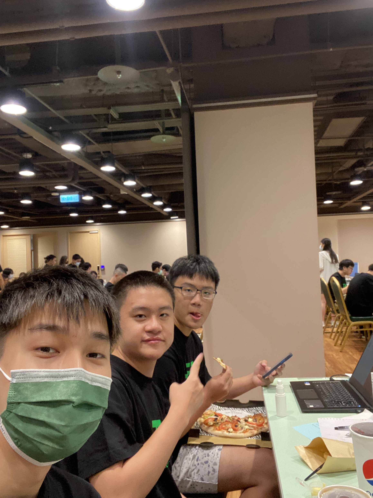

到了現場，我看到好多讀書會的學長，還有好多聽過名字但從來沒見過的好友，全部整齊劃一的穿著那簡單卻又透出些許霸氣的 YTP 紀念衣（直至今日，2022 年的 YTP 紀念衣的設計還是我有的裡面我最喜歡的），著實是個令人印象深刻的場合。現在回頭仔細去翻閱我當初隨手拍下的照片，發現當年社恐的我不敢交流的陌生人，在三年過後居然變成了常常跟我聊天和吃飯的系上同學或學長。看似將會各奔東西的合影，最終竟然會收斂於一點，緣份這種東西還真是奇妙啊。

由於系統好像燒機了一陣子，那年的比賽好像延後開始了一段時間，在過了比預計多了一個多小時候比賽還是開始了。

在開始後，我們也如我們預計的，跑去瘋狂拿免費的食物和~~順便~~寫題目。那個時候的我基本上是真的菜到沒剩，把簡單題寫掉後基本上應該都在靠隊友輸出。最後令我們挺意外的是，我們好像其實跟下一個階段的錄取線只有一步之遙，我們都覺得很可惜，不過我們也還年輕啦，明年再戰也行！今年有拿個證書蹭一下就行啦……？

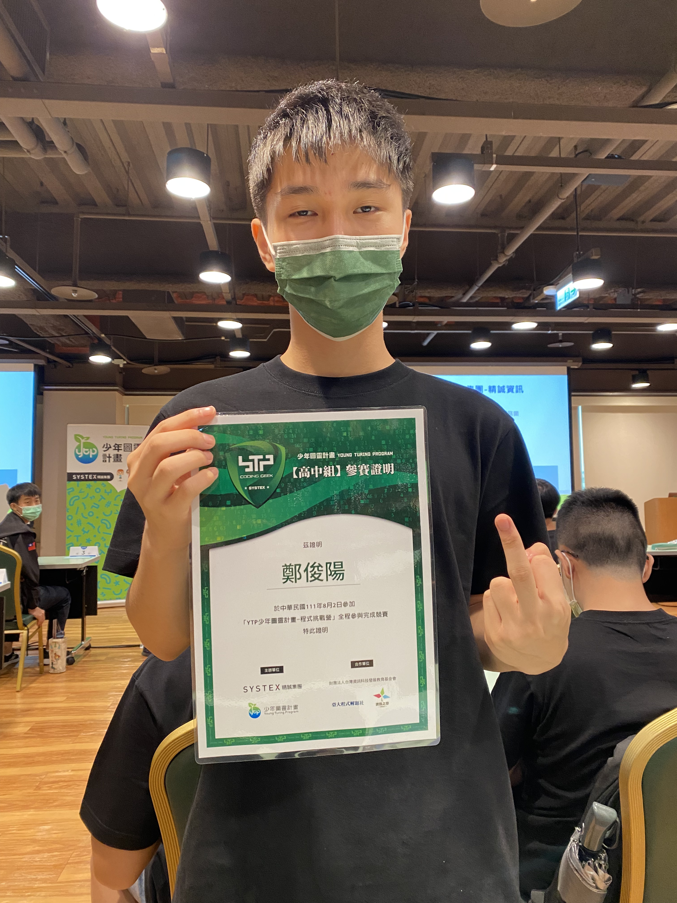

有個叫賴泓安的大聰明把我的名字打錯了。

為什麼會發生這種事呢？原來他們在報名時我跑去上廁所，他們懶得等我就幫我把名字打了，但很遺憾沒有打對。這件事情讓我跟賴泓安都學到了寶貴的一課：我學到千萬要親眼確認報名表單上的名字是對的；賴泓安學到不要把同學的名字打錯，不然同學會灰心與不值（X。

還好 YTP 的人很好，應該是 Irene 吧，跟我說把正確的名字跟家裡的地址給他，精誠會幫我把正確的參加證書寄到我家。

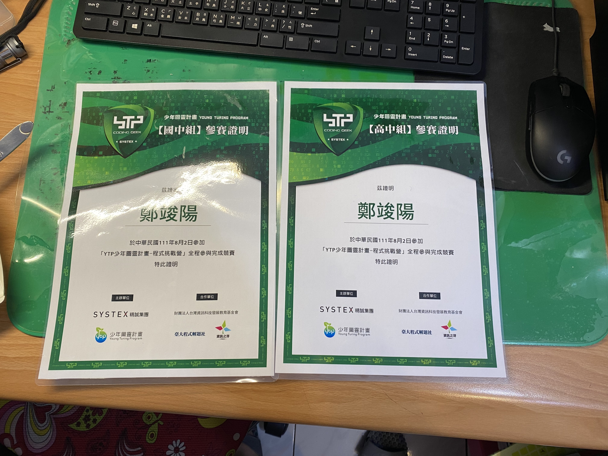

可以自己猜猜後來發生了什麼事。

## 一年努力後的捲土重來

### 夢醒後的暑假

如夢似幻的高二結束了，那是一段充滿挫折和挫折的歲月，但著實是我人生中最快樂的時光之一。很快，我們就要面對大多數高中生們的第一個大挑戰：學測。在那之前，我們還有很充足的時間享受開始戰鬥前的暑假……才怪。那年的暑假也是挺折磨人的，暑假的第一周就是我高中生涯的高潮，地奧決選營。看過我的[高中三年回顧](https://cy-cheng.github.io/posts/reflections/我在建中數資的那三年/)的應該都聽過知道，那是我人生中最痛苦的七天，心力交瘁，兩年的努力落得一場空，我花了好大一段時間才振作起來。

回歸正題，經過一年的洗禮，我和班上的同學都成長了很多，今年我、陳澔樂和賴泓安原班人馬再度挑戰第二年的 YTP，今年我們以進入專題階段作為目標前進。今年我們合作整體比去年順利不少很順利的就通過了初賽。到了複賽，雖然還是有卡題目，但我們做出的題目顯著的比去年多了許多，我還做了一題場內好像只有不到 10 隊做出來的構造題，還蠻爽的。

但不知道是我們其實沒有我們想像中強還是對手變強的比我們還要快，我們最後的名次其實沒有很好看，在一個不上不下的名次，不過我們問了學長後聽說好像能夠進入專題階段，真是有驚無險。除了我們之外，和電研的蔡孟衡學長和蔡嘉晉學弟組隊的吳亞倫也進入了專題階段，就這樣我們班上共有四個人一同在學測前夕開始搞莫名其妙的專題。

### 都什麼時候了怎麼還在搞專題阿

明明學測近在咫尺，我們卻又再拿到一個專題，~~我們顯然是高二專題成發完太爽所以想再做一個吧~~。我想說高中都沒有碰資安的東西，感覺學點資安挺不錯的，所以我們決定找臺科大的鄭瑞光教授來當我們的指導教授，同時不約而同的吳亞倫他們也決定找鄭瑞光教授做專題。

雖然說教授有一部份的專長是資訊安全跟通訊，但其實 YTP 的專題完全不用跟教授的專長有任何關聯，只要是個有趣且有用的題目就好了。但倔強的我們仍然在壓力山大的狀態下決定要繼續學習新東西，教授給了我們一些關鍵字，讓我們從這些關鍵字去學習，基本上就是教授的研究領域和教授的課程裡面的內容。我是個學習挺慢的人，從很早以前我就有自覺，比起那種能夠看一章就懂一張的人，我學習的步調比較像是得要看完整本書並在一知半解的狀態下寫過一些練習題後，才會突然：「啊，我懂了！」的那種人。很顯然的，教授給我們關鍵字後不會給我們課本，就算給我們課本我們也不可能讀懂或讀完。所以我們最後就想：「竟然這個這麼難讀，那我們不如做一個網站教別人怎麼讀，這樣一定很棒」。

我們最後決定做一個互動式的靜態網頁，內容是有關我們查到的通訊相關的資料做成簡單易懂的視覺化形式讓讀者去學習。我們甚至選了一個基本上沒什麼人在用的網頁框架：Svelte，陳澔樂說寫那個可能會找不到工作，因為他太簡單之類的。當時他說的這番話有沒有道理呢？我覺得還是挺正確的，畢竟我上大學後還真的沒有聽過任何一個人用過 Svelte（~~除了我跟陳澔樂在系統組面試某個叫做賴泓安的同學的時候~~）。

你如果仔細想想的話就會發現，其實我們做的東西根本就跟一個會動的筆記本聽起來沒有太大區別，而實際上也確實是這樣，我基本上只負責了做動畫的部份，唯一的收穫大概是我學了一點點 AI 吧（這裡指的是 Adobe Illustrator 哈哈哈）。如果放到我寫這篇心得的當下，我們的整個網站包含架構跟內容，大概只要 vibe coding 一個下午或頂多一兩天就可以做了吧。也不是現在的 LLM 真的強大到無所不能，現在的 LLM 還是沒辦法做出系上稍微難一點的作業，真的就是我們做的東西廢到哭。

到了發表當天，我們講完了我們廢到笑的靜態網頁報告後就開始讀學測或寫作業，但我還是分了點注意力去聽其他組的報告，發現大部分組別聽起來其實也都蠻廢的（可能是以我現在的角度去看就是了）。在一群感覺不知道在幹嘛的組別之中，出現了一組從臺風到內容都讓評審為之一亮的隊伍：MochaGen。這是吳亞倫的隊伍的主題，在吳亞倫的三寸不爛之舌（？）下，他成功讓評審們感覺他們做出了一個有實際應用價值而且很多人會想要用的程式。

公佈成果時，我們毫無懸念的沒有得獎，不過我們也不怎麼在乎啦，反正有拿到獎學金就好（X。與我們形成強烈對比的是鄭瑞光教授的另外兩個組別，吳亞倫他們拿了第一名，另外一組也拿了第三名。教授成了最大贏家。

在這之後，吳亞倫甚至通過了最終選拔，拿到了去 Berkeley 參訪的資格。那時的我很是羨慕，雖然對他來說可能只是「又一次的美國行」，但這對我來說很有可能是一生只有一次的難得機會。

我多麼希望自己也能獲得這種機會，但這終究只是個夢想，我不覺得自己能想到這麼有趣的主題，也不覺得我能夠在臺上流利的表達獲得評審的青睞。

## 隨心所欲的最後一舞

### 突兀至極的關鍵隊友

高三了，大家都開始準備申請大學了吧？大家應該沒時間做其他事了吧？你想多了，叱吒風雲的陳彥臻可不是這樣想的。陳彥臻是我們班上的傳奇人物，他是那種你會在漫畫中看到的，大家腦中會想像的「典型天才」。高中的時候他曾經同時通過過數學、物理、化學、生物、英文五科免修，這是一件多困難的事情？我高中總共也才通過四科不同的免修，他一個學期就通過了五科。如果說我的通過免修是因為我的能力已經等同於修完這門課的水準，那麼他通過免修是因為在建中能拿到關於課程的最高榮耀只有免修。還不只這樣，他還在高三的時候同時當上了生物跟化學的校隊，在很多人都為了卷上醫學系的建中，這種人更是少見。更扯的還在後頭，他甚至還在高三的時候進入了生物跟物理選訓營，簡直不把大學申請放在眼裡。明明他也得要去面對最麻煩的醫學系二階的，但他還是攬了一堆東西在身上，真是令人驚嘆。

為什麼我要在這裡提到他呢？那當然是因為他的豐功偉業遠遠不止於此啊。除了以上這些非人類的漫畫成就外，他還在高三時從頭開始學寫程式，並且在半年內就考到了 APCS 5/5 的滿分成績。雖然高三了吸收力確實會比較好，而且身邊有一群都考過的同學手把手教效率比自己慢慢探索來得快多了，但那姑且還是一個對一般資訊學生來說很有鑑別度的測驗阿。

果然，努力在天賦面前絲毫不值得一提。

他能夠在如此短的時間內學會寫程式跟基本的演算法很大一部分是賴泓安的功勞。於是手把手教會他的賴泓安決定當他那年的 YTP 隊友。當然，要找他的話勢必不會太認真打，找個剛過 APCS 的人打比賽想去 YTP 拿名次還是頗有難度的。

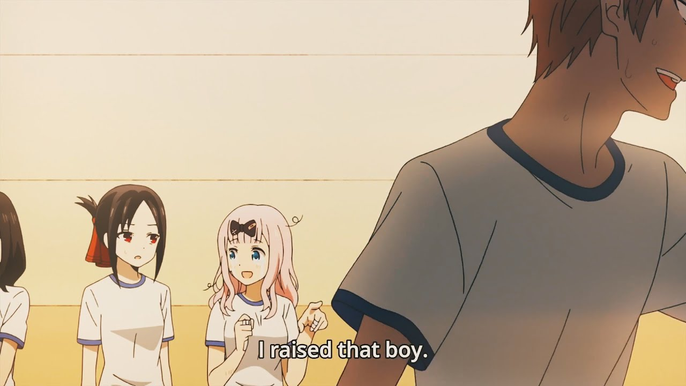

不過那時賴泓安已經差不多決定要去京都了，而我也是望著 NUS 蠢蠢欲動，我們想要去國外意味著我們很大機率不會參加最後的專題階段。「既然目標只是要吃 pizza 而已那跟陳彥臻一組也挺不錯的吧」我這麼想著。

於是，我、賴泓安和陳彥臻三人組成的黃金陣容就形成了。目標是今年能夠跟陳彥臻一起吃披薩。

### 程式競賽 101

那年的 YTP 可以算是我跟賴泓安高中生涯真正意義上的最後一場程式比賽，也同時是陳彥臻的第一場要跟別人競爭的程式比賽。作為多年比賽的老手，我們可以說是不慌不忙，我們隨便在建中找了一間無人使用的空教室，在裡面打開電燈跟電扇後便開始比賽。我跟賴泓安在開始前簡短的跟陳彥臻說了一下等等比賽的流程後便開始分配題目。三人認領好題目後，我們就順順的把拿到的題目做掉，而陳彥臻也成功的把分配給他的題目給解決了。

就這樣，我們順利的進入了複賽，陳彥臻的 YTP 紀念衣跟免費 pizza 也是手到擒來。

### 複賽和複賽的交響曲

這是我們的預想，但計畫終究趕不上變化。我們高三畢業後比了我們的最後一次智慧鐵人，這次我們大致上延襲了之前的隊伍配置，隊員有胡軒綸、洪浩烜、劉允中、賴泓安、我、陳彥臻。等等，後面三個人是不是好像重複了？畢竟陳彥臻什麼都會嘛，對於希望能夠拿到闖關王的我們來說陳彥臻是個班上基本上無出其右的強力打手，因此我們把他招募進來完成闖關王大業也是合情合理的。

但我們遇到了一個小小小小的**大問題**：智慧鐵人的複賽跟 YTP 的複賽有一段時間根本是重疊的。如果今年複賽辦在世新大學的話，我們可能還有機會等結束了立馬衝到會場。但很遺憾的，這次的智慧鐵人辦在暨南大學。

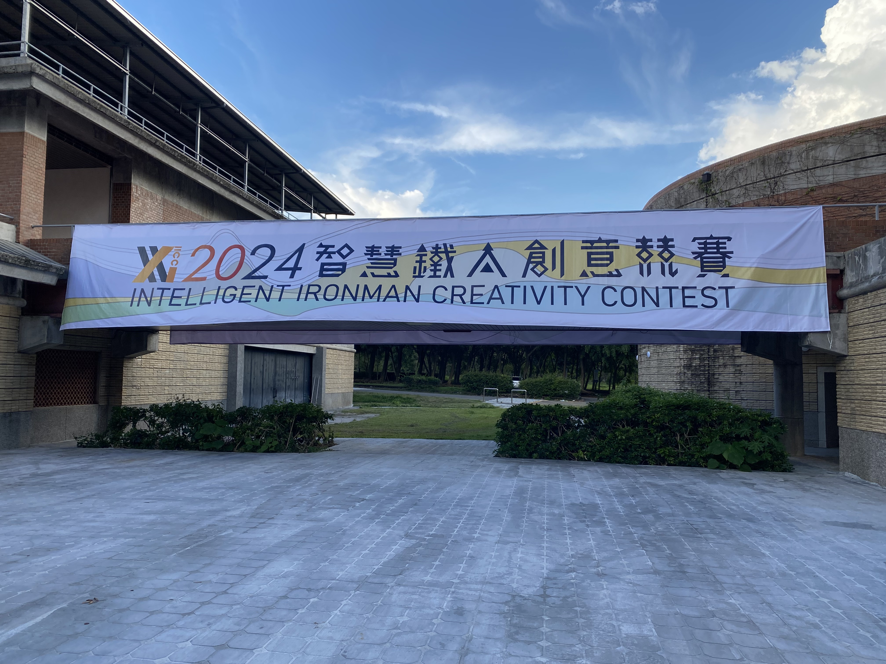

> 為什麼我們今年辦在暨南大學呢？原因很簡單，我們沒錢了。

智慧鐵人計畫主持人劉格非教授，在暨南大學的副校長前面致詞時說道。

看到這裡，你可能還不知道暨南大學在哪裡，所以不知道事情的嚴重性。暨南大學座落在南投的山間，距離最近的高鐵站有一個半小時的路程，甚至是在能坐到直達的客運的情況下。我們勢必得要向智慧鐵人請假，在凌晨五點便驅車返回臺北參加 YTP。但這又有一個問題：我們不能三個人都請假。根據智鐵的規定，至少要四個人才能構成一個隊伍，在比賽的任意時刻只要隊伍不滿四人即失去資格。因此我們得要面對一個大問題：要把誰留在南投？我們（指我跟賴泓安）真的很想讓陳彥臻體驗 YTP 的好吃好玩的，但我們也很希望能夠拿到最後的專題資格。討論了很多之後，我和賴泓安決定兩個人殺回臺北比賽。

為了向隊友彌補我們最後的關鍵六個小時的缺席，我跟賴泓安幾乎沒有睡覺的繼續幫忙我們的複賽主軸進度。在凌晨五點時，我們開始收拾行李，找專門的人帶我們下山。我們在最近的客運停靠站的路邊，拖著自己的行李箱，狼狽的站在路邊等著。

那時是六點零七分，我們拖著疲憊的身子望向車道看見了一臺四位數的客運朝我們開過來。如同導航寫的，客運上的 LED 燈寫著「臺中高鐵站」五個大字。我們興奮的向他招手，司機看著我們，用不好意思的眼神看著我們，向我們揮手。

　

　

　

*那輛客運從我們面前呼嘯而過。*

傻眼的我們不知所措，我拿起我剩餘電量不多的手機確認，賴泓安則再度看向了站牌。我們再三確認那班車確實是我們要搭的車，亦是我們前往臺中高鐵站的唯一選項。下一班車將會在 30 分鐘後到來，但我們仍忐忑不安。「為什麼他剛剛不停？」、「我們到底來得來不及？」、「難不成我們白跑出來了？」種種煩躁的念頭縈繞於我們的腦海。我們也想像不出更好的解決方法，在這種地方等計程車也根本等不到。

我們兩個加起來剩下的三個腦細胞做出了等待下一臺車並且祈禱下個司機會停下來的這個不怎麼明智的決定。

在冷清的鄉道上，我和賴泓安繼續罰站了三十分鐘。手機上的車況顯示從「三分鐘」轉變為「將進站」，我們拿出體內的最後一絲精力全神貫注的盯著呼嘯而過的來車。

「來了！」賴泓安提醒我。

我跟賴泓安開始奮力的招手，彷彿整個人要跳到車道中間似的。一開始那臺車的司機甚至沒有注意到我們，在快開離開站牌的瞬間突然往路肩減速，我們心中的重擔終於被放下了。

坐上我們的座位後，精神被耗散殆盡的我們倒頭就睡著了。

我聽到客運的廣播，從睡夢中甦醒。我們已經到達終點站了，我看向手機，才剛過八點不久。和過去暨南大學的接駁車走的路線不同，我們在某個陰暗的客運站下車，起先我有點懷疑，不過進到建築物後天花板上懸掛著的標示告訴我我們來到的是貨真價實的臺中站。在買了兩張自由座的票和飲料後，我們便搭上了回臺北的高鐵。

回到臺北車站時已經九點多了，但離 YTP 的報到時間還有兩個多小時，不知道要去哪裡而且餓壞的我們在臺北車站外拖著行李四處遊走，最後，我們決定去麥當勞買個點心。因為不常吃麥當勞，我花了很多時間才決定我要買一個蘋果派，回到座位等到餐點送來後，我開始慢條斯理的享受這片刻的悠哉。等我吃完後，我發現賴泓安已經倒在桌上開始呼呼大睡了，而我在那不久後也倒在麥當勞的桌子上。

一個半小時候，賴泓安把我搖醒，慌張的跟我說快要遲到了。於是我們就再度拖著行李去尋找能帶我們到比賽現場的公車。

到了比賽現場，兩個臺北人在一個於臺北舉辦的比賽向主辦單位申請交通補助，場面十分溫馨。Irene 走過來問我們我們今年的另外一個隊友在哪裡，在我們回答後他用著一臉疑惑的表情看著我們，並給予了我們加油。

比賽的現場一如往常的熱鬧，甚至可能更熱鬧了。但我沒有多去社交，跟陳澔樂和吳亞倫簡單寒暄過後我跟賴泓安就回到我們的座位開始倒頭大睡了。

於朦朧之間，我聽到了比賽開始的宣告。現在，是兩個 36 個小時沒有好好睡覺的人對決一份該給三個人寫的程式比賽題目。雖然我們的精神狀態理論上應該是奇差無比，但實際上我們卻打得還挺順的，整場過程就是賴泓安寫一題，debug，然後我寫一題或 debug，這樣順順的寫下去，沒有遇到不會做的題目，基本上都順順的寫下去。在過程中因為少了一個人，我們不是太敢去拿吃的，但還是意思一下拿了一些可以乾淨手持的時候邊寫邊吃。

就像最後一年的 NPSC 一樣，我們做完了自己能做的所有事情，剩下的就是聽天由命了。不過與 NPSC 不一樣，我們這次沒有被刷掉，我們甚至打出了我們三年來最好的成績，好像是 14 名吧。比完之後，我們整個人都興奮起來了，因為我們沒想過可以打這麼好，本來的疲憊也都瞬間被拋諸腦後。我們之後跟 Irene 要了陳彥臻的紀念衣，就這樣，陳彥臻在沒參與到整個複賽的情況下進入了 YTP 專題階段。

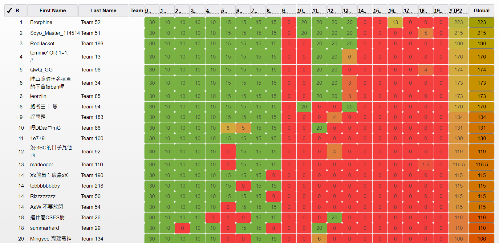

我跟賴泓安不是要出國嗎，要怎麼做專題？

說來可笑，因為一些複雜的原因，像是電機系主任的 Mövenpick 招待，賴泓安最終選擇了放棄京都大學資工系留在臺大讀電機（唉，腦波弱 XD），這可能是他做過最正確也最錯誤的決定吧。而我雖然拿到了 NUS 的全額獎學金，我當初最夢寐以求的的 offer，但我最終也是因為一些理由留在了臺大。

往好處想，陳彥臻的 YTP 專題有隊友了！（雖然他這時候還在南投，根本什麼都不知道）

### 黃金三角

就這樣，很早以前沒有打算要做專題的三個人莫名其妙的開始了他們大學的第一個專題。

我們在看過了和 YTP 的合作教授名單後決定找電機系的林澤教授當我們的指導教授。林澤教授的主要研究領域有金融科技和智慧醫療，非常符合我們三個人的背景（雖然我們才剛進大學而已讀什麼科系根本沒差哈哈哈）。

剛進去後，我們便開始每周跟實驗室的其他學長姐還有一些 YTP 的工作人員一起開會討論專題進度。會議的形式都是實體，在德田館旁的博理館舉行，而且每次 YTP 的人都會帶晚餐來給我們吃，~果然 YTP 是個蹭飯仔的夢幻活動~。比起去年，我們的會議頻率可以說是大幅提升了。去年好像一個月才一次吧，雖然因為要處理學測聽起來是個很好的理由，但實際上我覺得其實大學比高三忙多了（也有可能是因為我選了太多學分的關係啦）。

一開始的前幾周我們主要在做一些資料的蒐集與主題發想，由於我們三個人其實都對怎麼想出一個好題目沒什麼概念，所以我們的策略是每個人都想一些然後開會的時候拿給教授討論。其中一個我想的是「影片的德文字幕文法風格上色」之類的東西。會有這個想法是因為我那學期選修了德文，發現德文的文法很$\overset{噁\ 心}{嚴謹}$，但是其實是有一些很有意思的規則，加上從我以前學習英文的經驗，我認為如果在看影片的時候能夠自動生成字幕並且把文法結構標示出來的話，應該會是一個很不錯的學習工具。教授聽完後覺得這個想法挺無聊的，沒有發揮我們三個人的招牌。他跟我們建議，既然隊伍中有醫學系的同學，應該要想想跟醫學相關的東西。畢竟他是做智慧醫療的教授，這是十分合理的建議，這樣實驗室的學長姐也能夠給我們更精確、專業的建議。

由於最近 LLM 真的太夯了，一個很自然的方向就是去探索 LLM 在醫療領域的應用。不過那時候的一大問題是 LLM 技術還沒有成熟到可以被接受在臨床上作為輔助工具使用，如果做出來要怎麼跟評審交代東西的正確性和可靠性會是一大難題。所以教授建議我們可以從比較貼近我們的方向去下手，於是我們決定做一個「醫學生訓練系統」，希望能夠透過虛擬病人讓醫學生能夠在沒有真實病人或是某個老師之類的專業演員的條件下練習病歷詢問和診斷的能力。

在老師的引導下，我們成功定下了一個感覺還不錯的題目，這是我做過這麼多專題以來第一次定下一個同時感覺有用又能做出來的東西，感覺還挺不錯的。

接下來，就是漫長的奮鬥了。

### 全力以赴的大一上

大一上學期，報著「都留在臺灣了我就要卷到爆拿卷」的想法，我選了 23 學分（本來應該會到甚至 25 的，但我剛好微積分 2 免修），還在沒學完微積分、線性代數和機率的情況下去修了軒田教授的機器學習還有 ICPC 培訓班，基本上我那整個學期就是在每周被輪番上陣的作業暴打。在這種情況下，我這邊的進度其實沒有很多，除了找出一些基本的系統架構然後開始寫基本的網站外，我其實沒有花太多時間在讀相關的文獻或資料上。

賴泓安跟陳彥臻也是都相當忙碌，陳彥臻更是特別傳奇。他還加了桌球的系隊還是校隊之類的，然後每週都要團練。可能是行程塞的太滿了吧，導致他常常忘東忘西的，開會的時候他不只一次忘記了會議時 YTP 的人會帶晚餐過來，所以自己手上拿了一袋摩斯漢堡進來會議室，然後問為什麼桌子上有一包摩斯……。

雖然我說進度沒有很多，不過每次開會前我們總是會為了不要看起來很醜所以硬生了一些進度，再加上跟助教們的討論，我們的系統還是有在慢慢變好。而這時每週開會的好處也逐漸體現出來了，因為每週都有進度報告，也就代表每週都有更新，所以經過不斷的迭代系統也真的有越來越好。

### 最後衝刺

大一的第一個學期結束了，但我的戰鬥還沒。

寒假的第一周，我和高中同學們一起去了臺南玩。但培訓班的加分作業死線還沒結束，所以在同學們在分享他們的瓜的時候，我在自己的床上邊聽瓜邊寫模擬退火的介紹……。除此之外，我們的專題也還在以兩週一次的頻率開會。如果以高中生的角度去想的話會覺得很奇怪，那不就是開兩次會而已嗎？但其實大學的寒假比以前長得多，所以好像開了三四次會。其中就有一次是在我們去臺南玩的時候開的，看著班上同學看著我跟賴泓安共用一個手機跟教授通話，那時感覺自己真沒有生活。（誰會想到這樣的生活未來還得要繼續呢，唉）

寒假後面還有一次我跟國中同學寧家楨還有王鶱華一起去花蓮玩，一樣也是撞到了開會時間。這次更糟糕的是我們不只在出去玩，我還在花蓮騎摩托車的時候感冒了 ==。所以我就拜託賴泓安幫我輸出，自己想辦法擠出一點東西就下線了。

寒假結束後不久，又再次到了最終報告的時間。有了上次的的失敗經驗還有觀摩別組成功博得評審青睞的經驗後，我們這次決定要好好準備我們的簡報。我跟賴泓安甚至約了幾天在系館把簡報的每個細節跟圖片都調整到最好，我還想了一個非常瞎趴的名字給我們的系統：「PaTiENZ」，同時代表 patience、patients 和強調 AI，我覺得挺帥的。之後我們甚至還約了一間討論室跟陳彥臻一起練習簡報（可能是陳彥臻此生少數練習過的簡報）。這大概是我這輩子第一次這麼認真的準備簡報吧，其他的簡報我大概都是把投影片做完然後想個大概要怎麼講就上台了。

但願，我們做的一切努力不會白費。

## 跨越那世界線

到了期末報告的那天，我們自信滿滿的站上了精誠的演講臺，然後差點燒機（Ｘ。我們對於時間的管控還是沒有到很好，所以到了我的部份我就開始瘋狂加速，還好後來在可能在時限五秒內講完了。
在那之後我們就只能開始看別組的報告並且等待評審給出結果了。我覺得整體而言今年的組別感覺都比去年強上不少，陳澔樂的組別感覺也挺有料，雖然我不會彈吉他，但感覺挺厲害的。不過我認為我們的主題跟 presentation 應該也算是有不錯的水準，前三名應該沒有問題。

所有人都報告完後又過了一段時間，在我又到後面收割第 n 輪免費食物後，主持人做出了要開始頒獎的宣告。

第三名是林澤教授帶的另一組，建中科學班高二的學弟。

感覺……我們有機會第二名喔？

主持人公佈了第二名的特徵：
「吉他樂譜生成的組別」，是陳澔樂他們的主題。

　

　

那我們呢？

我幾乎覺得我們應該是第一名了，但心中還是有一絲絲的害怕，會不會我們其實沒有連名次都沒有？

我的心臟幾乎要跳出來了，主持人終於說出了第一名的隊伍特徵：
「醫學生訓練系統」，是我們的隊伍！

心中懸著的大石終於落下，我們成功了！

高中三年，我追逐著「第一」的封號，然而我從來沒有接觸過它。別說是比賽的第一名了，我很多的比賽連晉級決賽都沒有辦法。在班上的成績也是從來沒有拿過前五名。上一次拿到「第一」的榮耀，應該已經是國三的時候了吧。能夠拿到我暗自渴望許久的第一，真是太好了。

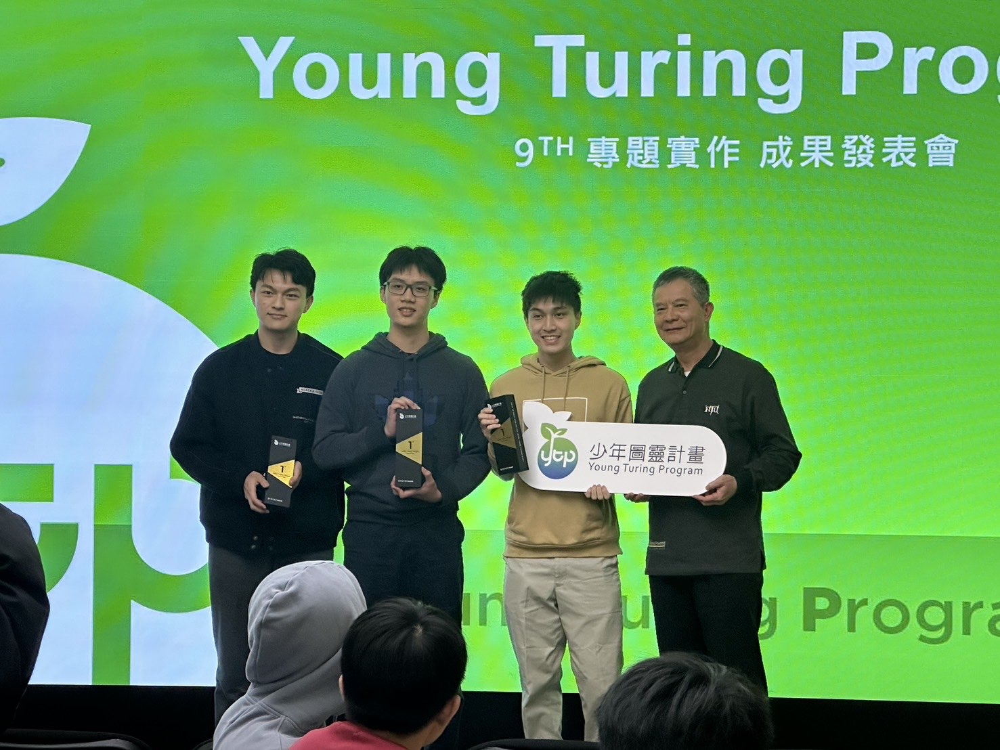

不過，這其實還不是結束。

### 決賽以後的世界

其實，我當初渴望的並不是第一名，而是去 Berkeley 的機會。在我聽到王政凱和王培軒他們獲得去 Berkeley 的資格之後，我就好希望我也能去美國看看這個世界。

不過要去 Berkeley 不是那麼簡單的事情。YTP 通常會邀請前三名和表現優秀的特定組員參加「最終選拔」。我其實不確定這是不是有個特別的名字，因為這其實已經到了官網上沒有寫很清楚的階段了。當初我會想要很想得到前三名其實是因為這基本上保證了我能夠獲得參加最終選拔的資格。

由於去 Berkeley 的參訪主要是要參加一個創業營隊，所以最終選拔的內容就是要提出一個 15 分鐘的創業 idea 簡報，講一個你有熱情並且覺得能夠受到青睞的創業 idea，而且要用全英文簡報。好在我認為自己的英文應該還算不錯，所以只要我能夠想出一個足夠好的 idea，我應該就有機會。

那麼，我要用什麼來作為我的 idea 呢？懶惰如我當然是不可能再想一個新的題目啦，所以我決定要用當初被林澤退掉的題目來改一下，作為我的最終選拔題目。YTP 其實有跟我們說 PaTiENZ 其實可以繼續當創業用的主題，但我想說可能賴泓安或陳彥臻會想要用，而且我也很想要證明自己的主題是有人喜歡的，所以我決定用我自己的題目來參加最終選拔。

這個最終選拔的簡報也是有個非常傳奇的故事，而且又跟智慧鐵人有關了。這次是因為我~腦波弱~報名了智慧鐵人的關主，代表我學期中要去當某場初賽的裁判。我抽（搶）到了臺南場。本來我想說蹭到免費出去玩的機會很爽，結果後來發現火車票根本訂不到。去程的時候還好，我搭到了有自由座的自強 3000，很舒服的到了臺南。但回程的時候就慘了，我根本訂不到回臺北的車票，只好硬著頭皮搭自強號的自由座回去。結果當天回臺北的自強號居然大爆滿，我根本沒有位子坐，我就這樣站在自強號上站了三個小時，然後還要在車上準備我的最終選拔簡報。

不過還是姑且把簡報的進度推了不少。回去後我又再用了不少時間把簡報跟自我介紹影片做完，然後在死線過後把東西交上去了。（對，我從很久以前就有遲交東西的壞習慣 XD）

### 最終選拔

那一天終於到了，我帶著我的筆電到了精誠的古亭辦公室，參加我 YTP 生涯的最後一個考驗。

我是我們班第一個報告的，有點緊張，但我相信只要好好講話然後引導他們去問我我會的問題應該就還行。我和預計的規劃一樣完成了我的簡報，結果馬上就被評審說我頭重腳輕，前面的 motivation 講太多了，後面的技術跟商業模式講太少了。不過我其實覺得我就是要這樣講他們才能夠被說服說我的這個主題是個還不錯的主題，所以可能其實還不錯。

大部分的評審對我的題目其實沒有什麼意見，有可能是他們對於其他語系的語言沒有什麼概念~所以被我唬得一愣一愣的~ XD。甚至有一個評審對我的主題很有興趣，後來還跑來跟我聊天。

### 突如其來的創業夢？

在結束報告後（這時候結果其實還沒公佈），一位評審透過 Irene 聯絡上了我，說他對我的題目很有興趣，想要跟我聊聊。他跟我說覺得我的題目很有潛力，因此希望能夠跟我合作，由他指導我來把這個 idea 做成一個真的新公司之類的。他給我看了一個 AI vibe coding 出來的簡單框架，跟我說用 vibe coding 就能做出很不錯的東西了，希望我能以這種方法去推進我的 idea。在那之後我就跟他開了幾次會，把 codebase 做推進並且跟他了解一些其他創業相關的事情。

幾周過後，我終於收到了來自 Irene 的訊息，問我今年有沒有空去 Berkeley。那一刻，夢想成真了。

## 我來了，加利福尼亞！

### 前情提要

除了我之外，這次和我一起去 Berkeley 的成員還有陳澔樂，以及早我們一年拿到資格的吳亞倫和 Mars。

這次的參訪的行程大致上可以分為前半和後半。前半部份是參觀加州的一些公司還有拜訪一些精誠在加州的人脈，還有一部分的自由活動；後半部份則是參加 UC Berkeley 的 Method of Entrepreneurship Bootcamp（BMoE），一個五天的創業夏令營。在 bootcamp 裡面需要和其他人一起組隊報告一個創業 idea，所以在過去之前我就開始雕琢我之前說的語言學習 app，並在中間定期和那位評審討論我的進度。

自從我從智慧鐵人複賽回來後，我就開始期待了。第一次踏入合眾國，第一次在真正的全英文環境下生活，會是怎麼樣的呢？我腦中演算著無限的可能性，殷切的期望旅程快點開始。

### 啟航

8/12 早上八點左右，我們在桃園機場集合，搭乘長榮航空十點的班機飛往舊金山。前兩次和班上同學出國都是搭乘廉價航空飛往日本，跟這次有著強烈的對比。就像是劉姥姥進大觀園似的，我作為整團裡面唯一沒有去過美國的人，對於飛機上的一切感到新奇。剛上飛機我就拿到了一副有兩個插頭的耳機，完美的和我座位前方的螢幕旁的插孔匹配。這聽起來再微不足道的事情，卻是我未曾想像過的。由於剛上飛機的時候是臺灣時間的早上，所以我還完全不累，於是我便開始把玩我面前的螢幕，點開了一集名偵探柯南電影版來看。再過了一段時間，空服員給我送上了我人生的第一餐飛機餐。從小我便聽說飛機餐不好吃，因為高空的氣壓會使味蕾便得遲鈍。但當我吃下去後發現，感覺吃起來跟地面的餐點差不多，不知道是科技太發達還是我真的是井底之蛙哈哈哈。

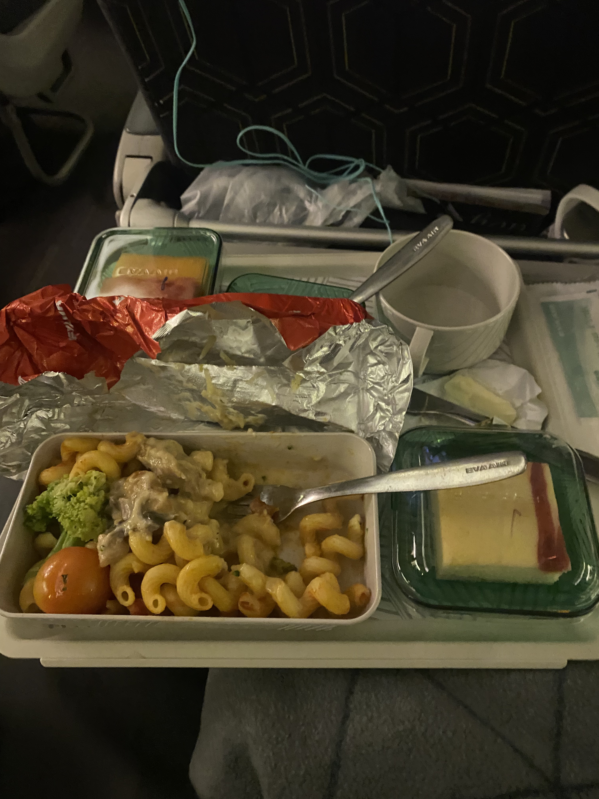

吃完飯後，其他常搭飛機的同學們都開始休息了，但我還處在亢奮狀態，於是我便開啟了座位螢幕上的遊戲場，開始亂玩遊戲。我找到了一個骰骰子的遊戲，明明很廢但我還是一直玩，玩到一個感覺滿高的分數。

玩了好一段時間後，我終於感到疲累，於是我便蓋上飛機附的毯子開始休息。

.

.

.

「好冷」。

我發現飛機比我想像中冷，雖然我有帶一件挺厚的外套，但我還是太低估了 -20°C 的高空溫度，我的短褲直接把我搞爆了。我別無選擇只好把毯子往下拉，盡可能蓋住我的腿，想辦法補點眠。

一段時間過後，我還是被冷醒了，還是維持一點精神身體比較舒服，於是我拿起我的筆電開始看命運石之門，同時等待下一餐飛機餐的到來。我之前不知道從哪邊看來的，跟別人打招呼的時候我就會說「嘟嘟嚕」，實際看了我才知道原來這是真由理的口頭禪。會在這個時候知道，看來這一切都是命運石之門的選擇。

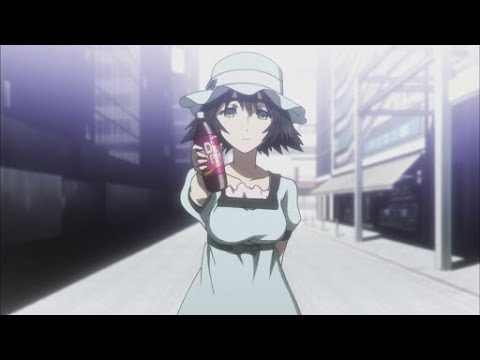

吃完下一餐也挺不錯的飛機餐後，我便繼續看命運石之門，並等待飛機的降落。

### 抵達 SFO

加利福尼亞時間 8/12 早上六點左右，飛機絲滑的降落在舊金山國際機場。真不可思議阿，在 8/12 的十點起飛的飛機居然在 8/12 的六點降落了，好像時間跳躍了一樣。明明這是經歷了十二年義務教育的我早就得知的必然結果，但親身經歷的時候感覺還是挺不一樣的。

下飛機後，我們便往海關前進，準備入境美利堅合眾國的程序。還沒看到海關人員，就已經有滿滿的人潮映入眼簾，此時我的兩個旅伴突然以略帶嘲諷的口氣跟我們分道揚鑣，原來他們有美國國籍，可以不用跟我們一起排隊，太可惡了。不過後來迴轉壽司根本就把他們卡住了，所以最後我們還是一起在等行李。

入關之後，我們便走到機場的出口，準備叫一台 Uber 去我們的飯店。走出機場的瞬間，一股冷冽又潮濕的風迎面而來，那是一股在臺灣，或至少臺灣的夏天不會有的感覺。略帶溼潤的空氣和只有一個語言的路牌深刻的提醒我，我真的來到美國了。

### Google

~由於我是個社團幽靈~，我完全沒有參訪過任何一個 Google 分部，所以這是我第一次踏入 Google。剛進入園區的時候其實挺沒有實感的，我本來以為一進去就會有一堆 Google 外觀的建築，但我們進去的入口其實就一兩個簡單的標示而已。不過想想也是，又不是什麼侏儸紀公園，這裡是工作的地方，沒有必要多盛大。但其實問題好像是 Google 真的太大了，所以也沒辦法到處都做裝飾。再深入一點之後就有感覺了，七彩（好像是四彩）的大樓映入眼簾，旁邊排滿了彩色沒有上鎖的腳踏車。太瘋狂了，Google 居然有自己的 UBike，還不用錢。聽到整個 Google 有近 20 萬人，而這裡就有三萬多個人，跟臺大一樣多，我才意識到這個全球前五大（寫的時候應該是第二大了）的企業的規模有多誇張的大。

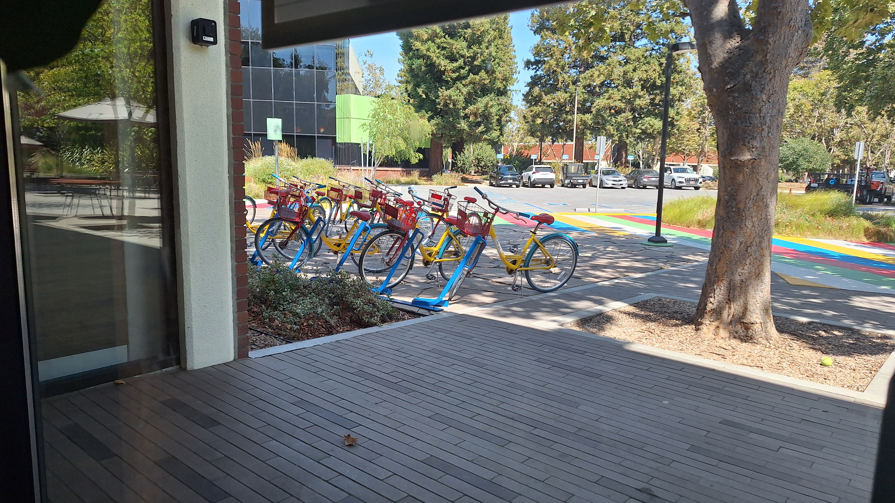

在園區裡面逛了一會後，我們就到了 Google 的食堂，Google 的食堂應該是我們去參訪的公司裡面唯一沒有結帳櫃臺的，字母公司還是太有錢了。之前聽學長說還會有哈根達斯可以免費吃，不過因為 Google 的餐廳太多了，所以我們好像沒有去到有冰淇淋的餐廳。吃完飯後我去了 Google 的廁所，我大為震撼：

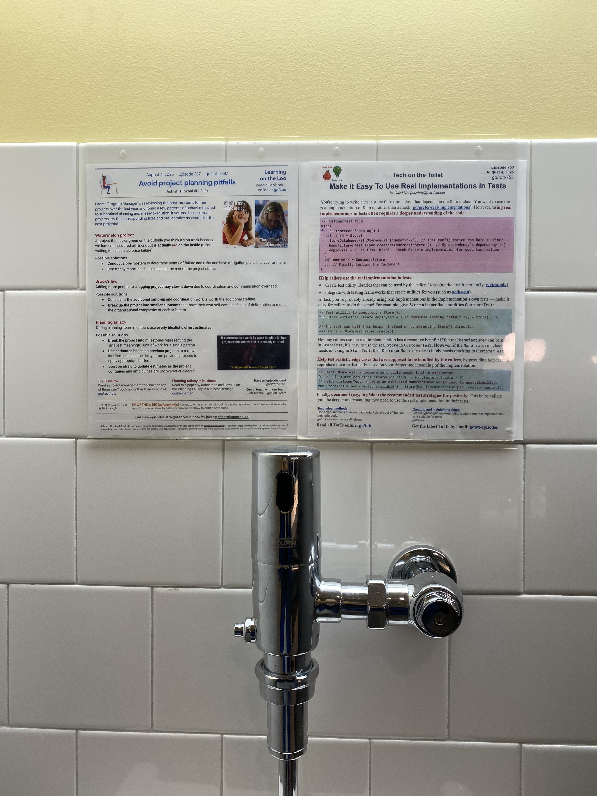

後來學長帶我們去坐了在灣區試營運的 WayMo，學長說 Google 的員工一週可以免費搭三次，他就讓我們用他的 quota 試搭了。WayMo  基本上都是由現有的車去改裝的，上面會放一個光達掃描附近的地形。看著方向盤自己轉動，感覺好像來到了未來一樣，電影一般的場景，居然在我眼前發生，灣區真的是個很有魔力的地方呢。

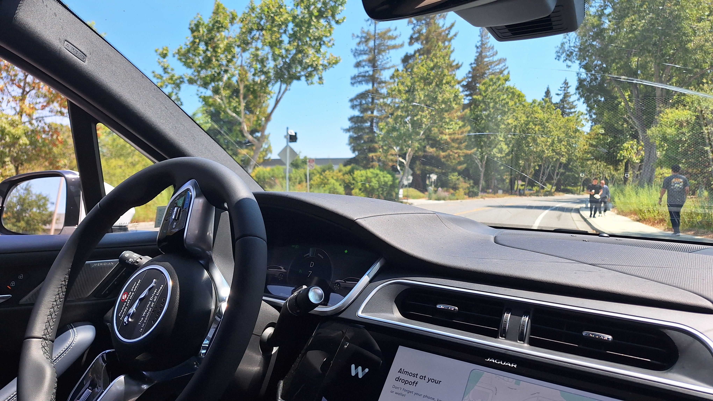

### 快閃 Stanford

在參訪完 Google 後，精誠派來帶隊的 Alice 跟他的老公（其實也是他們帶我們到 Google 的，但我決定寫在這邊）帶我們去 Stanford 讓我們自由活動了一陣子。Stanford 的校園非常的漂亮，搭配明媚的陽光跟清爽的空氣，是非常有生活的地方。真希望我當初有申請 Stanford，雖然申請了也大概不會上就是了。Stanford 美麗的校園，尤其是那個教堂，讓我至今難以忘懷，但願我總有一天能夠成為 松樹校徽的學生。

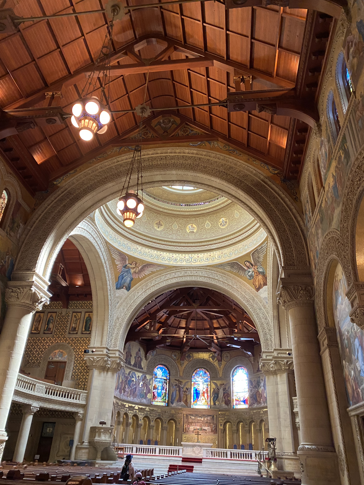

在離開之前，我們去 Stanford 的禮品店買了一些東西，這是我在美國第一次消費，整個禮品店逛過一圈，我發現大部分東西的標價好像跟臺灣差不多，只是幣值不一樣然後有個小數點而已……。我還是買了一件 T-shirt，因為酒紅色的衣服真的是太好看了哈哈哈。

### 大聯盟棒球賽！

回去飯店的路上，Alice 幫我們買了晚上在舊金山球場的棒球賽門票，那一天是地主舊金山巨人對聖地牙哥教士。這不只是我在美國第一次看棒球，其實還是我這輩子第一次進場看職業的體育賽事。我在購物區晃了一圈過後發現我再不買東西我就要餓死了，最後隨手買了個漢堡跟大蒜薯條就上去座位區了。

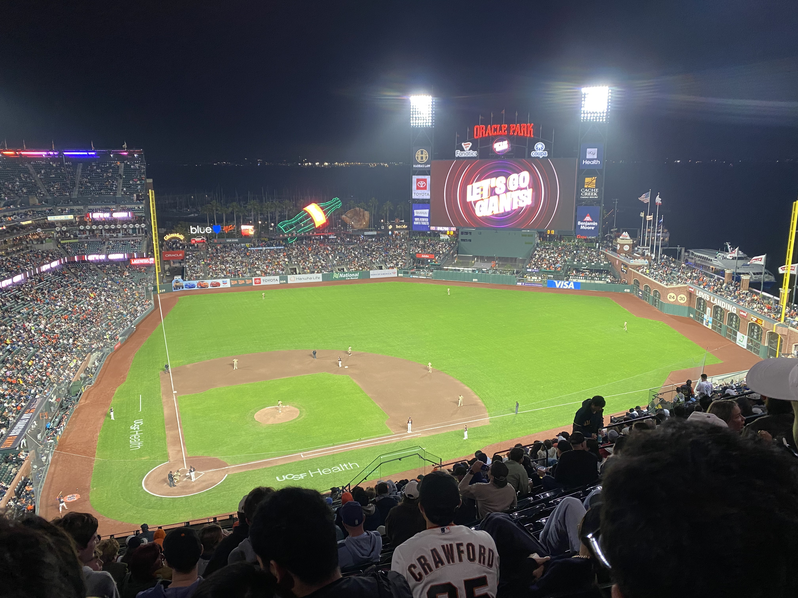

看臺是個幾乎可以說是一望無際的區域，總共好像有超過一百列（row）個座位，而緊鄰的看台的就是太平洋了，所以大家都很期待能夠有全壘打轟到海裡。不過實際的比賽其實有點讓人失望，就是看教士表演當巨人最嚴厲的父親。

### Plug And Play

Plug And Play 是矽谷規模名列前茅的創投加速器（accelerator），什麼是加速器呢？簡單的說就是幫助新創公司成長的機構，與加速器類似的還有孵化器（incubator），不過孵化器通常是提供比較早期的資源，而加速器則是幫助已經有一定規模的新創公司更進一步成長。除了跟我們分享他們作為員工的經驗外，帶我們參觀的員工也跟我們分享了一般新創公司的成長過程，以及作為一間 venture capital（風險投資公司）他們是怎麼評估新創公司是不是值得投資的。

### Apple

我們這次還有去逛 Apple 園區裡面的店面，其實就只是一家店而已，因為蘋果是出了名的不愛讓人參觀（聽說是他們的環境沒那麼漂亮但我不信）。去的時候我也去過幾家其他的店逛過或是買過東西了，我大概得出了以下結論：如果你把某個商品的標價的小數點丟掉（往右移一位）後覺得這在臺灣是個合理的價錢的話，那這大概就是一個在美國的 fair price 了。值得注意的是，Apple 的產品在美國的價錢其實跟臺灣是基本上一模一樣的（會因為匯率有點浮動但大致上差不多），所以你如果用我剛剛說的換算方法的話就會發現對於美國人來說 Apple 的價錢體感上是比臺灣人的便宜三倍左右的。這是個非常有趣的現象，給了我心中「Apple 憑什麼是世界上手機市占率第一」一個很好的解釋：對於 Apple 的大部分市場來說，Apple 的產品其實是相當便宜的。

### Nvidia

Nvidia 是我們這次參訪的公司裡面市值最高的了（X。剛踏入 Nvidia 園區我就見到了不愧為世界第一的公司的建築。猶如星際效應裡面的太空船的建築物分別叫做 Endeavour 和 Voyager，都是常見的太空船名稱，由許多三角形拼接而成的骨架和顯示卡的影像生成任務相呼應著。

這，就是世界上最大的公司。

帶我們參觀的是 Nvidia 的資深員工，我覺得最有趣的是他跟我們分享黃仁勳真的就像想像中的一樣，是個非常好的老闆。雖然跟他開會什麼的一定會有壓力，但他還是很親民的，甚至會有員工在公司的路上找他合照跟簽名之類的，蠻神的。除了這個之外他也跟我們分享了他在 Nvidia 工作的心境。「你在 Nvidia 工作了這麼久，應該早就夠你退休了吧」是我心中很好奇的一件事，在 Nvidia 工作的早期員工，他們拿到的股票分紅應該早就夠他們退休了吧，為什麼還要工作呢。他和我們分享其實很多的員工確實都已經賺夠錢了，但因為他們是真心喜歡他們的工作~還有沒有工作的話會很無聊~，所以他們願意繼續追隨黃仁勳在 Nvidia 工作。感覺我還是沒那麼有熱情阿，希望未來能有一個讓我沈浸其中的工作吧。

除了 Nvidia 的工作環境外還有一個讓我印象深刻的是 Nvidia 的員工餐廳。Nvidia 的餐廳也是需要自行付費的，但有員工折扣，一餐用十倍法則來看的話非常便宜，要吃飽大概 7~15 美金就有機會了。他們的員工餐真的很好吃，是那種如果在外面開一間店我會天天到的那種。

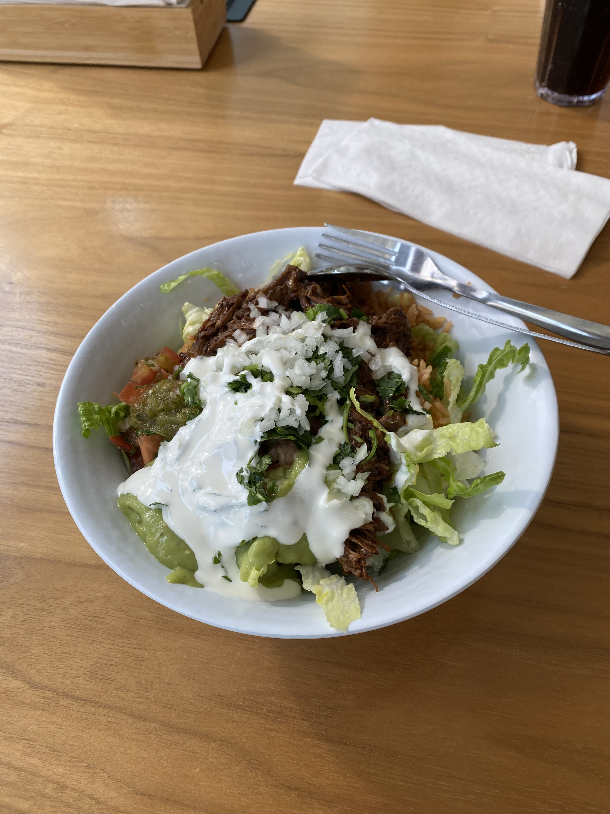

### 和創業家與投資人的餐敘

除了跟以公司員工的視角看矽谷外，我們也有跟高嘉良還有詹益鑑先生聊天。高嘉良先生曾經創過不少間公司，他和我們分享的創業會遇到的各種問題以及心得，讓我們從不只是從 high level 的投資者角度去看創業，還能夠了解作為一位創業者會面對的挑戰跟需要的覺悟。詹益鑑先生則是從投資者的角度跟我們分享他是怎麼看待一個新創公司是不是值得投資的。還跟我們推薦了一些他覺得的臺大課程，還說他認識我們其中一個人的爸爸（？），超好笑。

### 這都能遇到

看到我們的限動後，高中社團的同學蔡敦郁傳訊息給吳亞倫說他也在加州，甚至就在 Berkeley，於是我們就一起玩了一天。體驗了舊金山特有的 cable car 跟漁人碼頭，~我以前一直以為漁人碼頭只有臺灣有沒想到是抄的~。

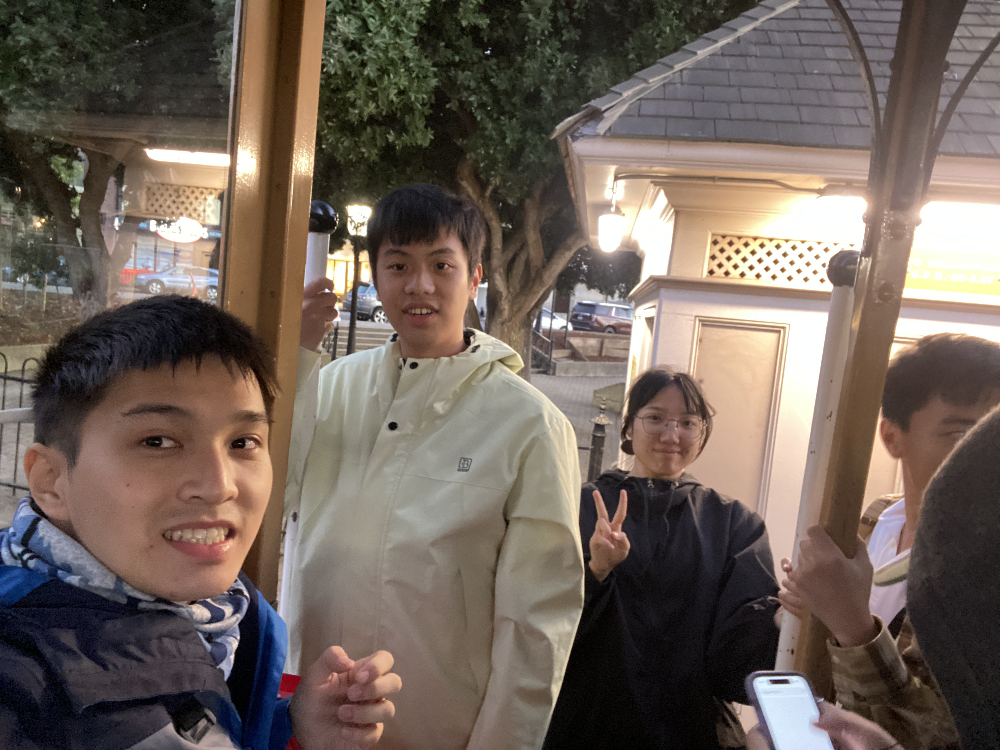

### 舊金山之旅

結束灣區的活動後，我們便驅車前往 Berkeley，在去 BMoE 前還剩幾天可以讓我們自由活動。所以天才如我們馬上搭火車回了舊金山去逛街，那邊的唐人街非常酷，真的非常的中化，感覺你不會講英文還是可以在那邊正常生活。那邊甚至還有國民黨的美國總部，還有滿街的青天白日滿地紅旗幟。看著滿街的正體中文標誌，我感覺好像回到了臺灣，心裡的思鄉情節也得到了些緩解。但走著走著，街上的旗幟慢慢的變成了五星旗，真是令人感到不甚唏噓。

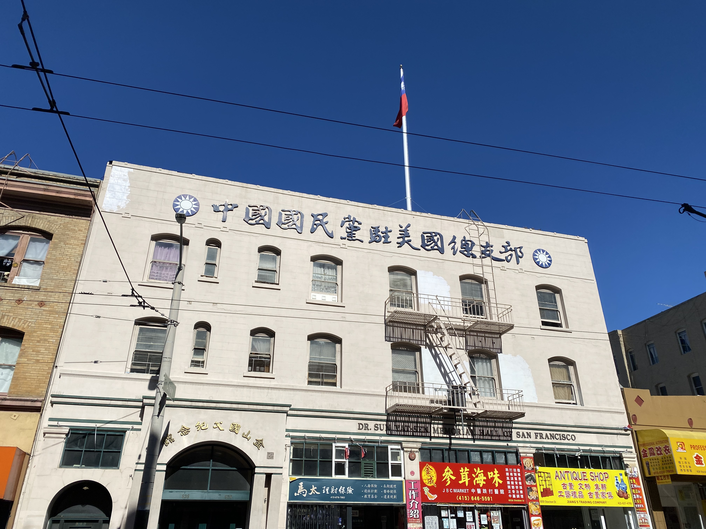

我們還去了一些其他的景點，像是金門大橋還有九曲花街，不過去金門大橋的時候天氣很差，在哪邊都看不到橋的全貌，而且冰冷的海風還帶著海水冷凍著我們，所以我們走了一半的金門大橋就回去了。

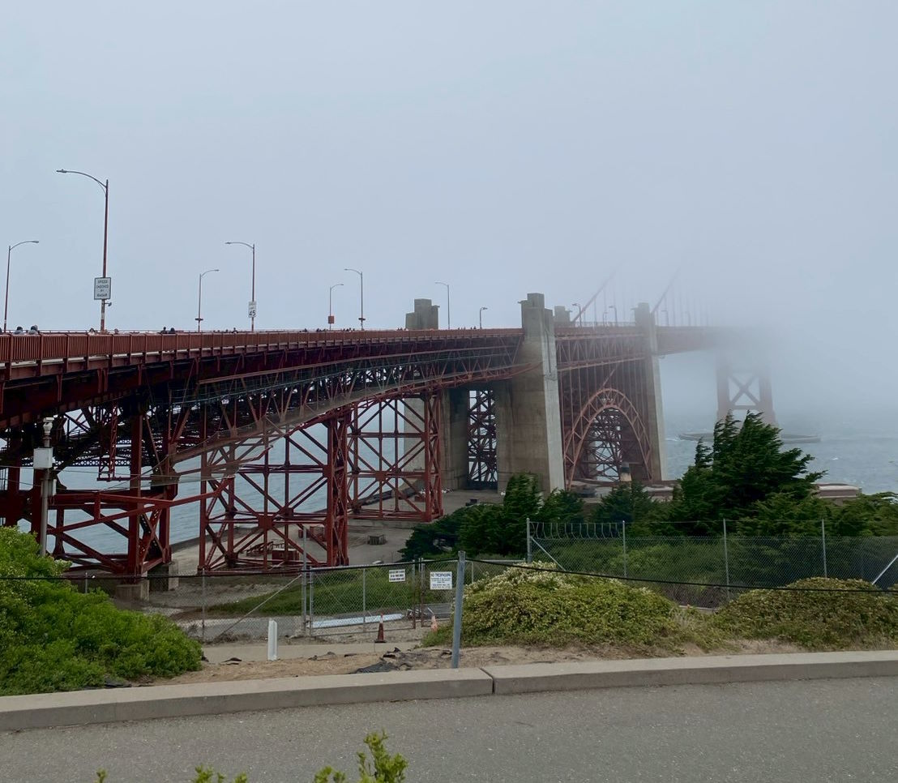

不過金門公園也很令人放鬆，它還大到令人難以置信，好像是大安森林公園的十倍以上大，甚至比臺大總區還要大的樣子。感覺在那邊慢跑得到肺癌的機率應該比在臺北的公園小上不小。

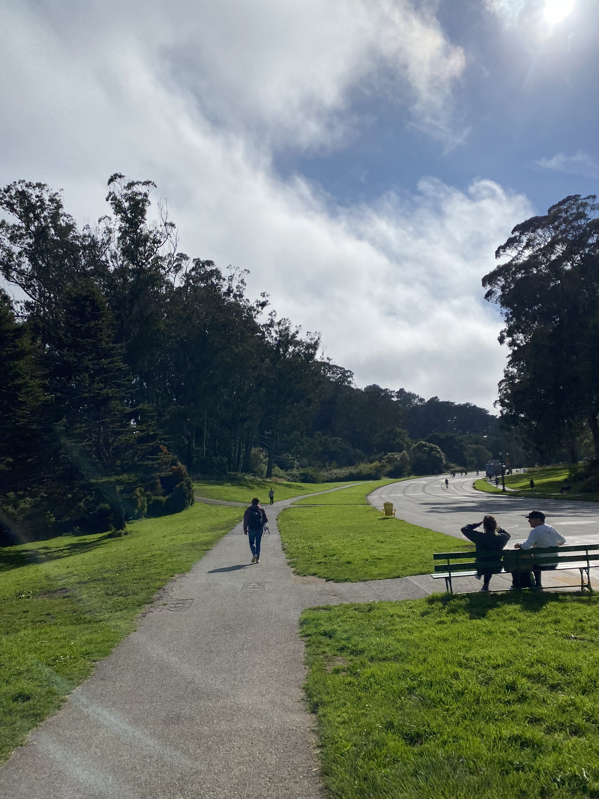

最後我們還去了罰款美術宮殿（Palace of Fine Arts），在那邊拍了一堆 YTP 的心得影片，但我們覺得主要的 BMoE 還沒開始所以就大概講了一些就收工了。

不過舊金山也不是每個地方都很安全，好像是前陣子 COVID 的疫情造成的吧，舊金山很大一部分有沒落的跡象。像是某家百貨公司裡面幾乎什麼人都沒有，還有人在大廳鬼吼鬼叫，嚇得剩下的人都跑走了。還有警衛在我去廁所的時候跟我說小心被廁所裡面的流浪漢伏擊……。在治安方面臺灣真的還是挺不錯的，要好好珍惜。

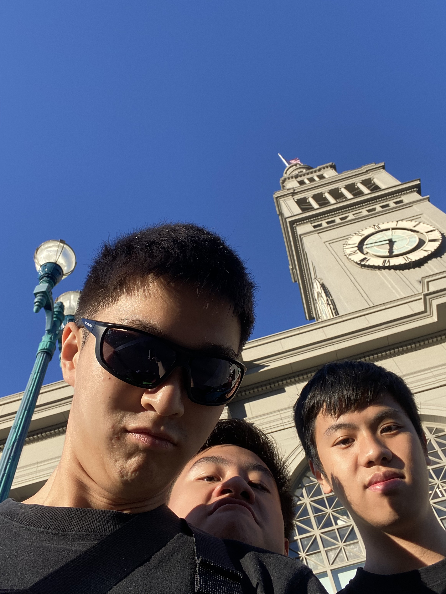

## BMoE 創業營

在快一週的各種參訪還有快閃景點過後，BMoE 終於要開始了，而也是這時我才得知一個非常難過的事情。還記得我說過我們得要和別人分享我們的創業 idea 然後找組別嗎？基本上過去的所有人都會自己有一個主題，但最後會是 4~5 個人一組，一起以組長的主題做為他們的創業題目。

而 YTP 近十年來送來參加 BMoE 的所有人裡面只有一個人有成功作為組長創建隊伍，那個人是資奧的前半金，當時應該正在讀 MIT。

突然覺得壓力好大，明明這幾天已經看過這麼多了，無力感仍在把我吞噬。我早就知道創業是個百裡挑一都不一定會成功的挑戰了，但我的自尊還是不允許我自己沒有成功。在聽到了令人絕望的成功率後，我還是要繼續前進。

### 組隊 Pitch

過了這麼久我還是不知道要怎麼好好的用中文解釋 pitch 是什麼，反正就是要把你的 idea 想辦法用流利、吸引人的方法介紹給你的目標。我們的第一個 pitch 當然就是要介紹我們的 idea 給其他營隊的參加者聽，想辦法吸引他們加入你的組別。在聽完其他人的 pitch 之後，我發現大家其實好像都不太知道自己在幹嘛，可能是因為我作為一個比較理科生的原因吧，我會覺得好像不是一個嶄新的概念就說服不了我，或是沒有什麼技術上的突破我就不知道他想要幹嘛，像是想要賣飲料的 idea，從事後諸葛的角度看這確實是有道理的，但我在當下就不是很懂他們想要幹嘛，市面上不是已經有一堆飲料了嗎。比起想這個是不是一個好題目，我感覺我一部分的腦袋好像更像是在想這個是不是一個好的研究主題。當然換到我自己的視角去 pitch 的時候，我覺得我也沒有講的很好，但至少我認為我的主題是有趣的。

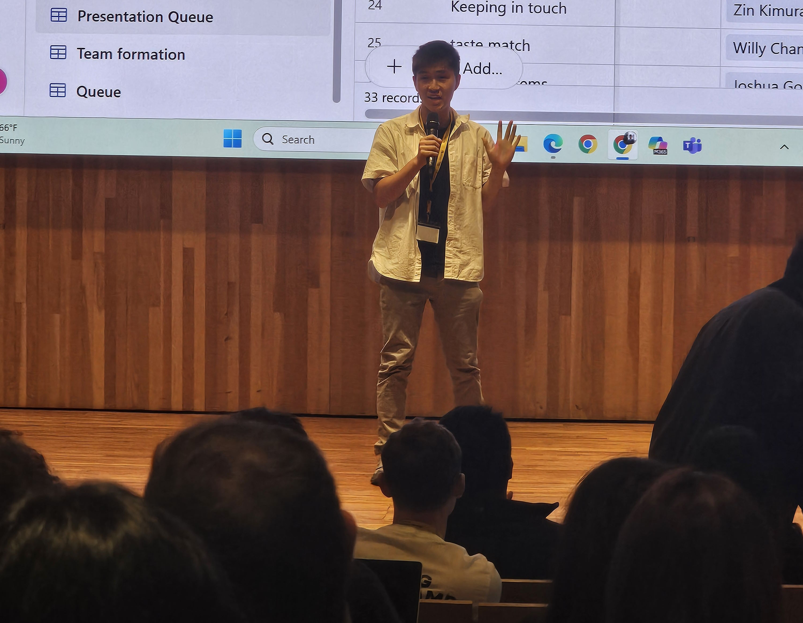

### 組隊時間

組隊的 pitch 結束後不久，就開始組隊時間了，組隊時間可以自由的在不同人的海報前面移動，可以找他們了解他們的 idea 的內容細節跟他會需要的人才。海報是什麼，什麼時候做的？主辦方的作法是給每個人一張海報紙跟一支麥克筆，給你差不多五分鐘的時間在瞬息萬變的環境裡面把你的 idea 用非常低品質的方式畫出來。這對於我來說可以說是十分不利，畢竟我對如何設計出一個吸引人的海報根本沒概念。反正我還是想辦法把他畫出來了，接下來就是慢慢抓人進來了。

然而，根本就沒有人來找我。

確實是有零星幾個人來問我我的 idea 是什麼，但跟其他組比起來，狀況確實糟糕不少。在仔細想想過後，這個結局也是挺必然的。營隊的學生大致上分為三種人：Berkeley 的學生、有贊助來參加的學生（我們）還有一些因為酷炫原因來的成年人。對於參加者裡面佔了大半的 UC Berkeley 的學生來說，大部分的人都是加州的居民，是英文的母語使用者，因此對他們來說學習語言並不是一件生活中必要的事情，所以大家不買單也是很正常的。這個經驗也給了我一個很重要的教訓：「沒有正確的目標受眾怎麼樣都不會成功」。不久後，時間已經過半，我也差不多放棄了，決定要去看看其他還在找人的組題目是什麼，說不定我會有興趣。在參觀其他的組的時候，我聽到了一些很抽象的題目，像是有個 Berkeley 的材料相關的 PhD Candidate 說他研究出了一個能夠用 1/100 的成本做出 10 倍強大的奈米碳管之類的。可能是因為我不了解這個領域的市場之類的吧，但我總感覺這如果是真的直接隨便找間公司合作應該比較有道理？

逛了一圈後，我有找到幾組還算有興趣的題目，像是吳亞倫最後加的那組 TrailMaps，不過 YTP 的人希望我們不要在同一組裡面。不過我感覺後來還是想要以 AI 教育為主題。正當我開始苦惱到底有沒有其他可以加入的時候，跟我們一起參加的 Mars 跑來問我有沒有找到組了，他們的組現在只缺一個人就可以成隊了。雖然原則上不該兩個 YTP 來的在一隊，不過如果能組成一隊的話好像還行。所以我就去看了一下他的主題：「University of AI」。

好土的名字。

時至今日我還是覺得這名字可以更好，不過至少當下我覺得他想要的 idea 其實跟我原本想要的東西是有點相似的，所以我就加入了他的組。和我同組的還有在 Berkeley 讀大學的中國人 Jimmy 還有用和我們類似的管道來參加營隊的韓國人 Seok-Ho。接下來的幾天，我們將作為命運共同體一起完成最後的報告。

等等，怎麼全部都是亞洲人……？

### 小隊活動

好像所有營隊都會一些「深具啟發性」的小組遊戲，除了破冰之外也順便根據營隊的主題來做一些教育。其中我比較有印象的活動是智慧鐵人實作題還有 flipping 大賽。

智慧鐵人實作題就認真是跟平常初賽會出的題目基本上一模一樣，給你一些隨機的材料，然後要想辦法把東西堆到離地面越遠越好。比較有意思的是我記得那個遊戲好像不能使用膠帶，只能用棉線之類的東西去固定結構，其他的材料都蠻 standard 的，像是義大利麵、竹筷之類的東西。

由於我們沒有主修 Civil Engineering 的隊員，所以我們完全不會好好的搭一個結構，時間快到的時候才發現我們的東西根本站不起來。不過我玩過太多智鐵實作題了所以我也沒有特別想要玩得很好的那種想法，就給他倒吧。後來我把裝材料的紙袋直接放在桌上然後把他們規定的終點直接放在紙袋上拿了個 40 cm 的成績哈哈哈。

另外一個我印象特別深刻的活動則是 flipping 大賽，原本這個活動的名字可能叫做 Exchange of Value 之類的名字，我會說他叫做 flipping 大賽是因為他讓我想到小時候玩 Hypixel Skyblock 的時候會看到有人在網路上 post 自己跟別人一直換東西最後換到很貴的物品的影片。本質上是一樣的遊戲，規則很簡單，一開始用一個很便宜的物品（在 BMoE 的活動裡面是他們發的一支 Berkeley 創業中心的原子筆），你得要在 Berkeley 校園周遭（在時間內能回來就好）跟別人用以物易物的方式一物換一物，最後在 Ebay 之類的網站上面尋找價格最高的同品項物件，最高的組就贏了。

我們的交換一開始還算順利，我們找了個人換了一支某個日本牌子的鋼筆，這個活動讓我覺得自己在這方面的能力還是有點弱，未來可能也要多練習一下這種 small talk 的能力了。換完之後他跟我們說他是一個在 Instagram 上面畫畫的藝術家，有好像七千多個粉絲，蠻酷的。後來我們又找了人換到了一個類似腿套的東西，感覺像是個敗著，因為後來就沒有人想要跟我們換了，畢竟如果有人拿著一組腿套來跟我換東西的話，我大概也不會同意吧。在 flipping 的過程，我有滿大的體悟，首先我覺得英文能力不好真的是很吃虧的，在之前的活動也有類似的想法。說到這個，美國人的 small talk 文化在很多地方都讓我感覺滿困惑的，和他們對話必須要有一種泰然自若的迷之自信，需要以某個奇怪的東西作為引子來跟對方開啟對話。我很不擅長這種東西，雖然我覺得我在系館還算能跟人搭話，但感覺還是得要稍微認識那個人或是有某種共同話題才行，完全沒有這些東西的話我就不知道要怎麼開啟對話了。不過其實也有可能這只是 business people 的特有文化吧，沒什麼概念。

回去之後，我們就開始找那雙腿套的價格，Mars 很神的好像把他唬爛到有將近 $60 的價格，蠻扯的。正當我們在沾沾自喜（其實也沒有）的時候，發現其他組的同學拿來的東西有點……超乎想像。有一組同學拿來了三臺 Macbook，還有一組同學換到了一臺真的可以用的鋼琴，甚至有一組同學換到了一支勞力士……。

助教請他們派一名代表來分享他們的 flipping 經驗，結果他們的歷程基本上都差不多：在路上隨機找一個看起來有錢到很可疑的看起來退休的人，然後跟他們說自己是 Berkeley 的學生，正打算要創業，需要累積創業的基金，拜託他們給點有價值的東西。以一個近乎於乞討的方式來從他們獲取價值；「交換」這個行為只是一個幌子。

在這場以物易物大賽中，我深刻的了解到了，「物」是沒有價值的；真正的價值，其實是作為來自 Berkeley 的年輕創業家的無限潛力。

之前我曾經聽聞好像是 Stanford 的某個類似的課程也有類似的挑戰，目標是用 50 美金創造盡可能高的價值，最後的贏家好像根本沒用到那 $50，也是和這個 flipping 大賽一樣的道理吧。

### University of AI

在每天上完課後，我們就會在上課的建築物的大廳或是隨機的其他地方開始討論。一開始我們的主題想要做到的事情是一個像 Coursera 一樣的服務，只要在我們的系統上完成指定量的課程，就可以獲得等同大學學歷的證書，聽起來很不錯對吧？但仔細想想這基本上就是一個漏洞百出的計畫。首先，我們的系統要怎麼跟 Coursera 做出區別？再者，我們要怎麼要確立一個有公信力的系統，使得企業和教育機構願意接受我們發出的證書？最後，我們要怎麼說服教育者來到我們的平臺授課，或是如何用 AI 生成正確的課程來名副其實的「University of AI」？我認為這些都是如果想要以這個名稱作為創業想法需要面對的問題，我們勢必得針對這些問題去做一些命題上的修正或是想出一套合乎情理且可實現的解決方法。

初期在討論的時候常常會遇到不知道該怎麼解決或是意見分歧的時候，這時候 mentor 的幫助就是不可或缺的了。第一天跟我們討論的 mentor 有做過作業系統相關的工作，也有自己創過業的樣子。他的教學方法比較像是一個對抗式生成的感覺；他會聽過我們的 idea 之後跟我們問我們那這個問題要怎麼處理、這個部份在實際上不太可行之類的，然後我們就會經過一串討論來提出一個更好的想法。他自己的說法是他在扮演一個討人厭的掃興鬼的角色，會想辦法在我們的 idea 裡面雞蛋裡挑骨頭。但我認為其實不然，我很喜歡這種透過不斷指出某個環節的問題來修正或是改向的過程，在一開始組員沒有共識的時候有個專家來進行對抗給我帶來的興奮跟成就感高上不少。最後我們決定，把我們的主題改成提供 AI 為骨幹的實習體驗來讓學生能更好的跟職場連接。

第二天晚上我們先是跟某個 Berkeley EECS 的助教討論了一下我們的 idea，然後他就找了個和我們的想法有點類似的網站，讓我們可以參考他們的商業模式還有提供的服務來找出我們的系統的定位跟缺失的東西或是別人沒有的東西。後來我們找到了另外一個 mentor 跟我們討論我們的題目，稍微再分析一下商業模式應該要怎麼處理之類的。那天比較有趣的是後來那位 mentor 還**鉅細靡遺**地跟我們分享了他創業的經驗。他創過一間醫療科技的公司，主要服務客群是醫院，好像有一部分的業務是幫醫院做資料庫管理之類的事務。最有趣的是他跟我們分享他挑人的標準：作為一間公司的大老闆，公司要錄用新員工的話最後的一關面試一定是他自己負責，而技術方面的問題，他一定會問受試者覺得他在用的語言或是工具最欠缺的功能是什麼。用這種方式去檢驗受試者對那些他們宣稱他們會使用的工具的了解是否透徹，如果沒有提出合理的見解就代表他們沒有真正熟練那些工具。這是很有意思的用人哲學，給了我很大的啟發，之後在學習的時候，我也會透過這樣的方式來自省，看自己有沒有對正在學習的技術有充分的理解。後來他又和我們分享了一些他對社會發展和地緣政治的看法，還推薦我們去讀總體經濟學。他的睿智從他的一字一句中滿溢而出，但很遺憾的是那時候已經晚上十一點半了，我再不回飯店真的明天就起不來了，所以我也沒有什麼精神認真聽他後面在說什麼。

第三天晚上是準備報告的最後一天（討論的天數我是從第二天開始算的，第一天沒有討論），我們又再找了另外一位 mentor 跟我們討論我們的主題。這天我們跟他討論的時候發現一個奇怪的事情：他和我們討論的結論和昨天的 mentor 跟我們討論出來的結論是完全相反的。我們這才意識到，每個評審的喜好都不相同，所以有時候我們覺得很好的主意也不一定能打動他們；也有可能我們覺得很爛的方線被他們認為完全可行。對我們來說，這是個一則以喜，一則以憂的消息。這不是程式競賽，不會有所謂的最優解存在，代表我們永遠沒辦法到達一個所有評審都滿意的狀態，但有限數量的評審其實也代表著我們可以根據已知的評審做出一些 presentation 上面的改動，來讓我們的題目來在特定的評審上有稍高的分數。除此之外這個晚上的 mentor 時間我還有另外一個有趣的觀察是感覺這個時候大部分的 mentors 都在提供情緒價值，除了稍微給點建議之外還會不斷的說你們真的很棒，超好笑。

跟 mentor 討論完後，我們的戰鬥還沒結束，明天就是最後的 pitch 了，我們需要把我們的 idea 做成一個簡報並想好在臺上要講什麼。前面幾天其實我們就有在做簡報了，不過最後的 polishing 肯定還是得留到今天才能做的。這時我也才發現，我已經習慣了和隊友的合作模式，漸漸比較能抓到跟他們對話的時候要用什麼樣的方式跟他們說才能有效溝通，還有他們擅長的領域是什麼，怎麼跟他們合作才能有最高效的產出，還蠻有成就感的。

在這幾天的時間裡面，我獲得了非常快速的成長，從完全不熟識的隊友到現在能夠做出一份大家都算滿意的簡報，接觸了一堆商學院特有的名詞和概念，將自己稚嫩的創業想法不斷的 pivot 到合乎邏輯的架構。「從零開始到現在這樣的團隊竟然只花了四天，真是不可思議」我邊在走廊上自言自語著自己的講稿邊這樣想著。

### 最終報告

在最後一天的報告，我們進行了一個全部人都睡過頭的操作，不過不慌，因為我們的報告順序算是篇後面的，時間到前有到就好。

由於每個組的報告時間超過十分鐘，總共的組別太多了，所以總共被分為三個賽道，我們的賽道的評審剛好有一個是和我們討論過得 mentor，究竟他會覺得我們有很大的成長，還是會覺得我們沒什麼進步？讓我們拭目以待吧。我們上臺的報告整體而言還算挺通順的，跟預計的差不多，Q&A 的部份我認為也還行，看評審的表情我覺得也還算滿意，應該還不錯吧？

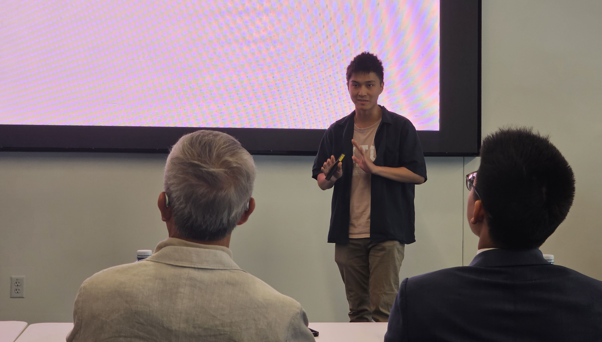

不過後來我才知道一個賽道只會有一個贏家，那就沒什麼贏面啦。後來公佈結果時，第一個賽道的贏家是來自烏克蘭的已經出社會的創業家所領導的隊伍，他們的主題是建造可以摧毀俄羅斯無人機的反空無人機武器。第二個賽道的贏家全員都是來自 Berkeley 的學生，他們的主題是蒐集一個多人種、多性別的 non-biased 的癌症資料庫。第三個賽道的贏家也是來自 Berkeley 的學生為主，他們的主題是某個失智症有關的回憶服務之類的，我沒記錯的話應該有點像吳亞倫那組 but for 失智症。

.

.

.

這怎麼贏阿？

一個隊伍要擊敗俄羅斯終結烏俄戰爭，一個要治療癌症，一個要治療失智症。光是選題方面我就已經輸的心服口服，我們就算報告的再好（以我們的 potential 達到完美）我都不覺得有太大贏得機會了。沒讓宿儺大人使出全力我很抱歉。但我也沒有很失望啦，畢竟就像營隊裡面很多講師常說的：是創業中失敗的成本是非常低的，甚至是負的，正是這些失敗能讓我們從中學習，在下一次的 pitch 展現出更好的自己。回首我的高中生涯，確實那些當下我覺得天崩地裂的失敗都沒有真的讓我一落千丈，反而是化作為我在 YTP 的這趟旅程重要墊腳石。

挫折並不可恥，只要跌倒後你願繼續前進。

而我選擇繼續前進。

## 趣聞、逸事、美食

嚴肅的部份結束了，來講一些有的沒有有趣故事吧。

### 條條大路通 BMoE

在計畫主持人 Gigi 的某一個演講裡面，他問我們所有人是怎麼知道這個 bootcamp 的。正如同之前提到過的，BMoE 除了提供給 Berkeley 的學生作為一個兩學分的短期暑假課程外，也有提供給其他外部人士參加的名額。這些外部人士包括了像我們這樣的參加其他比賽受到贊助的學生，還有一些自己出錢的社會人士。

其中最讓我印象深刻的有一群北科大來的用他們的經費來參訪的教授，還有一個全場唯一的日本人。那個日本人是落在我剛說的自己出錢的社會人士裡面的，當 Gigi 點他問他他是怎麼知道 bootcamp 的時候，他說出了一個我完全沒想到的答案：

> ChatGPT. I asked it how to learn about entrepreneurship, and it told me to come here.

### 我的筷子呢

剛成隊完的第一天，助教告訴我們今天他們不會負責我們的晚餐，要自己跟隊友去外面找餐廳吃。我的隊友 Jimmy 是中國人，因此我們剛成隊完的第一天晚上選擇了 Berkeley 附近的中國餐廳吃飯。菜色本身還算不錯吃，不過還是比不上智鐵當年招待外賓請的蘇杭（畢竟是免費的哈哈哈）。即使如此，我還是對那間餐廳很有印象，因為那間餐廳的服務態度不是特別好。Seok-Ho 不小心把筷子弄掉到地上了，所以我們就有人就找人再要一雙筷子。

> I don't work here, pal!

差點沒把我笑死。

後來他們就再找了一個真的是服務生的人去要筷子，不過他們過了十幾分鐘還是沒有拿筷子過來給我們。Jimmy 跟我們說他們對外國人其實通常態度不是很好，所以他就靈機一動：

> 老鐵，我筷子呢？

筷子馬上就送上來了。

### 陷落於披薩的漩渦

很久很久以前，從我第一次參加 YTP 開始，YTP 對我來講最重要的元素之一就是披薩了。而在這次的 BMoE 裡面，我們也跟披薩有了一場邂逅。Berkeley 外面有一家評分還不錯的披薩店，叫做 La Val's Pizza。由於負責伙食的助教大概也是很喜歡，所以在這短短的營隊裡面他就訂了兩次（第二天跟第四天）La Val's。

你喜歡怎樣的披薩呢？這是個很主觀的問題，有些人喜歡必勝客或達美樂預設的那種鬆厚的餅皮，有些人則是喜歡薄的；有些人喜歡起司很多的，有些人覺得蕃茄醬的部份才是精華。我雖然沒有吃過真正道地的義大利披薩，但我心目中姑且還是有一把尺的。要我說的話，我認為我心中標準的披薩應該要是像瑪麗珍那樣的披薩吧。

很遺憾的是美式的披薩沒有很對我的胃口。La Val's 的披薩客觀上應該不算難吃，但對我來說還是有點太油了，而且幾乎每個上面都有臘腸之類的加工肉品。可能是我太久沒吃青菜了吧，所以我一直在披薩上面尋找蓼蓼無幾的蔬菜。

BMoE 第二天吃完第一次後，我便對它印象沒有到特別好。畢竟我這趟來美國的時間是有限的，如果可以我還是會想多吃一點讓我驚豔的食物或是有特色的食物。

結果第三天晚上，我又在大廳的長桌上看到了滿滿的披薩。

助教說 La Val's 的店員記錯時間了，所以本來該在第四天送來的披薩被錯誤的送了過來。當然，這是店員的疏失，所以明天還是會再送來一次。就這樣，我們連續吃了三天的披薩，彷彿陷入了沒有中止條件的迴圈之中。

對吳亞倫來說更是絕望了。前面說過 BMoE 的第一天的晚餐是要跟小組組員一起自己去外面找的晚餐，猜猜他們去吃了什麼？提示：一家在 Berkeley 附近評分還不錯的披薩店。

### 抖音姐

最終報告的前一個晚上，我們在夜深人靜的討論室討論，已經晚上十一點多了，隔壁組還在跟他們的 mentor 討論，告一段落之後非常$\overset{社交恐怖份子}{社恐}$的某個女生跑過來請我們幫忙給他們和他們的 mentor 拍一個合照。

拍完之後，那個女生跑來找我們說希望可以幫忙他給他新的音樂拍某種宣傳影片，因為我超不懂拒絕那種超級陽角就和他拍了幾秒。為什麼他可以這麼社牛的就走過來找人幫他拍影片呢？我到現在還是不懂，究竟這是美國的特色呢？還是全世界的陽角都是這樣的？我在幫他拍的時候也完全不知道他是要拍什麼的影片，後來才知道是 Tiktok 的影片。想想也是。

### 與世隔絕的學霸

營隊結束後，我們開始跟隨機的路人交換聯絡方式，畢竟在創業，甚至只是找工作的時候，人脈都是最重要的資源。BMoE 的講者們給我一個很重要的啟示就是，一個真正有價值的主意只要沒有人脈就無法孕育；一個很無聊的主意只要有了人脈就還是有可能成功。因此在營隊結束後，我們就開始四處加別人的聯絡方式。

問到 Seok-Ho 的聯絡方式的時候，我震驚了。他說他沒有 Facebook，沒有 Instagram，也沒有 Discord。唯一有的社群媒體是 LinkedIn，也不太常用。

這人是得了什麼上網就會全身流血的疾病嗎？

## 後記

回到臺灣後一段時間，我看到了吳亞倫隊友 Yoohan 的限動。打著凌晨兩點的時間標記，哭喊著 BMoE 的 final report 要做不完了。Final report？那是什麼？我們上臺報告的那個不是嗎？

為什麼當初那麼多全員 Berkeley 學生的隊伍，此刻似乎有了答案。

